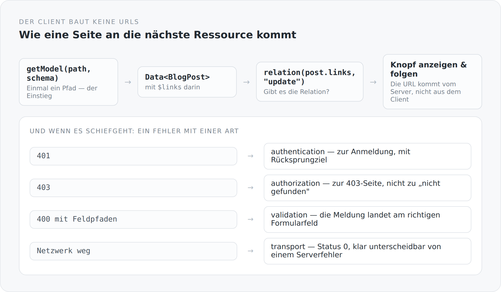

Im Artikel über HATEOAS habe ich die Serverseite beschrieben: Jede Antwort trägt in `$links`, was der Aufrufer mit ihr tun darf. Das ist nur die Hälfte. Es nützt nichts, wenn der Client die URLs trotzdem selbst zusammenbaut.

Dieser Artikel handelt von der anderen Hälfte.

## Der Einstieg ist ein Pfad, alles danach eine Relation

{width=720}

```ts
export function relation(links: readonly Link[] | ListProperty<Link>, rel: string): Link | undefined
```

Eine Funktion. Sie sucht in einer Link-Liste nach einer Relation und gibt sie zurück — oder `undefined`.

Damit ist der Rest fast trivial. Eine Seite fragt nicht „darf dieser Benutzer bearbeiten". Sie fragt, ob es eine Relation `update` gibt. Gibt es sie, zeigt sie den Knopf und benutzt die URL, die im Link steht. Gibt es sie nicht, gibt es keinen Knopf.

Der Client kennt keine Pfadschemata. Er hat keine Datei mit Endpunkt-Konstanten. Es gibt genau einen Einstiegspunkt pro Seite, und alles Weitere steht in den Antworten.

## Modelle, die sich selbst beschreiben

```ts
export abstract class Entity {
  @JsonId
  readonly id = property<string | null>(null);

  @JsonIgnore({ serialize: false, deserialize: true })
  readonly modified = localDateTimeProperty();

  @JsonProperty("$links")
  @JsonIgnore({ serialize: false, deserialize: true })
  readonly links = listProperty<Link>([]);
}
```

Drei Dinge sind hier bemerkenswert.

**Die Felder sind Properties, keine Werte.** `property<string | null>(null)` ist ein beobachtbarer Wert. Ein Textfeld, das daran gebunden ist, aktualisiert sich, wenn er sich ändert — ohne Neu-Rendern, ohne Vergleich.

**`$links` wird gelesen, aber nie geschrieben.** `serialize: false, deserialize: true`. Das ist die Client-Seite derselben Aussage, die serverseitig `@Transient` heißt: Möglichkeiten kommen vom Server und gehen nie zurück. Ein manipulierter Client kann sich keine Rechte zurückschicken.

Dasselbe gilt für `created` und `modified`. Zeitstempel gehören dem Server.

**Die Validierung steht am Modell.** Die Importe verraten es:

```ts
import { NotBlank, Pattern, Size } from "@anjunar/jfx-forms";
```

Dieselben Namen wie die Bean-Validation-Annotationen im Scala-Modell — `@NotBlank`, `@Size`, `@Pattern`. Das Frontend prüft dieselben Regeln wie das Backend, mit denselben Begriffen.

Das ist bewusst eine Doppelung, keine Sicherheitsmaßnahme: Die Prüfung im Client ist Bequemlichkeit, die im Server ist die Wahrheit. Aber weil beide gleich heißen, sieht man beim Lesen, ob sie übereinstimmen.

## Die drei Formen, wieder

```ts
export function dataSchema<T>(itemSchema: JsonSchema<T>): JsonSchema<Data<T>>
export function tableSchema<T>(itemSchema: JsonSchema<T>): JsonSchema<Table<T>>
```

`Data<T>` und `Table<T>` — dieselben Namen wie im Backend, dieselbe Bedeutung.

Das ist der Punkt, an dem sich die Arbeit aus dem Artikel über die drei Antwortformen auszahlt. Weil der Server nur drei Gestalten kennt, braucht der Client nur drei. Er muss nicht pro Endpunkt wissen, wie die Antwort aussieht.

## Fehler mit einer Art

```ts
export type ApiErrorKind = "transport" | "parsing" | "validation"
  | "authentication" | "authorization" | "not-found" | "server" | "http";

function classify(status: number, errors: readonly FormErrorResponse[]): ApiErrorKind {
  if (status === 401) return "authentication";
  if (status === 403) return "authorization";
  if (status === 404) return "not-found";
  if (errors.length > 0 || status === 400 || status === 422) return "validation";
  if (status >= 500) return "server";
  return "http";
}
```

Ein `ApiError` trägt nicht nur einen Status, sondern eine Kategorie. Und die Kategorie ist das, worauf der Code reagiert.

Der Unterschied wird bei `transport` sichtbar: Ein Netzwerkfehler bekommt Status 0 und die Art `transport`. Damit ist „der Server ist nicht erreichbar" klar unterscheidbar von „der Server hat 500 geantwortet". Für den Benutzer sind das zwei verschiedene Sätze.

Und Validierungsfehler behalten ihre Struktur:

```ts
function fieldErrors(value: unknown): readonly FormErrorResponse[] {
  if (!Array.isArray(value)) return [];
  return value.flatMap((entry): FormErrorResponse[] => {
    const candidate = entry as { message?: unknown; path?: unknown };
    if (typeof candidate.message !== "string" || !Array.isArray(candidate.path)) return [];
    const path = candidate.path.filter((part): part is string => typeof part === "string");
    return path.length === candidate.path.length ? [{ message: candidate.message, path }] : [];
  });
}
```

Ein Fehler hat einen Pfad. `["translations", "0", "title"]` landet an genau dem Feld, das gemeint ist — statt als allgemeine Meldung über dem Formular.

Die Prüfungen sind auffällig streng: Ist auch nur ein Element des Pfads keine Zeichenkette, wird der ganze Eintrag verworfen. Lieber keine Zuordnung als eine falsche.

## Eine Weiterleitung mit einer Bedingung

```ts
function redirectReadFailure(status: number, method: string): void {
  if (typeof window === "undefined" || method !== "GET") return;
  const returnTo = `${window.location.pathname}${window.location.search}${window.location.hash}`;
  if (status === 401) window.location.replace(localizedUrl(loginPath(returnTo)));
  else if (status === 403) window.location.replace(localizedUrl("/403"));
  else if (status === 404) window.location.replace(localizedUrl("/404"));
}
```

Ein 401 beim Lesen führt zur Anmeldung — mit dem Rücksprungziel im Pfad, damit man nach dem Login wieder da ist, wo man war.

Aber nur bei `GET`. Wer ein Formular abschickt und ein 401 bekommt, wird nicht weggeleitet; er bekommt eine Fehlermeldung und behält, was er getippt hat. Eine Weiterleitung würde die Eingabe verlieren.

Und nur im Browser: `typeof window === "undefined"` schließt das serverseitige Rendering aus. Dort gibt es kein `window.location`, und die Fehlerbehandlung läuft über `routerConfig.onFailure` aus dem vorigen Artikel.

## Dieselbe Datei, zwei Laufzeiten

```ts
const graalSsr = typeof globalThis !== "undefined" && "__jfxFetch" in globalThis;
const serviceOrigin = typeof window === "undefined" && !graalSsr
  ? (process.env.SIMPLICITY_BLOG_API_ORIGIN ?? "http://localhost:8080").replace(/\/$/, "")
  : "";
```

Drei Fälle in zwei Zeilen. Im Browser sind die Pfade relativ. In GraalJS gibt es ein bereitgestelltes `__jfxFetch`, das den Request-Kontext kennt — auch dort relativ. Und in einem Node-Prozess ohne beides braucht es einen absoluten Ursprung.

Das ist die einzige Stelle in `api.ts`, an der die Laufzeit eine Rolle spielt. Alles darunter ist identisch, egal wo es läuft.

## Der Preis

**Man muss dem Prinzip folgen.** Eine Seite, die eine URL selbst zusammensetzt, funktioniert genauso gut — bis sich der Pfad ändert. Das Muster ist eine Disziplin, keine Zwangsläufigkeit.

**Antworten sind größer.** Jedes Objekt trägt seine Links.

**Und es ist ein zusätzlicher Schritt.** `relation(links, "update")?.url` ist mehr zu schreiben als `/service/blog/posts/post/${id}`.

## Was ich dafür bekomme

Ich habe im ganzen Frontend keine einzige URL-Konstante. Wenn ich einen Pfad im Backend ändere, ändert sich der Link, den der Server ausliefert, und der Client folgt ihm. Es gibt keine Stelle, an der beide auseinanderlaufen könnten.

Das ist der Unterschied zwischen einer API, die man kennt, und einer, der man folgt.

Der nächste Artikel schließt die Frontend-Staffel ab — mit dem Teil, den man nicht als Architektur bezeichnet und der trotzdem einer ist: wie eine Seite aussieht.
