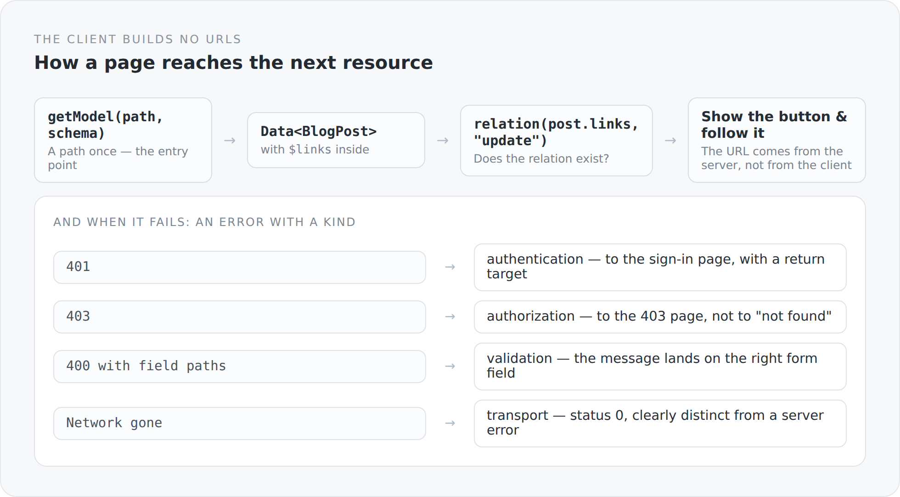

In the article about HATEOAS I described the server side: every response carries in `$links` what the caller may do with it. That is only half. It is no use if the client assembles the URLs itself anyway.

This article is about the other half.

## The entry is a path, everything after it is a relation

{width=720}

```ts
export function relation(links: readonly Link[] | ListProperty<Link>, rel: string): Link | undefined
```

One function. It looks for a relation in a link list and returns it — or `undefined`.

That makes the rest almost trivial. A page does not ask "may this user edit". It asks whether an `update` relation exists. If it does, it shows the button and uses the URL from the link. If it does not, there is no button.

The client knows no path schemes. It has no file of endpoint constants. There is exactly one entry point per page, and everything else lives in the responses.

## Models that describe themselves

```ts
export abstract class Entity {
  @JsonId
  readonly id = property<string | null>(null);

  @JsonIgnore({ serialize: false, deserialize: true })
  readonly modified = localDateTimeProperty();

  @JsonProperty("$links")
  @JsonIgnore({ serialize: false, deserialize: true })
  readonly links = listProperty<Link>([]);
}
```

Three things are notable here.

**The fields are properties, not values.** `property<string | null>(null)` is an observable value. A text field bound to it updates when it changes — without re-rendering, without comparison.

**`$links` is read but never written.** `serialize: false, deserialize: true`. That is the client-side version of the same statement that on the server is called `@Transient`: possibilities come from the server and never go back. A tampered client cannot send permissions back to itself.

The same applies to `created` and `modified`. Timestamps belong to the server.

**Validation sits on the model.** The imports give it away:

```ts
import { NotBlank, Pattern, Size } from "@anjunar/jfx-forms";
```

The same names as the Bean Validation annotations in the Scala model — `@NotBlank`, `@Size`, `@Pattern`. The frontend checks the same rules as the backend, with the same vocabulary.

That is deliberately a duplication, not a security measure: the check in the client is convenience, the one on the server is the truth. But because both are named alike, you can see at a glance whether they agree.

## The three shapes, again

```ts
export function dataSchema<T>(itemSchema: JsonSchema<T>): JsonSchema<Data<T>>
export function tableSchema<T>(itemSchema: JsonSchema<T>): JsonSchema<Table<T>>
```

`Data<T>` and `Table<T>` — the same names as in the backend, the same meaning.

This is where the work from the article about the three response shapes pays off. Because the server knows only three forms, the client needs only three. It does not have to know per endpoint what the answer looks like.

## Errors with a kind

```ts
export type ApiErrorKind = "transport" | "parsing" | "validation"
  | "authentication" | "authorization" | "not-found" | "server" | "http";

function classify(status: number, errors: readonly FormErrorResponse[]): ApiErrorKind {
  if (status === 401) return "authentication";
  if (status === 403) return "authorization";
  if (status === 404) return "not-found";
  if (errors.length > 0 || status === 400 || status === 422) return "validation";
  if (status >= 500) return "server";
  return "http";
}
```

An `ApiError` carries not only a status but a category. And the category is what the code reacts to.

The difference shows at `transport`: a network failure gets status 0 and the kind `transport`. So "the server is unreachable" is clearly distinguishable from "the server answered 500". For the user those are two different sentences.

And validation errors keep their structure:

```ts
function fieldErrors(value: unknown): readonly FormErrorResponse[] {
  if (!Array.isArray(value)) return [];
  return value.flatMap((entry): FormErrorResponse[] => {
    const candidate = entry as { message?: unknown; path?: unknown };
    if (typeof candidate.message !== "string" || !Array.isArray(candidate.path)) return [];
    const path = candidate.path.filter((part): part is string => typeof part === "string");
    return path.length === candidate.path.length ? [{ message: candidate.message, path }] : [];
  });
}
```

An error has a path. `["translations", "0", "title"]` lands on exactly the field meant — instead of as a general message above the form.

The checks are notably strict: if even one element of the path is not a string, the whole entry is discarded. Better no mapping than a wrong one.

## A redirect with a condition

```ts
function redirectReadFailure(status: number, method: string): void {
  if (typeof window === "undefined" || method !== "GET") return;
  const returnTo = `${window.location.pathname}${window.location.search}${window.location.hash}`;
  if (status === 401) window.location.replace(localizedUrl(loginPath(returnTo)));
  else if (status === 403) window.location.replace(localizedUrl("/403"));
  else if (status === 404) window.location.replace(localizedUrl("/404"));
}
```

A 401 while reading leads to the sign-in page — with the return target in the path, so that after signing in you are back where you were.

But only on `GET`. Somebody who submits a form and gets a 401 is not redirected; they get an error message and keep what they typed. A redirect would lose the input.

And only in the browser: `typeof window === "undefined"` excludes server-side rendering. There is no `window.location` there, and error handling runs through `routerConfig.onFailure` from the previous article.

## The same file, two runtimes

```ts
const graalSsr = typeof globalThis !== "undefined" && "__jfxFetch" in globalThis;
const serviceOrigin = typeof window === "undefined" && !graalSsr
  ? (process.env.SIMPLICITY_BLOG_API_ORIGIN ?? "http://localhost:8080").replace(/\/$/, "")
  : "";
```

Three cases in two lines. In the browser the paths are relative. In GraalJS there is a provided `__jfxFetch` that knows the request context — relative there too. And in a Node process without either, an absolute origin is needed.

That is the only place in `api.ts` where the runtime plays a role. Everything below it is identical, no matter where it runs.

## The price

**You have to follow the principle.** A page that assembles a URL itself works just as well — until the path changes. The pattern is a discipline, not an inevitability.

**Responses are larger.** Every object carries its links.

**And it is an extra step.** `relation(links, "update")?.url` is more to write than `/service/blog/posts/post/${id}`.

## What I get for it

I have not a single URL constant in the entire frontend. When I change a path in the backend, the link the server delivers changes, and the client follows it. There is no place where the two could drift apart.

That is the difference between an API you know and one you follow.

The next article closes the frontend arc — with the part nobody calls architecture and that is one anyway: how a page looks.
