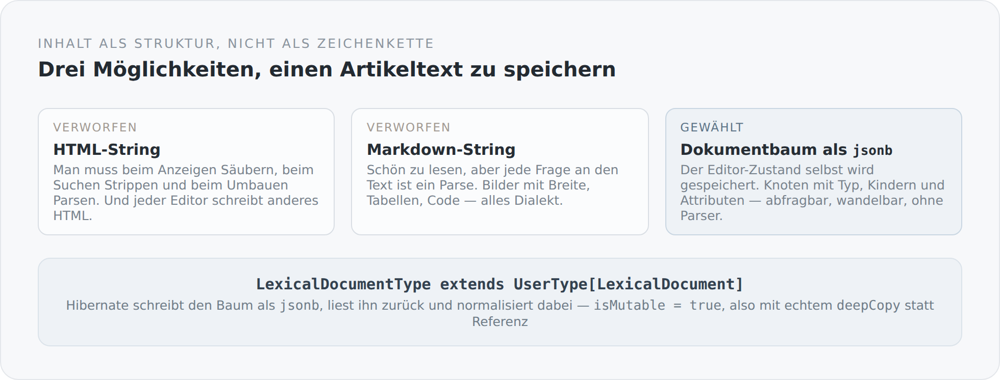

Die naheliegende Art, einen Artikeltext zu speichern, ist eine Spalte vom Typ `text`. Man schreibt HTML hinein, liest es wieder heraus und gibt es aus. Es funktioniert sofort, es ist billig, und es ist der Anfang von einer ganzen Reihe von Problemen.

## Warum nicht HTML

Sobald der Text HTML ist, muss man bei jeder Gelegenheit etwas damit machen.

Beim Anzeigen muss man säubern, weil man sonst Skripte ausliefert, die jemand hineingeschrieben hat. Beim Suchen muss man Tags entfernen, sonst findet man `<strong>` statt Wörtern. Beim Erzeugen eines Teasers muss man parsen, sonst schneidet man mitten in ein Element. Beim Umbenennen einer Bild-URL muss man ebenfalls parsen. Und beim Wechsel des Editors stellt man fest, dass jeder Editor anderes HTML schreibt.

Jedes einzelne dieser Probleme ist lösbar. Zusammen sind sie ein Parser, der an fünf Stellen im Projekt in leicht unterschiedlichen Versionen existiert.

Markdown ist die zweite naheliegende Antwort, und sie ist besser — aber sie hat dasselbe Grundproblem: Der Text ist eine Zeichenkette, und jede Frage an ihn ist ein Parse. Dazu kommt, dass alles Interessante Dialekt ist. Bilder mit Breitenangabe, Tabellen, Code-Blöcke mit Sprache: nichts davon ist in der Kernsyntax.

{width=720}

## Was stattdessen gespeichert wird

Der Editor dieses Blogs ist Lexical, und Lexical hat einen Zustand — einen Baum aus Knoten mit Typ, Kindern und Attributen. Genau dieser Baum wird gespeichert.

```scala
class LexicalDocument extends DTO with Serializable {
  @JsonbProperty
  var root: LexicalNode = new LexicalNode()
}

class LexicalNode extends DTO with Serializable {
  @JsonbProperty var `type`: String = uninitialized
  @JsonbProperty var children: util.List[LexicalNode] = new util.ArrayList()
  @JsonbProperty var text: String = uninitialized
  // ...
  @JsonbProperty var src: String = uninitialized
  @JsonbProperty var altText: String = uninitialized
  @JsonbProperty var mediaId: String = uninitialized
  @JsonbProperty var widthPx: java.lang.Long = uninitialized
  @JsonbProperty var language: String = uninitialized
  @JsonbProperty var code: String = uninitialized
}
```

Ein Knoten hat einen Typ und Kinder. Was er sonst noch hat, hängt vom Typ ab: Ein Textknoten hat `text` und `format`, ein Bildknoten `src`, `altText`, `mediaId` und `widthPx`, ein Code-Block `language` und `code`, eine Tabellenzelle `colSpan` und `headerState`.

Damit ist der Inhalt abfragbar, ohne ihn zu parsen. „Welche Bilder kommen in diesem Artikel vor" ist ein Baumdurchlauf. „Welche Sprachen kommen in Code-Blöcken vor" auch. Und beim Rendern gibt es nichts zu säubern, weil nie HTML gespeichert war — es entsteht erst beim Anzeigen, aus Knotentypen, die die Anwendung kennt.

## Wie er in die Datenbank kommt

```scala
@JsonbProperty
@NotNull
@Column(nullable = false, columnDefinition = "jsonb")
@Type(value = classOf[LexicalDocumentType])
var content: LexicalDocument = uninitialized
```

PostgreSQL kann JSON nativ. `jsonb` ist eine echte Spalte mit einem echten Typ, und man kann darauf indizieren und darin suchen.

Die Brücke dorthin ist ein Hibernate-`UserType`:

```scala
class LexicalDocumentType extends UserType[LexicalDocument] {
  override def getSqlType(): Int = Types.OTHER

  override def nullSafeGet(rs: ResultSet, position: Int, options: WrapperOptions): LexicalDocument = {
    val json = rs.getString(position)
    if (json == null) null
    else LexicalDocument.normalize(objectMapper.readValue(json, classOf[LexicalDocument]))
  }

  override def isMutable(): Boolean = true
}
```

Drei Details daran sind wichtiger, als sie aussehen.

**`isMutable = true`.** Ein Dokumentbaum ist veränderlich. Hibernate muss deshalb beim Laden eine tiefe Kopie anlegen, sonst kann es nicht feststellen, ob sich etwas geändert hat — und speichert entweder zu viel oder zu wenig. Das `deepCopy` geht hier über Serialisieren und wieder Einlesen. Nicht die schnellste Methode, aber die einzige, die garantiert keine Referenz übrig lässt.

**Normalisierung beim Lesen und beim Schreiben.** Lexical lässt `indent` weg, wenn es null ist; beim nächsten Speichern steht es plötzlich drin. Das Ergebnis wären ständige „Änderungen" an Artikeln, an denen niemand etwas geändert hat.

```scala
private def normalizeNode(node: LexicalNode): Unit = {
  if (IndentAwareNodeTypes.contains(node.`type`) && node.indent == null) node.indent = 0L
  node.children.forEach(normalizeNode)
}
```

**Ausgeschriebenes `equals` und `hashCode`.** Beide Klassen vergleichen alle Felder, von Hand, über dreißig Zeilen. Das sieht nach Fleißarbeit aus und ist der Grund, warum die Änderungserkennung überhaupt funktioniert: Zwei Bäume sind gleich, wenn ihr Inhalt gleich ist, nicht wenn es dasselbe Objekt ist.

Der Preis: Wenn ich ein Feld ergänze und vergesse, es in `equals` aufzunehmen, wird eine Änderung an diesem Feld nicht bemerkt. Das ist eine echte Falle, und es ist die Stelle in dieser Klasse, an der ich am ehesten einen Test bräuchte, der die Felderliste gegen die Vergleichsliste prüft.

## Der Knoten, der ein Medium kennt

Ein Detail ist mir besonders wichtig:

```scala
@JsonbProperty var src: String = uninitialized
@JsonbProperty var mediaId: String = uninitialized
```

Ein Bildknoten trägt beides: die Adresse, unter der das Bild geliefert wird, und die Id des Mediums in der Datenbank.

Die Adresse allein wäre zu wenig. Sie ändert sich, wenn sich der Auslieferungsweg ändert, und sie sagt nichts darüber, welche Bilder ein Artikel eigentlich braucht. Mit der Id kann das System die Frage beantworten, welche Medien noch verwendet werden — und die Übersetzung führt entsprechend eine eigene `media`-Beziehung.

Das ist der Unterschied zwischen einem Text, der zufällig Bilder enthält, und einem Dokument, das weiß, woraus es besteht.

## Was das kostet

**Größe.** Ein Baum als JSON ist deutlich größer als derselbe Text als Markdown. Bei einem Artikel egal, bei einer Übersichtsseite, die zwanzig davon lädt, nicht mehr — und genau das ist der Grund, warum die Übersicht eine eigene Projektion braucht, wie ich im vorigen Artikel zugegeben habe.

**Bindung an den Editor.** Die Knotentypen sind Lexicals Knotentypen. Ein Wechsel des Editors wäre eine Migration. Abgefedert ist das durch den Markdown-Codec, der in beide Richtungen übersetzt — aber es bleibt eine Kopplung.

**Ein `UserType` mehr.** Neunzig Zeilen Infrastruktur für eine Spalte.

## Warum es trotzdem richtig ist

Weil ein Artikel ein Dokument ist und kein Fließtext mit Markierungen.

Sobald man Bilder mit Breiten hat, Code-Blöcke mit Sprachen, Tabellen mit Kopfzeilen und Medien, die verwaltet werden müssen, ist der Inhalt strukturiert. Die Frage ist dann nicht mehr, *ob* man diese Struktur speichert, sondern *ob man sie jedes Mal neu ausrechnet*.

Ich speichere sie. Der Text, den Sie gerade lesen, liegt als solcher Baum in einer `jsonb`-Spalte — und gleichzeitig als Markdown-Datei in einem Repository. Wie beides zusammenpasst, ist das Thema in zwei Artikeln.

Zuerst aber die Frage, warum dieser Baum nicht am Artikel hängt, sondern an seiner Übersetzung.
