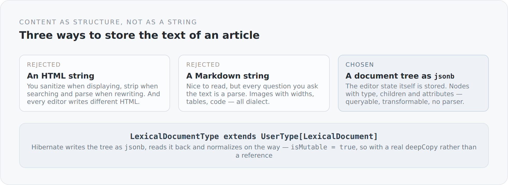

The obvious way to store the text of an article is a `text` column. You write HTML into it, read it back out and print it. It works immediately, it is cheap, and it is the beginning of a whole series of problems.

## Why not HTML

The moment the text is HTML, you have to do something with it at every opportunity.

When displaying, you have to sanitize, otherwise you ship scripts somebody wrote into it. When searching, you have to strip tags, otherwise you find `<strong>` instead of words. When producing a teaser, you have to parse, otherwise you cut in the middle of an element. When renaming an image URL, you have to parse as well. And when changing editors, you discover that every editor writes different HTML.

Each of those problems is solvable on its own. Together they are a parser existing in five slightly different versions across the project.

Markdown is the second obvious answer, and it is better — but it has the same underlying problem: the text is a string, and every question you ask it is a parse. On top of that, everything interesting is dialect. Images with widths, tables, code blocks with a language: none of it is in the core syntax.

{width=720}

## What gets stored instead

The editor of this blog is Lexical, and Lexical has a state — a tree of nodes with type, children and attributes. That tree is exactly what gets stored.

```scala
class LexicalDocument extends DTO with Serializable {
  @JsonbProperty
  var root: LexicalNode = new LexicalNode()
}

class LexicalNode extends DTO with Serializable {
  @JsonbProperty var `type`: String = uninitialized
  @JsonbProperty var children: util.List[LexicalNode] = new util.ArrayList()
  @JsonbProperty var text: String = uninitialized
  // ...
  @JsonbProperty var src: String = uninitialized
  @JsonbProperty var altText: String = uninitialized
  @JsonbProperty var mediaId: String = uninitialized
  @JsonbProperty var widthPx: java.lang.Long = uninitialized
  @JsonbProperty var language: String = uninitialized
  @JsonbProperty var code: String = uninitialized
}
```

A node has a type and children. What else it has depends on the type: a text node has `text` and `format`, an image node has `src`, `altText`, `mediaId` and `widthPx`, a code block has `language` and `code`, a table cell has `colSpan` and `headerState`.

The content is therefore queryable without parsing. "Which images appear in this article" is a tree walk. So is "which languages appear in code blocks". And when rendering there is nothing to sanitize, because HTML was never stored — it comes into being at display time, from node types the application knows.

## How it reaches the database

```scala
@JsonbProperty
@NotNull
@Column(nullable = false, columnDefinition = "jsonb")
@Type(value = classOf[LexicalDocumentType])
var content: LexicalDocument = uninitialized
```

PostgreSQL handles JSON natively. `jsonb` is a real column with a real type, and you can index it and search inside it.

The bridge to it is a Hibernate `UserType`:

```scala
class LexicalDocumentType extends UserType[LexicalDocument] {
  override def getSqlType(): Int = Types.OTHER

  override def nullSafeGet(rs: ResultSet, position: Int, options: WrapperOptions): LexicalDocument = {
    val json = rs.getString(position)
    if (json == null) null
    else LexicalDocument.normalize(objectMapper.readValue(json, classOf[LexicalDocument]))
  }

  override def isMutable(): Boolean = true
}
```

Three details there matter more than they look.

**`isMutable = true`.** A document tree is mutable. Hibernate therefore has to make a deep copy on load, otherwise it cannot tell whether anything changed — and either writes too much or too little. The `deepCopy` here goes through serialize and read back. Not the fastest method, but the only one guaranteed to leave no reference behind.

**Normalization on read and on write.** Lexical omits `indent` when it is null; on the next save it is suddenly there. The result would be constant "changes" to articles nobody changed anything in.

```scala
private def normalizeNode(node: LexicalNode): Unit = {
  if (IndentAwareNodeTypes.contains(node.`type`) && node.indent == null) node.indent = 0L
  node.children.forEach(normalizeNode)
}
```

**Hand-written `equals` and `hashCode`.** Both classes compare every field, by hand, over thirty lines. That looks like busywork and is the reason change detection works at all: two trees are equal when their content is equal, not when they are the same object.

The price: if I add a field and forget to include it in `equals`, a change to that field goes unnoticed. That is a real trap, and it is the place in this class where I could most use a test comparing the field list against the comparison list.

## The node that knows a medium

One detail matters to me in particular:

```scala
@JsonbProperty var src: String = uninitialized
@JsonbProperty var mediaId: String = uninitialized
```

An image node carries both: the address the image is served from, and the id of the medium in the database.

The address alone would be too little. It changes when the delivery route changes, and it says nothing about which images an article actually needs. With the id the system can answer the question of which media are still in use — and the translation correspondingly maintains a `media` relation of its own.

That is the difference between a text that happens to contain images and a document that knows what it is made of.

## What it costs

**Size.** A tree as JSON is considerably larger than the same text as Markdown. Irrelevant for one article; not irrelevant for a listing page loading twenty of them — and that is exactly why the listing needs a projection of its own, as I admitted in the previous article.

**A tie to the editor.** The node types are Lexical's node types. Changing editors would be a migration. That is cushioned by the Markdown codec, which translates in both directions — but a coupling remains.

**One more `UserType`.** Ninety lines of infrastructure for one column.

## Why it is right anyway

Because an article is a document and not running text with markers.

The moment you have images with widths, code blocks with languages, tables with headers and media that need managing, the content is structured. The question is then no longer *whether* you store that structure, but *whether you recompute it every time*.

I store it. The text you are reading right now lives as such a tree in a `jsonb` column — and at the same time as a Markdown file in a repository. How those two fit together is the subject of an article two steps ahead.

But first: why this tree does not hang on the article but on its translation.
