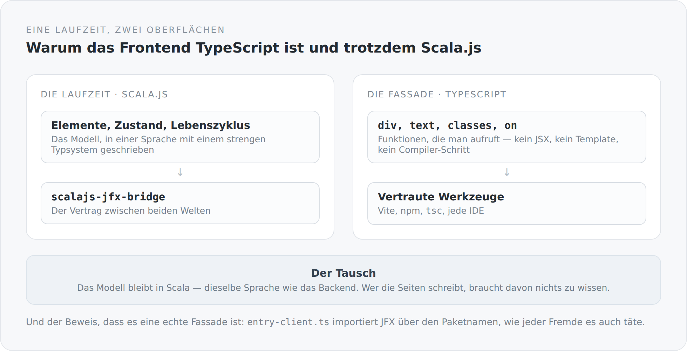

Das Frontend dieses Blogs ist TypeScript. Es benutzt Vite, npm und `tsc`, und jede TypeScript-Entwicklerin könnte eine Seite darin schreiben, ohne etwas Neues zu lernen.

Darunter liegt Scala.js.

Diese Kombination braucht eine Erklärung, weil sie auf den ersten Blick nach dem Schlechtesten aus zwei Welten aussieht.

## Die Ausgangslage

Ich schreibe das Backend in Scala 3. Ich mag die Sprache, weil sie ausdrucksstark und streng gleichzeitig ist. Der naheliegende Gedanke wäre gewesen, auch das Frontend in Scala zu schreiben — Scala.js gibt es, es funktioniert, und dann wäre alles eine Sprache.

Der Haken: Wer das Frontend anfassen will, muss dann Scala können. Und das gesamte Ökosystem — jede Bibliothek, jedes Beispiel, jedes Werkzeug, jeder Editor, jeder Stack-Overflow-Eintrag — spricht TypeScript.

Die andere naheliegende Lösung wäre gewesen, das Frontend ganz in TypeScript zu schreiben und Scala im Backend zu lassen. Dann hätte ich zwei Modelle, zwei Denkweisen und zwei Orte, an denen dieselben Konzepte leicht unterschiedlich heißen.

## Die dritte Möglichkeit

{width=720}

JFX 3 ist eine UI-Laufzeit, geschrieben in Scala.js: Elemente, Zustand, Bindung, Lebenszyklus, Routing, Serialisierung. Darüber liegt eine TypeScript-Fassade.

Die Fassade ist keine Übersetzungsschicht mit Reibungsverlust. Sie ist eine Menge von Funktionen, die man aufruft:

```ts
export function imprintPage(): void {
  div(() => {
    classes("imprint-page", "content-page");
    pageSeo({ title: translated("Imprint").get, path: "/impressum" });

    div(() => {
      classes("imprint-page__hero", "content-page__header");
      heading(1, () => text(translated("Imprint")));
      paragraph(() => text(translated("Angaben gemäß § 5 DDG.")));
    });
  });
}
```

Kein JSX, kein Template, kein Compiler-Schritt, der aus einer eigenen Sprache Code erzeugt. Was dasteht, passiert, in der Reihenfolge, in der es dasteht. `div(...)` öffnet ein Element, alles im Callback läuft in dessen Kontext, danach ist es zu.

Wer das liest, muss nichts über Scala wissen. Wer JFX weiterentwickelt, arbeitet in Scala.

## Kein virtueller DOM

Das ist die zweite Entscheidung, die in dieser Zeile steckt.

Ein virtueller DOM ist ein Trick, um ein deklaratives Programmiermodell auf einen imperativen Baum abzubilden: Man beschreibt, wie es aussehen soll, das Framework rechnet aus, was sich geändert hat, und macht die Änderungen. Das funktioniert gut und kostet — Speicher für den zweiten Baum, Zeit für den Vergleich, und eine Menge Regeln darüber, wann neu gerendert wird.

JFX geht den anderen Weg: Der Zustand ist beobachtbar, und wer sich für ihn interessiert, hört zu. Ändert sich ein Wert, ändert sich genau das, was an ihm hängt. Es gibt nichts zu vergleichen, weil nichts neu erzeugt wird.

```ts
const notice = property("");
disposeWith(message.observeWithoutInitial(value => notice.set(available ? "" : value)));
text(notice);
```

`text(notice)` bindet einen Textknoten an einen Wert. Ändert sich der Wert, ändert sich der Knoten. Sonst nichts.

Der Preis ist, dass man den Lebenszyklus selbst führen muss. Wer zuhört, muss irgendwann aufhören zuzuhören. Genau darum geht es im nächsten Artikel.

## Der Beweis, dass es eine Fassade ist

Im `entry-client.ts` steht ein langer Kommentar, den ich hier ganz zitiere, weil er eine Geschichte erzählt:

```ts
// Imported by package specifier, like any other consumer would. That this is
// possible at all is the point of the npm modularisation: the relative path
// that used to stand here (`../../jfx/src/index.js`) existed because Vite's SSR
// module runner did not reliably dedupe a `file:` symlink against a direct path
// to the same file, and installRuntime()'s "installed" state lives in one
// module-level variable -- two module instances meant two slots. The fix is in
// vite.config.ts's `resolve.dedupe`, at the cause; see CLAUDE_REVIEW_3.md §7.1.
import { hydrate } from "@anjunar/jfx-core";
```

Früher stand hier ein relativer Pfad. Das war eine Notlösung: Über den Symlink konnte dasselbe Modul zweimal im Graphen landen, und die Laufzeit hat eine Variable auf Modulebene, die dann zweimal existierte — zwei Instanzen, zwei Welten, keine sieht die andere.

Der relative Pfad hätte das Symptom beseitigt. Behoben wurde stattdessen die Ursache, in der Vite-Konfiguration, mit `resolve.dedupe`.

Dass der Import heute wieder über den Paketnamen läuft, ist deshalb mehr als Kosmetik. Es ist der Nachweis, dass JFX von diesem Blog aus genauso benutzt wird wie von jedem anderen Projekt. Eine Abstraktion, die für ihren eigenen Autor eine Ausnahme braucht, ist keine.

## Was das kostet

**Zwei Repositories, ein Vertrag.** Das steht ausführlich im Artikel über die lokalen npm-Pakete. Kurz: Die Bridge zwischen Scala.js und TypeScript wandert auf beiden Seiten gemeinsam weiter, und man darf veröffentlichte und lokale Pakete nicht mischen.

**Eine Schicht, die niemand sonst kennt.** React kann jeder. JFX kann ich. Für ein persönliches Projekt ist das in Ordnung, für ein Team wäre es eine ernsthafte Frage.

**Und Fehler können tief fallen.** Wenn etwas in der Scala.js-Laufzeit schiefgeht, hilft der TypeScript-Stacktrace begrenzt weiter.

## Warum es das trotzdem gibt

Weil dieser Blog zwei Zwecke hat. Er ist ein Blog, und er ist der Ort, an dem sich JFX beweisen muss.

Ein Framework, das nur in seinen eigenen Beispielen funktioniert, funktioniert nicht. Erst ein echtes System mit Formularen, Routing, Mehrsprachigkeit, Editor, serverseitigem Rendering und Hydration zeigt, wo die Ideen tragen und wo nicht. Jedes „das geht so nicht" in diesem Blog ist eine Änderung im Nachbarrepository.

Das ist der eigentliche Grund für die ganze Konstruktion: Der Blog ist gleichzeitig Anwendung und Prüfstand.

Im nächsten Artikel geht es um den Preis, den ein Framework ohne virtuellen DOM verlangt — und darum, dass er in diesem Fall an einer Stelle bezahlt wird, die ich für die richtige halte.
