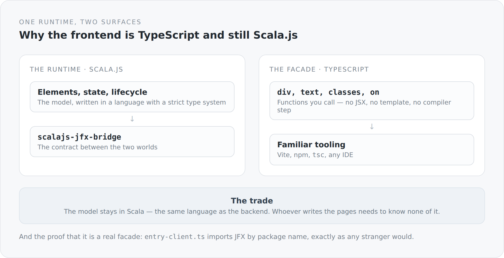

The frontend of this blog is TypeScript. It uses Vite, npm and `tsc`, and any TypeScript developer could write a page in it without learning anything new.

Underneath it sits Scala.js.

That combination needs an explanation, because at first glance it looks like the worst of two worlds.

## The starting point

I write the backend in Scala 3. I like the language, because it is expressive and strict at the same time. The obvious thought would have been to write the frontend in Scala as well — Scala.js exists, it works, and then everything would be one language.

The catch: anyone who wants to touch the frontend then has to know Scala. And the entire ecosystem — every library, every example, every tool, every editor, every Stack Overflow answer — speaks TypeScript.

The other obvious solution would have been to write the frontend entirely in TypeScript and leave Scala in the backend. Then I would have two models, two ways of thinking, and two places where the same concepts are named slightly differently.

## The third possibility

{width=720}

JFX 3 is a UI runtime written in Scala.js: elements, state, binding, lifecycle, routing, serialization. On top of it sits a TypeScript facade.

The facade is not a translation layer with friction losses. It is a set of functions you call:

```ts
export function imprintPage(): void {
  div(() => {
    classes("imprint-page", "content-page");
    pageSeo({ title: translated("Imprint").get, path: "/impressum" });

    div(() => {
      classes("imprint-page__hero", "content-page__header");
      heading(1, () => text(translated("Imprint")));
      paragraph(() => text(translated("Information pursuant to Section 5 DDG.")));
    });
  });
}
```

No JSX, no template, no compiler step that turns a dialect into code. What is written happens, in the order it is written. `div(...)` opens an element, everything in the callback runs in its context, and afterwards it is closed.

Whoever reads that needs to know nothing about Scala. Whoever develops JFX works in Scala.

## No virtual DOM

That is the second decision hidden in this line.

A virtual DOM is a trick for mapping a declarative programming model onto an imperative tree: you describe how it should look, the framework works out what changed, and applies the changes. That works well and it costs — memory for the second tree, time for the comparison, and a pile of rules about when re-rendering happens.

JFX goes the other way: state is observable, and whoever is interested in it listens. When a value changes, exactly what hangs on it changes. There is nothing to compare, because nothing is recreated.

```ts
const notice = property("");
disposeWith(message.observeWithoutInitial(value => notice.set(available ? "" : value)));
text(notice);
```

`text(notice)` binds a text node to a value. When the value changes, the node changes. Nothing else.

The price is that you have to manage the lifecycle yourself. Whoever listens has to stop listening at some point. That is exactly what the next article is about.

## The proof that it is a facade

`entry-client.ts` contains a long comment I will quote in full here, because it tells a story:

```ts
// Imported by package specifier, like any other consumer would. That this is
// possible at all is the point of the npm modularisation: the relative path
// that used to stand here (`../../jfx/src/index.js`) existed because Vite's SSR
// module runner did not reliably dedupe a `file:` symlink against a direct path
// to the same file, and installRuntime()'s "installed" state lives in one
// module-level variable -- two module instances meant two slots. The fix is in
// vite.config.ts's `resolve.dedupe`, at the cause; see CLAUDE_REVIEW_3.md §7.1.
import { hydrate } from "@anjunar/jfx-core";
```

There used to be a relative path here. That was a workaround: over the symlink the same module could land in the graph twice, and the runtime has a module-level variable that then existed twice — two instances, two worlds, neither seeing the other.

The relative path would have removed the symptom. What was fixed instead was the cause, in the Vite configuration, with `resolve.dedupe`.

That the import goes through the package name again today is therefore more than cosmetic. It is proof that JFX is used from this blog exactly as it would be used from any other project. An abstraction that needs an exception for its own author is not one.

## What it costs

**Two repositories, one contract.** That is covered at length in the article about local npm packages. In short: the bridge between Scala.js and TypeScript advances on both sides together, and published and local packages must not be mixed.

**A layer nobody else knows.** Everyone can do React. I can do JFX. For a personal project that is fine; for a team it would be a serious question.

**And failures can fall a long way.** When something goes wrong in the Scala.js runtime, the TypeScript stack trace only helps so much.

## Why it exists anyway

Because this blog has two purposes. It is a blog, and it is the place where JFX has to prove itself.

A framework that only works in its own examples does not work. Only a real system with forms, routing, localization, an editor, server-side rendering and hydration shows where the ideas hold and where they do not. Every "that does not work like this" in this blog is a change in the neighbouring repository.

That is the actual reason for the whole construction: the blog is application and test bench at the same time.

The next article is about the price a framework without a virtual DOM demands — and about the fact that in this case it is paid somewhere I consider the right place.
