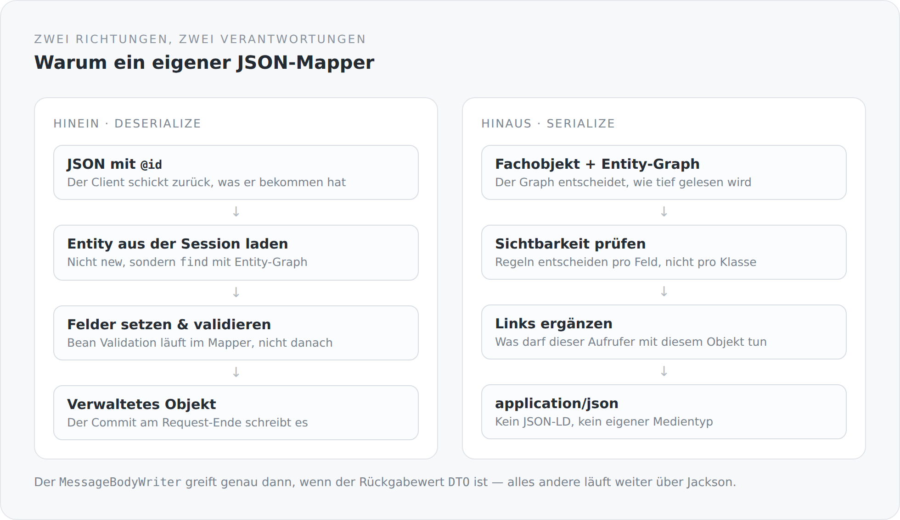

Es gibt wenige Entscheidungen, die man schlechter begründen kann als „ich habe mir einen eigenen JSON-Mapper gebaut". Jackson ist ausgereift, schnell, gut dokumentiert und in jedem Projekt vorhanden. Es gibt keinen guten Grund, das nachzubauen.

Ich habe auch nichts nachgebaut. Jackson ist im Classpath und wird benutzt. Aber es gibt einen zweiten Weg für einen bestimmten Fall, und dieser Artikel erklärt, welchen und warum.

## Der Fall, den Jackson allein nicht löst

Ein Client bekommt einen Artikel. Er ändert den Titel. Er schickt das Objekt zurück.

Was soll jetzt passieren? Bei einer normalen Deserialisierung entsteht ein neues Objekt mit den Feldern aus dem JSON. Dieses Objekt ist nicht die Entität aus der Datenbank — es ist ein Fremder mit derselben Id. Um daraus ein Update zu machen, muss jemand die echte Entität laden und die Felder übertragen. Diesen Code schreibt man in jedem Controller neu, und in jedem Controller etwas anders.

Genau das passiert hier stattdessen:

```scala
val idNode = Option(jsonObject.value.get("@id")).getOrElse(jsonObject.value.get("id"))

val instance: AnyRef =
  if (idNode == null || idNode.isInstanceOf[JsonNull]
      || !classOf[EntityProvider].isAssignableFrom(resolvedClass.raw)) {
    resolvedClass.raw.getConstructor().newInstance()
  } else {
    val primaryKey = extractUuid(idNode.value.toString)
    val entity = findWithEntityGraph(resolvedClass.raw, primaryKey, entityGraph)
    if (entity != null) entity else resolvedClass.raw.getConstructor().newInstance()
  }
```

Trägt das JSON eine Id und ist der Zieltyp eine Entität, wird das verwaltete Objekt aus dem Persistenzkontext geladen und *in dieses* hineingeschrieben. Am Ende des Requests committet der Transaktionsfilter, und Hibernate schreibt genau die Felder, die sich geändert haben.

Der Controller muss dafür nichts tun. Er bekommt eine Entität, die schon die richtige ist.

{width=720}

## Der Entity-Graph als roter Faden

Durch beide Richtungen zieht sich ein Begriff: der Entity-Graph.

```scala
private def resolveEntityGraph(entityGraphName: String) =
  if (entityGraphName == null) null
  else entityManager.getEntityGraph(entityGraphName)
```

Der Name kommt von der aufgerufenen Methode — `RestMethodSupport.entityGraphName(resourceInfo)` liest ihn aus der Ressource, die gerade dran ist. Damit legt der Endpunkt fest, wie tief gelesen wird, und dieselbe Festlegung gilt beim Serialisieren *und* beim Deserialisieren.

Das löst ein Problem, das man sonst zweimal löst. Ohne Graph entscheidet beim Lesen das Lazy-Loading, und beim Schreiben entscheidet die Kaskadierung — zwei getrennte Mechanismen, die man aufeinander abstimmen muss. Mit Graph steht an einer Stelle, welcher Ausschnitt des Objektgeflechts dieser Endpunkt bedient.

Beim Laden mit Graph wird zusätzlich aufgefrischt:

```scala
val hints = java.util.Map.of[String, Any]("jakarta.persistence.fetchgraph", entityGraph)
val entity = entityManager.find(clazz, id, hints)
if (entity != null) entityManager.refresh(entity, hints)
```

Das ist nicht gratis — ein `refresh` ist eine zusätzliche Abfrage. Es garantiert dafür, dass die Assoziationen wirklich geladen sind und nicht nur in dem Umfang, in dem sie zufällig schon im Persistenzkontext lagen.

## Validierung gehört in den Mapper

```scala
JsonMapper.deserialize(jsonObject, instance, resolvedClass, entityGraph, loader, beanLookup, validator)
```

Der `Validator` wird hineingereicht. Bean Validation läuft also während der Deserialisierung, nicht danach.

Der Unterschied ist nicht kosmetisch. Läuft die Validierung danach, kann der Mapper schon Felder auf eine verwaltete Entität geschrieben haben, bevor jemand merkt, dass sie ungültig sind. Man müsste sich auf den Rollback verlassen. Läuft sie währenddessen, entstehen Fehler dort, wo auch der Feldname bekannt ist — und die Antwort kann sagen, *welches* Feld falsch war, nicht nur *dass* etwas falsch war.

## Wo dieser Weg greift — und wo nicht

Der `MessageBodyWriter` ist bewusst wählerisch:

```scala
override def isWriteable(clazz: Class[?], genericType: Type,
                         annotations: Array[Annotation], mediaType: MediaType): Boolean =
  classOf[DTO].isAssignableFrom(clazz) ||
    classOf[java.util.Collection[?]].isAssignableFrom(clazz) ||
    classOf[java.util.Map[?, ?]].isAssignableFrom(clazz)
```

Nur wenn der Rückgabewert das Marker-Interface `DTO` trägt, greift der eigene Mapper. Alles andere geht den normalen Weg. Die Exception-Mapper zum Beispiel geben eine schlichte `LinkedHashMap` mit `timestamp`, `status`, `error`, `message`, `path` zurück — dafür braucht es keine Schema-Erzeugung und keine Link-Berechnung.

Zwei Wege nebeneinander sind normalerweise ein Geruch. Hier halte ich sie für richtig, weil sie zwei verschiedene Dinge tun: Der eine transportiert Fachobjekte samt ihrer Möglichkeiten, der andere transportiert Nachrichten.

## Was ich mir damit eingehandelt habe

**Reflexion.** `TypeResolver`, `AnnotationIntrospector`, generische Typauflösung zur Laufzeit. Das ist schwer zu debuggen, wenn es einmal nicht tut, was man denkt.

**Ein globaler Zugriffspunkt.** `RuntimeContext.getBean(clazz)` und `RuntimeContext.entityManager()` sind statische Einstiege in den CDI-Kontext, weil der Mapper an Stellen läuft, an denen Injektion nicht greift. Das ist die zweite kleine Wunde in diesem Modul, nach dem statischen Komponenten-Index.

**Eine eigene Bibliothek.** `com.anjunar:json-mapper` ist ein weiteres Projekt von mir. Wer diesen Blog verstehen will, muss irgendwann auch dort hineinsehen.

**Und eine Kopplung, die man sich anschauen muss.** Deserialisierung, Persistenz und Validierung passieren an einer Stelle. Das ist bequem und dicht. Wenn ich diese Stelle jemals ändern muss, ändere ich drei Dinge gleichzeitig.

## Warum es trotzdem so ist

Weil die Alternative nicht „weniger Komplexität" heißt, sondern „dieselbe Komplexität, verteilt auf jeden Controller".

Der Code, der eine Entität lädt, Felder überträgt, validiert und Assoziationen behandelt, muss irgendwo stehen. Entweder einmal an einer Stelle, die man dokumentieren kann — oder zwanzigmal in leicht unterschiedlichen Varianten, von denen drei einen Fehler haben.

Ich habe mich für einmal entschieden. Der Artikel, den Sie gerade lesen, ist ein Teil der Dokumentation, die zu dieser Entscheidung gehört.

Im nächsten Artikel geht es darum, was am anderen Ende herauskommt: die drei Formen, in denen dieser Server überhaupt antwortet.
