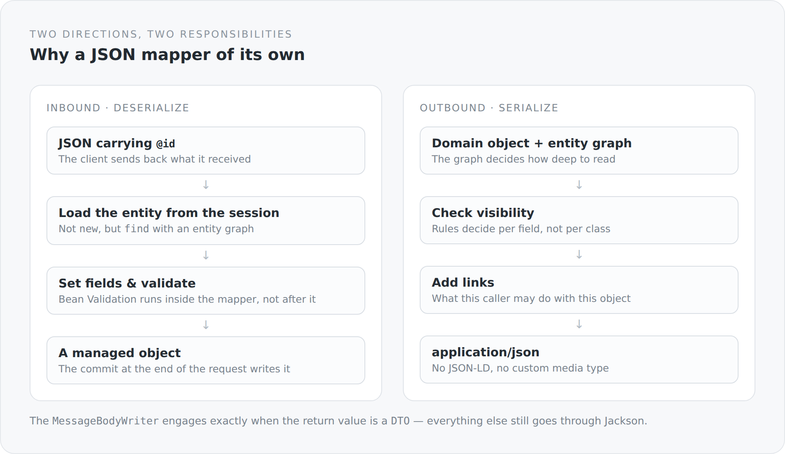

There are few decisions harder to justify than "I built my own JSON mapper". Jackson is mature, fast, well documented and present in every project. There is no good reason to rebuild it.

I did not rebuild anything. Jackson is on the classpath and gets used. But there is a second route for one particular case, and this article explains which one and why.

## The case Jackson alone does not solve

A client receives an article. It changes the title. It sends the object back.

What should happen now? With ordinary deserialization a new object appears with the fields from the JSON. That object is not the entity from the database — it is a stranger with the same id. To turn it into an update, somebody has to load the real entity and copy the fields over. You write that code in every controller, and slightly differently in each one.

This is what happens instead:

```scala
val idNode = Option(jsonObject.value.get("@id")).getOrElse(jsonObject.value.get("id"))

val instance: AnyRef =
  if (idNode == null || idNode.isInstanceOf[JsonNull]
      || !classOf[EntityProvider].isAssignableFrom(resolvedClass.raw)) {
    resolvedClass.raw.getConstructor().newInstance()
  } else {
    val primaryKey = extractUuid(idNode.value.toString)
    val entity = findWithEntityGraph(resolvedClass.raw, primaryKey, entityGraph)
    if (entity != null) entity else resolvedClass.raw.getConstructor().newInstance()
  }
```

If the JSON carries an id and the target type is an entity, the managed object is loaded from the persistence context and written *into*. At the end of the request the transaction filter commits, and Hibernate writes exactly the fields that changed.

The controller does not have to do anything for that. It receives an entity that is already the right one.

{width=720}

## The entity graph as the common thread

One concept runs through both directions: the entity graph.

```scala
private def resolveEntityGraph(entityGraphName: String) =
  if (entityGraphName == null) null
  else entityManager.getEntityGraph(entityGraphName)
```

The name comes from the method being invoked — `RestMethodSupport.entityGraphName(resourceInfo)` reads it from the resource currently in play. The endpoint therefore determines how deep to read, and the same determination applies both when serializing *and* when deserializing.

That solves a problem you otherwise solve twice. Without a graph, lazy loading decides when reading and cascading decides when writing — two separate mechanisms you have to keep in tune. With a graph, one place states which slice of the object web this endpoint serves.

Loading with a graph also refreshes:

```scala
val hints = java.util.Map.of[String, Any]("jakarta.persistence.fetchgraph", entityGraph)
val entity = entityManager.find(clazz, id, hints)
if (entity != null) entityManager.refresh(entity, hints)
```

That is not free — a `refresh` is an extra query. In exchange it guarantees that the associations really are loaded, and not merely to the extent that they happened to be in the persistence context already.

## Validation belongs in the mapper

```scala
JsonMapper.deserialize(jsonObject, instance, resolvedClass, entityGraph, loader, beanLookup, validator)
```

The `Validator` is passed in. Bean Validation therefore runs during deserialization, not after it.

The difference is not cosmetic. If validation runs afterwards, the mapper may already have written fields onto a managed entity before anyone notices they are invalid. You would have to rely on the rollback. If it runs during, errors appear where the field name is also known — and the response can say *which* field was wrong, not merely *that* something was.

## Where this route applies — and where it does not

The `MessageBodyWriter` is deliberately picky:

```scala
override def isWriteable(clazz: Class[?], genericType: Type,
                         annotations: Array[Annotation], mediaType: MediaType): Boolean =
  classOf[DTO].isAssignableFrom(clazz) ||
    classOf[java.util.Collection[?]].isAssignableFrom(clazz) ||
    classOf[java.util.Map[?, ?]].isAssignableFrom(clazz)
```

Only when the return value carries the `DTO` marker interface does the custom mapper engage. Everything else takes the normal route. The exception mappers, for instance, return a plain `LinkedHashMap` with `timestamp`, `status`, `error`, `message`, `path` — that needs no schema generation and no link computation.

Two routes side by side are normally a smell. Here I think they are right, because they do two different things: one transports domain objects together with their possibilities, the other transports messages.

## What I took on with it

**Reflection.** `TypeResolver`, `AnnotationIntrospector`, generic type resolution at runtime. Hard to debug when it once does not do what you think.

**A global access point.** `RuntimeContext.getBean(clazz)` and `RuntimeContext.entityManager()` are static entries into the CDI context, because the mapper runs in places where injection does not reach. That is the second small wound in this module, after the static component index.

**A library of my own.** `com.anjunar:json-mapper` is another project of mine. Anyone who wants to understand this blog eventually has to look in there too.

**And a coupling worth examining.** Deserialization, persistence and validation happen in one place. That is convenient and dense. If I ever have to change that place, I change three things at once.

## Why it is like that anyway

Because the alternative is not "less complexity", but "the same complexity, distributed across every controller".

The code that loads an entity, copies fields, validates and handles associations has to live somewhere. Either once, in a place you can document — or twenty times in slightly different variants, three of which have a bug.

I chose once. The article you are reading is part of the documentation that belongs to that decision.

The next article covers what comes out at the other end: the three shapes this server answers in at all.
