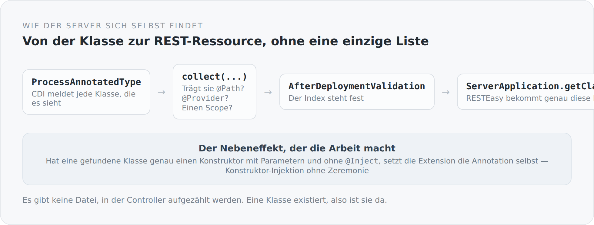

In einem Applikationsserver gibt es eine Stelle, an der jemand entscheidet, welche Klassen REST-Ressourcen sind. Man sieht sie nie. Man legt ein WAR hinein, und danach gibt es Endpunkte.

Wenn man keinen Applikationsserver hat, muss man diese Stelle selbst bauen. Sie liegt in `system`, ist etwa hundert Zeilen lang, und dieser Artikel handelt von ihr.

## Das Problem

Jakarta REST braucht eine `Application`-Klasse, die sagt, welche Ressourcen und Provider es gibt. Der naive Weg ist eine Liste:

```scala
override def getClasses = Set(
  classOf[BlogPostController],
  classOf[BlogPostsController],
  classOf[BlogCommentController],
  // ... und so weiter, für immer
)
```

Das funktioniert und ist die zuverlässigste Methode, um irgendwann einen Endpunkt zu haben, der nicht erreichbar ist, weil jemand eine Zeile vergessen hat.

CDI weiß aber ohnehin schon von jeder Klasse im Deployment. Die Frage ist nur, ob man zuhört.

## Eine CDI-Extension, die zuhört

```scala
class ResteasyComponentExtension extends Extension {

  private val resourceClasses = new util.LinkedHashSet[Class[?]]()
  private val providerClasses = new util.LinkedHashSet[Class[?]]()

  def collect(@Observes event: ProcessAnnotatedType[?]): Unit = {
    val javaClass = event.getAnnotatedType.getJavaClass

    if (isConcrete(javaClass) && !javaClass.isAnnotationPresent(classOf[Vetoed])) {
      val resource = javaClass.isAnnotationPresent(classOf[Path])
      val provider = javaClass.isAnnotationPresent(classOf[Provider])
      val scoped   = hasScope(javaClass)

      if (resource || provider || scoped) {
        if (resource) resourceClasses.add(javaClass)
        if (provider) providerClasses.add(javaClass)
        // ...
      }
    }
  }
}
```

`ProcessAnnotatedType` ist ein CDI-Lebenszyklus-Ereignis, das für jede Klasse im Deployment ausgelöst wird. Die Extension sieht also alles, was es gibt, und sortiert es in zwei Mengen: `@Path` sind Ressourcen, `@Provider` sind Provider.

{width=720}

Am Ende der Deployment-Phase steht der Index fest, und die `Application`-Klasse ist eine einzige Zeile:

```scala
@ApplicationPath("service")
class ServerApplication extends Application {
  override def getClasses: util.Set[Class[?]] =
    ResteasyComponentIndex.allClasses.toSet.asJava
}
```

Ein Controller existiert also, weil er existiert. Nicht, weil er zusätzlich noch irgendwo eingetragen wurde.

## Der Nebeneffekt, der die eigentliche Arbeit macht

In derselben Methode steckt noch etwas, das ich fast wichtiger finde:

```scala
if (shouldMarkInjectConstructor(javaClass)) {
  configuredType
    .filterConstructors(_ => true)
    .forEach(constructor => constructor.add(InjectLiteral.Instance))
}

private def shouldMarkInjectConstructor(javaClass: Class[?]): Boolean =
  javaClass.getDeclaredConstructors.length == 1 &&
    !javaClass.getDeclaredConstructors.head.isAnnotationPresent(classOf[Inject]) &&
    !javaClass.getDeclaredConstructors.head.getParameterTypes.isEmpty
```

Hat eine Klasse genau einen Konstruktor, hat der Parameter, und fehlt ihm `@Inject` — dann setzt die Extension die Annotation selbst.

Das ist derselbe Komfort, den man von Spring kennt, in acht Zeilen und ohne Framework. Und es hat einen Nebeneffekt, der mir wichtiger ist als die gesparte Annotation: Wenn Konstruktor-Injektion selbstverständlich ist, benutzt man sie. Und wenn man sie benutzt, sind Abhängigkeiten sichtbar und Objekte nach der Konstruktion vollständig. Feld-Injektion mit `var x: Foo = uninitialized` ist immer ein Zeitfenster, in dem ein Objekt halb da ist.

Ich halte mich selbst nicht überall daran — an einigen Stellen im Projekt steht noch Feld-Injektion. Aber die Infrastruktur dafür ist gebaut.

## Der Index ist ein Objekt

Der Index existiert zweimal: als CDI-Bean und als Singleton-Objekt.

```scala
def registerIndexBean(@Observes event: AfterBeanDiscovery): Unit = {
  event.addBean()
    .beanClass(classOf[ResteasyComponentRegistry])
    .scope(classOf[Singleton])
    .createWith(ctx => new ResteasyComponentRegistry(
      resourceClasses.asScala.toList, providerClasses.asScala.toList))
}

def finish(@Observes event: AfterDeploymentValidation): Unit =
  ResteasyComponentIndex.initialize(resourceClasses.asScala, providerClasses.asScala)
```

Die Bean ist für alles, was CDI kennt. Das statische Objekt ist für die `Application`-Klasse, die RESTEasy instanziiert, bevor CDI-Injektion dort greift. Ein Henne-Ei-Problem, an genau einer Stelle gelöst, mit `@volatile` und ohne Framework.

Das ist keine schöne Lösung. Statischer Zustand ist immer eine kleine Wunde. Aber sie ist klein, sie steht an einer Stelle, und sie hat einen Grund, den man in zwei Sätzen erklären kann. Das ist mir lieber als eine elegante Konstruktion, die man erst nach einer halben Stunde versteht.

## Was daneben noch nötig war

Der REST-Layer besteht nicht nur aus dem Index. In `system` liegen außerdem:

- ein `ParamConverterProvider`, damit `@PathParam` eine Entität direkt laden kann,
- Message-Body-Reader und -Writer für das eigene JSON-Format,
- Exception-Mapper, die aus geworfenen Fehlern strukturierte Antworten machen,
- ein Filter für Transaktionen,
- ein Interceptor für Zeitmessung.

Jedes dieser Teile ersetzt etwas, das ein Applikationsserver mitgebracht hätte. Zusammen sind das vielleicht achthundert Zeilen. Das ist der Preis, den ich im vorigen Artikel angekündigt habe, jetzt als Zahl.

## Was ich davon habe

Ein Beispiel. Als eine Klasse nicht als REST-Ressource auftauchte, war die Frage nicht „warum findet der Server sie nicht" — sondern „ist sie konkret, hat sie `@Path`, ist sie nicht `@Vetoed`". Drei Bedingungen, alle in einer Methode, alle lesbar.

In einem Applikationsserver hätte dieselbe Frage bedeutet: Dokumentation lesen, Scanning-Regeln verstehen, `beans.xml` prüfen, Klassenlader-Reihenfolge vermuten. Nicht weil das System schlechter wäre, sondern weil die Antwort woanders liegt.

Das ist der ganze Punkt dieses Moduls. Nicht, dass es besser wäre. Sondern dass die Antwort im Projekt liegt.

Der nächste Artikel nimmt sich das Stück Verkabelung vor, das die meisten Fehler verursacht, wenn es fehlt: die Transaktion.
