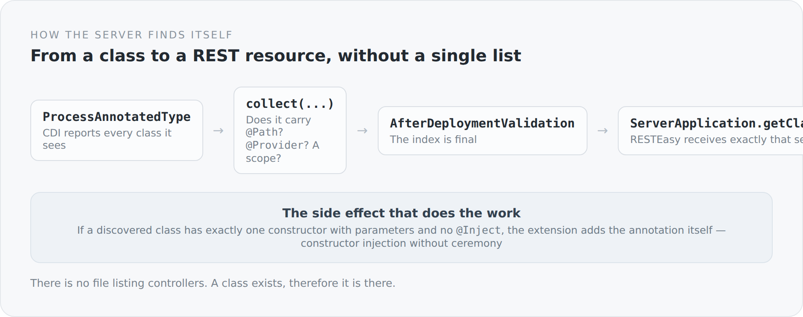

Inside an application server there is a place where somebody decides which classes are REST resources. You never see it. You drop in a WAR, and afterwards there are endpoints.

When you do not have an application server, you have to build that place yourself. It lives in `system`, is about a hundred lines long, and this article is about it.

## The problem

Jakarta REST needs an `Application` class that says which resources and providers exist. The naive route is a list:

```scala
override def getClasses = Set(
  classOf[BlogPostController],
  classOf[BlogPostsController],
  classOf[BlogCommentController],
  // ... and so on, forever
)
```

That works and is the most reliable method of eventually having an endpoint that is unreachable because somebody forgot a line.

But CDI already knows about every class in the deployment. The only question is whether anyone is listening.

## A CDI extension that listens

```scala
class ResteasyComponentExtension extends Extension {

  private val resourceClasses = new util.LinkedHashSet[Class[?]]()
  private val providerClasses = new util.LinkedHashSet[Class[?]]()

  def collect(@Observes event: ProcessAnnotatedType[?]): Unit = {
    val javaClass = event.getAnnotatedType.getJavaClass

    if (isConcrete(javaClass) && !javaClass.isAnnotationPresent(classOf[Vetoed])) {
      val resource = javaClass.isAnnotationPresent(classOf[Path])
      val provider = javaClass.isAnnotationPresent(classOf[Provider])
      val scoped   = hasScope(javaClass)

      if (resource || provider || scoped) {
        if (resource) resourceClasses.add(javaClass)
        if (provider) providerClasses.add(javaClass)
        // ...
      }
    }
  }
}
```

`ProcessAnnotatedType` is a CDI lifecycle event fired for every class in the deployment. The extension therefore sees everything there is and sorts it into two sets: `@Path` are resources, `@Provider` are providers.

{width=720}

At the end of the deployment phase the index is final, and the `Application` class is a single line:

```scala
@ApplicationPath("service")
class ServerApplication extends Application {
  override def getClasses: util.Set[Class[?]] =
    ResteasyComponentIndex.allClasses.toSet.asJava
}
```

A controller therefore exists because it exists. Not because it was additionally registered somewhere.

## The side effect that does the real work

The same method contains something I find almost more important:

```scala
if (shouldMarkInjectConstructor(javaClass)) {
  configuredType
    .filterConstructors(_ => true)
    .forEach(constructor => constructor.add(InjectLiteral.Instance))
}

private def shouldMarkInjectConstructor(javaClass: Class[?]): Boolean =
  javaClass.getDeclaredConstructors.length == 1 &&
    !javaClass.getDeclaredConstructors.head.isAnnotationPresent(classOf[Inject]) &&
    !javaClass.getDeclaredConstructors.head.getParameterTypes.isEmpty
```

If a class has exactly one constructor, that constructor has parameters, and it lacks `@Inject` — then the extension adds the annotation itself.

That is the same convenience you know from Spring, in eight lines and without a framework. And it has a side effect I care about more than the saved annotation: when constructor injection is the obvious thing, people use it. And when they use it, dependencies are visible and objects are complete after construction. Field injection with `var x: Foo = uninitialized` is always a window of time in which an object is half there.

I do not follow that rule everywhere myself — some places in the project still use field injection. But the infrastructure for it is built.

## The index is an object

The index exists twice: as a CDI bean and as a singleton object.

```scala
def registerIndexBean(@Observes event: AfterBeanDiscovery): Unit = {
  event.addBean()
    .beanClass(classOf[ResteasyComponentRegistry])
    .scope(classOf[Singleton])
    .createWith(ctx => new ResteasyComponentRegistry(
      resourceClasses.asScala.toList, providerClasses.asScala.toList))
}

def finish(@Observes event: AfterDeploymentValidation): Unit =
  ResteasyComponentIndex.initialize(resourceClasses.asScala, providerClasses.asScala)
```

The bean is for everything CDI knows about. The static object is for the `Application` class, which RESTEasy instantiates before CDI injection reaches it. A chicken-and-egg problem, solved in exactly one place, with `@volatile` and without a framework.

That is not a beautiful solution. Static state is always a small wound. But it is small, it sits in one place, and it has a reason you can explain in two sentences. I prefer that to an elegant construction you understand only after half an hour.

## What else was needed alongside

The REST layer is not only the index. `system` also contains:

- a `ParamConverterProvider`, so that `@PathParam` can load an entity directly,
- message body readers and writers for the project's own JSON format,
- exception mappers that turn thrown errors into structured responses,
- a filter for transactions,
- an interceptor for timing.

Each of those replaces something an application server would have brought along. Together they are maybe eight hundred lines. That is the price I announced in the previous article, now as a number.

## What I get from it

An example. When a class did not show up as a REST resource, the question was not "why does the server not find it" — but "is it concrete, does it have `@Path`, is it not `@Vetoed`". Three conditions, all in one method, all readable.

Inside an application server the same question would have meant: read documentation, understand scanning rules, check `beans.xml`, guess at classloader ordering. Not because the system is worse, but because the answer lives somewhere else.

That is the whole point of this module. Not that it is better. But that the answer lives in the project.

The next article takes on the piece of wiring that causes the most failures when it is missing: the transaction.
