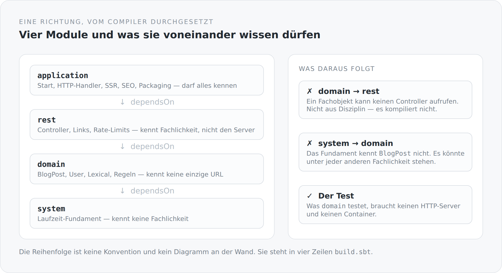

Fast jedes Projekt hat ein Schichtenbild. Es hängt im Wiki, es wird bei Onboardings gezeigt, und meistens beschreibt es einen Wunsch. Denn nichts im Projekt hindert jemanden daran, aus der untersten Schicht in die oberste zu greifen, wenn es gerade schnell gehen muss. Das Bild bleibt hängen, die Struktur zerfällt.

Deshalb steht die Schichtung dieses Blogs nicht in einem Bild, sondern im Build.

## Vier Zeilen

```scala
lazy val system = Project(id = "simplicity-blog-system", base = file("system"))

lazy val domain = Project(id = "simplicity-blog-domain", base = file("domain"))
  .dependsOn(system)

lazy val rest = Project(id = "simplicity-blog-rest", base = file("rest"))
  .dependsOn(domain)

lazy val application = Project(id = "simplicity-blog-backend", base = file("application"))
  .dependsOn(rest)
```

Das ist die vollständige Architekturaussage über das Backend. Vier Module, eine Kette, keine Abkürzung. `sbt` baut sie in dieser Reihenfolge, und der Scala-Compiler sieht in jedem Modul nur das, was unter ihm liegt.

{width=720}

## Was in welchem Modul lebt

**`system`** ist das Fundament und weiß nichts über Blogs. Hier liegt die Verkabelung: der Transaktionsfilter, die Message-Body-Reader und -Writer für JSON, die CDI-Extension, die REST-Komponenten einsammelt, die Exception-Mapper, ein Repository-Kontext über Hibernate, ein Suchmechanismus, ein kleiner Performance-Interceptor. Man könnte dieses Modul unter eine völlig andere Fachlichkeit stellen. Es würde nichts vermissen.

**`domain`** ist die Fachlichkeit. `BlogPost`, `BlogComment`, `BlogTag`, `User`, `Media`, die Lexical-Dokumentstruktur, der Markdown-Codec, die Sichtbarkeitsregeln, die Passwort-Behandlung. Dieses Modul kennt keine einzige URL. Es weiß nicht, dass es ein Web gibt.

**`rest`** ist die Schnittstelle nach außen. Controller, Transportmodelle, die Stellen, an denen Links entstehen, Rate-Limits, Zugriffsprüfungen. Dieses Modul kennt die Fachlichkeit und kennt HTTP — aber es kennt den Server nicht, in dem es später läuft.

**`application`** ist der Ort, an dem alles zusammenkommt und startet. Undertow-Handler, Konfiguration, Persistence-Producer, SEO, der GraalJS-Renderer, das Packaging. Und das TypeScript-Frontend, das im selben Modul liegt.

## Die Richtung ist wichtiger als die Anzahl

Vier Schichten sind unspektakulär. Fast jedes System hat so etwas. Was zählt, ist, was *nicht* geht.

`domain` kann keinen Controller aufrufen. Nicht, weil wir uns darauf geeinigt haben, sondern weil `rest` in diesem Modul nicht auf dem Classpath liegt. Wenn ich in einem `BlogPost` versucht wäre, „schnell mal" eine HTTP-Antwort zu formen, muss ich die `build.sbt` ändern. Und eine Änderung an der `build.sbt` sieht man im Diff. Eine Änderung an einer Konvention nicht.

`system` kennt `BlogPost` nicht. Das klingt selbstverständlich, ist es aber nicht. In vielen Projekten wandert Fachlichkeit langsam nach unten ins Framework, weil das Framework der bequemste Ort für gemeinsamen Code ist. Diese Grenze hält nur, wenn sie technisch ist.

## Der Beweis liegt in den Tests

Der beste Test für eine Schichtung ist nicht, ob sie sich gut anhört, sondern ob man die unteren Schichten allein testen kann.

In `domain` liegen Tests wie `BlogSlugBehaviorSpec`, `BlogPostLifecycleSpec`, `BlogMarkdownCodecSpec`, `LinkBuilderSpec`, `PasswordHashSpec`. In `rest` liegen `BlogCommentAccessSpec`, `BlogCommentRateLimiterSpec`, `ClientAddressSpec`, `MediaControllerSpec`.

Keiner dieser Tests startet einen HTTP-Server. Keiner braucht eine Datenbank. Keiner braucht einen Container. Sie prüfen Verhalten, nicht Infrastruktur — und sie können das nur, weil das Verhalten dort liegt, wo keine Infrastruktur ist.

Wenn ein Domänentest plötzlich einen Server bräuchte, wäre das kein Testproblem. Es wäre die Meldung, dass die Fachlichkeit nach oben gerutscht ist.

## Die Stelle, an der es unbequem wird

Ich möchte die Sache nicht schöner darstellen, als sie ist.

Ein Modul, das ganz unten liegt und keine Fachlichkeit kennen darf, wird zum Sammelplatz. Alles, was zwei Stellen gemeinsam brauchen, landet dort. `system` ist deshalb der Ort, den ich im Auge behalten muss. Es ist ein kleines Framework, und Frameworks haben die Angewohnheit, zu wachsen, weil jeder neue Bedarf sich dort am leichtesten unterbringen lässt. Die Grenze „kennt keine Fachlichkeit" hilft, ist aber nicht dasselbe wie „bleibt klein".

Und noch eine Ehrlichkeit: Ein paar Klassen in `system` heißen `QuarkusTransactionFilter`, `QuarkusGlobalExceptionMappers`, `QuarkusMapperMessageBodyWriter`. Es gibt in diesem Projekt kein Quarkus. Die Namen erzählen, woher die Idee stammt, nicht was der Code tut. Das ist eine kleine Schuld, die noch offen ist. Namen sind Teil der Architektur, und diese hier lügen ein bisschen.

## Und das Frontend?

Das TypeScript-Frontend liegt in `application/src/main/typescript` und ist damit formal Teil des obersten Moduls. Das ist bewusst so: Es hängt vom Backend genauso ab wie das Backend vom Frontend, nämlich über HTTP und über das SSR-Bundle — und beide Enden werden vom selben Build erzeugt.

Innerhalb des Frontends gibt es dieselbe Frage noch einmal, nur in klein: Was darf eine Seite über den Server wissen? Die Antwort dort ist noch strenger, und sie ist ein eigener Artikel wert.

## Warum das genügt

Man kann Schichtung mit Werkzeugen erzwingen, mit Architekturtests, mit Regeln in einer Pipeline. All das funktioniert. Aber es ist eine zweite Wahrheit neben dem Code, und zweite Wahrheiten veralten.

Vier `dependsOn` sind keine zweite Wahrheit. Sie sind die Bauanweisung selbst. Wenn die Struktur verletzt wird, gibt es kein Warning und keinen roten Report — es gibt einfach keinen Build.

Das ist für mich die praktischste Form von Architektur: eine, die man nicht einhalten *muss*, weil man sie gar nicht verletzen *kann*.
