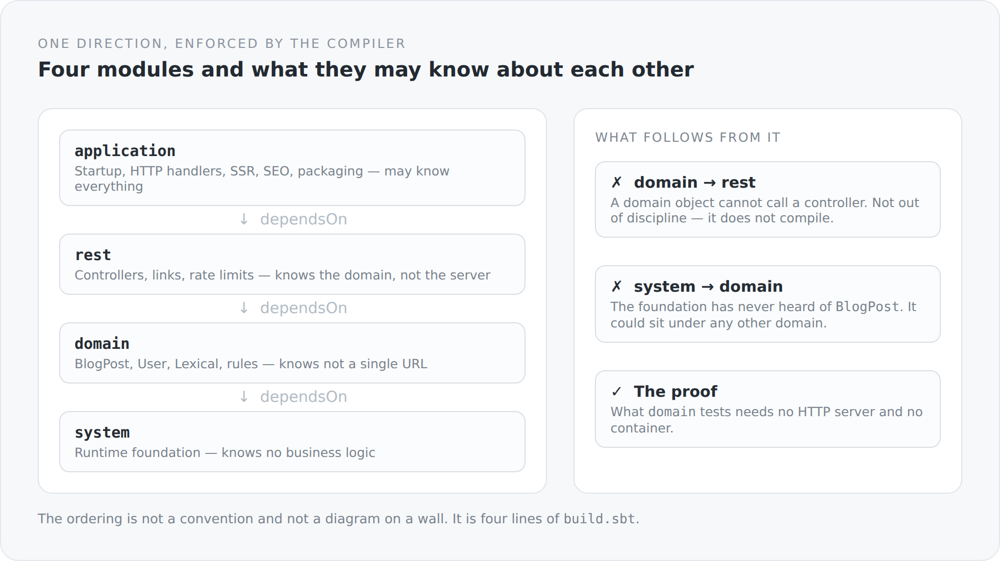

Almost every project has a layer diagram. It hangs in the wiki, it gets shown at onboardings, and most of the time it describes a wish. Because nothing in the project stops anyone from reaching from the bottom layer into the top one when things need to move fast. The picture stays on the wall, the structure falls apart.

That is why the layering of this blog does not live in a picture. It lives in the build.

## Four lines

```scala
lazy val system = Project(id = "simplicity-blog-system", base = file("system"))

lazy val domain = Project(id = "simplicity-blog-domain", base = file("domain"))
  .dependsOn(system)

lazy val rest = Project(id = "simplicity-blog-rest", base = file("rest"))
  .dependsOn(domain)

lazy val application = Project(id = "simplicity-blog-backend", base = file("application"))
  .dependsOn(rest)
```

That is the complete architectural statement about the backend. Four modules, one chain, no shortcut. `sbt` builds them in that order, and the Scala compiler sees, inside each module, only what lies beneath it.

{width=720}

## What lives in which module

**`system`** is the foundation and knows nothing about blogs. This is where the wiring lives: the transaction filter, the message body readers and writers for JSON, the CDI extension that collects REST components, the exception mappers, a repository context over Hibernate, a search mechanism, a small performance interceptor. You could place this module under a completely different domain. It would not miss a thing.

**`domain`** is the business model. `BlogPost`, `BlogComment`, `BlogTag`, `User`, `Media`, the Lexical document structure, the Markdown codec, the visibility rules, password handling. This module knows not a single URL. It does not know the web exists.

**`rest`** is the interface to the outside. Controllers, transport models, the places where links are created, rate limits, access checks. This module knows the domain and knows HTTP — but it does not know the server it will later run in.

**`application`** is where everything comes together and starts. Undertow handlers, configuration, persistence producers, SEO, the GraalJS renderer, packaging. And the TypeScript frontend, which lives in the same module.

## Direction matters more than count

Four layers is unremarkable. Almost every system has something like it. What counts is what is *not* possible.

`domain` cannot call a controller. Not because we agreed on it, but because `rest` is not on the classpath in that module. If I am tempted, inside a `BlogPost`, to "quickly" shape an HTTP response, I have to change `build.sbt`. And a change to `build.sbt` shows up in a diff. A change to a convention does not.

`system` has never heard of `BlogPost`. That sounds obvious and is not. In many projects, business logic slowly migrates downwards into the framework, because the framework is the most convenient place for shared code. That boundary only holds when it is technical.

## The proof is in the tests

The best test of a layering is not whether it sounds good, but whether the lower layers can be tested on their own.

In `domain` there are tests like `BlogSlugBehaviorSpec`, `BlogPostLifecycleSpec`, `BlogMarkdownCodecSpec`, `LinkBuilderSpec`, `PasswordHashSpec`. In `rest` there are `BlogCommentAccessSpec`, `BlogCommentRateLimiterSpec`, `ClientAddressSpec`, `MediaControllerSpec`.

None of these tests starts an HTTP server. None needs a database. None needs a container. They check behaviour, not infrastructure — and they can only do that because the behaviour lives where the infrastructure does not.

If a domain test suddenly needed a server, that would not be a testing problem. It would be the report that business logic has drifted upwards.

## Where it becomes uncomfortable

I do not want to make this look nicer than it is.

A module that sits at the bottom and is not allowed to know any business logic becomes a collecting point. Everything that two places need in common ends up there. `system` is therefore the module I have to keep an eye on. It is a small framework, and frameworks have a habit of growing, because every new need finds a home there most easily. The boundary "knows no business logic" helps, but it is not the same as "stays small".

And one more piece of honesty: a few classes in `system` are called `QuarkusTransactionFilter`, `QuarkusGlobalExceptionMappers`, `QuarkusMapperMessageBodyWriter`. There is no Quarkus in this project. The names tell you where the idea came from, not what the code does. That is a small outstanding debt. Names are part of an architecture, and these ones lie a little.

## And the frontend?

The TypeScript frontend lives in `application/src/main/typescript` and is therefore formally part of the topmost module. That is deliberate: it depends on the backend exactly as much as the backend depends on it, namely over HTTP and over the SSR bundle — and both ends are produced by the same build.

Inside the frontend the same question comes up again in miniature: what may a page know about the server? The answer there is even stricter, and it is worth an article of its own.

## Why that is enough

You can enforce layering with tools, with architecture tests, with rules in a pipeline. All of that works. But it is a second truth alongside the code, and second truths go stale.

Four `dependsOn` are not a second truth. They are the build instruction itself. When the structure is violated there is no warning and no red report — there is simply no build.

To me that is the most practical form of architecture: one you do not have to *keep* because you cannot *break* it.
