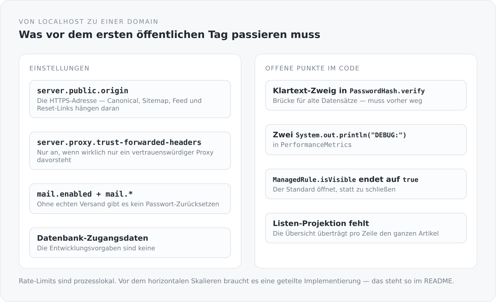

Dieser Blog läuft seit Monaten unter `http://localhost:8080`. Das ist ein bequemer Zustand: Alles funktioniert, niemand sieht es, und nichts ist verbindlich.

Dieser letzte Artikel der Reihe handelt davon, was sich ändert, wenn er eine Adresse bekommt — und von dem, was bis dahin offen ist.

## Was eingestellt werden muss

{width=720}

**`server.public.origin`.** Die von außen sichtbare HTTPS-Adresse. Der vorige Artikel hat gezeigt, was alles daran hängt: Canonical-Links, hreflang, Sitemap, Atom-Feed, die Links in Passwort-Reset-Mails. Ein falscher Wert ist konsistent falsch — was besser ist als teilweise falsch, aber immer noch falsch.

**`server.proxy.trust-forwarded-headers`.** Standardmäßig aus, und das soll so bleiben, bis die Anwendung wirklich nur über einen vertrauenswürdigen Proxy erreichbar ist. Angeschaltet bestimmt der erste `X-Forwarded-For`-Wert, wer für Rate-Limits als Client gilt — ein Header, den jeder setzen kann, wenn er die Anwendung direkt erreicht.

**`mail.enabled` und die SMTP-Einstellungen.** Solange der Versand aus ist, gibt es kein Passwort-Zurücksetzen und keine Registrierungsbestätigung. Beide Funktionen existieren im Code und tun nichts.

**Echte Datenbank-Zugangsdaten.** Die Entwicklungsvorgaben sind keine Zugangsdaten.

Und die Rate-Limits sind prozesslokal, was im README steht: Vor dem horizontalen Skalieren braucht es eine geteilte Implementierung.

## Was im Code offen ist

Ich habe diese Punkte in den jeweiligen Artikeln benannt. Hier stehen sie zusammen, weil eine Liste, die verteilt ist, keine Liste ist.

**Der Klartext-Zweig in `PasswordHash.verify`.** Eine Brücke für Datensätze aus der Zeit vor dem Hashing, mit einem Kommentar und einem zeitkonstanten Vergleich versehen. Vor dem ersten öffentlichen Tag muss dieser Zweig weg und die alten Datensätze mit ihm.

**Zwei `System.out.println("DEBUG: …")` in `PerformanceMetrics`.** Stehen gebliebene Fehlersuche, ausgerechnet in der Klasse, die Laufzeiten messen soll.

**`ManagedRule.isVisible` endet auf `true`.** Ein Feld, für das der Besitzer weder „für alle" noch eine Personenliste eingestellt hat, wäre sichtbar. Folgenlos, weil überall `OwnerRule` verwendet wird — der Standard ist trotzdem falsch herum.

**Die Übersichtsseite hat keine eigene Projektion.** Der Listen-Endpunkt liefert pro Zeile den vollständigen Artikel samt aller Übersetzungen als Lexical-Baum. Die beiden Entity-Graphs `BlogPost.list` und `BlogPost.full` haben verschiedene Namen und denselben Inhalt.

**Kein Löschen eines Passkeys.** Es gibt einen Weg hinein und keinen hinaus.

**Ein „Bearbeiten"-Schalter für anonyme Leser.** Rein lokal, ohne Speicherrecht — und trotzdem ein Widerspruch zu dem Prinzip, dass die Oberfläche zeigt, was die Relationen erlauben.

**Die Navigation ist einsprachig.** Titel und Zusammenfassungen im Katalog stehen als englische Zeichenketten, während der Rest des Frontends übersetzt wird.

**Und ein Docblock in `app/head.ts` behauptet, es gebe keine SEO-Ausgabe.** Es gibt sie.

Dazu kommen die Namen: `QuarkusTransactionFilter`, `QuarkusGlobalExceptionMappers`, `QuarkusMapperMessageBodyWriter` — in einem Projekt, in dem kein Quarkus läuft.

## Was bewusst fehlt

Eine Liste offener Punkte ist nur dann etwas wert, wenn daneben eine zweite steht: das, was nicht kommt.

Kein Newsletter. Keine Artikelserien als Datenmodell. Keine Lesezeit-Anzeige. Keine „verwandten Artikel". Keine Analytics. Kein zeitgesteuertes Veröffentlichen. Kein Volltext-Suchindex. Keine Revisionshistorie im Blog selbst — die führt git im Content-Repository.

Jeder dieser Punkte wäre machbar und einige wären nett. Sie fehlen, weil ein System, das alles kann, aufhört, eine Aussage zu sein.

## Was diese Reihe zeigen sollte

Zweiunddreißig Artikel über einen Blog sind ein absurdes Verhältnis. Genau das war die Absicht.

Ein großes System kann seine Entscheidungen hinter Größe verstecken. Man kann jahrelang in einem Projekt arbeiten und nie die Stelle sehen, an der entschieden wird, wann eine Transaktion committet. In einem kleinen System gibt es diese Ausrede nicht. Jede Entscheidung ist sichtbar, und jede muss sich rechtfertigen.

Ich habe versucht, in jedem Artikel dieselben drei Dinge zu tun: zeigen, wie es gebaut ist; sagen, was es kostet; und benennen, wo es noch nicht stimmt. Der dritte Teil war der wichtigste. Eine Architekturbeschreibung, in der alles aufgeht, ist keine Beschreibung, sondern Werbung.

## Was ich unterwegs gelernt habe

Drei Dinge, die ich vorher anders gesehen hätte.

**Der Build ist Architektur.** Vier `dependsOn` sagen mehr über die Struktur eines Systems aus als jedes Diagramm — weil sie durchgesetzt werden und ein Diagramm nicht.

**Sichtbarkeit gehört an das Feld.** Nicht in den Controller, nicht in eine Matrix, nicht in eine Prüfmethode. Sobald die Regel dort steht, wo die Daten stehen, gilt sie beim Lesen, beim Schreiben und im Formular gleichzeitig.

**Und eine Naht ist wichtiger als eine Schicht.** Die interessanteste Stelle dieses Systems ist nicht `domain` und nicht `system`, sondern die eine Funktion, die einen Pfad bekommt und HTML zurückgibt. Alles davor und danach ist darauf ausgerichtet, dass diese Naht schmal bleibt.

## Und das Aufschreiben selbst

Beim Schreiben dieser Reihe habe ich den `ManagedRule`-Fehler gefunden, den falschen Docblock in `head.ts` und die stehen gebliebenen Debug-Ausgaben. Nichts davon war in einem Review aufgefallen.

Der Grund ist einfach: Beim Review liest man Code gegen eine Erwartung. Beim Aufschreiben muss man ihn jemandem erklären, der ihn nicht kennt. Und an der Stelle, an der die Erklärung stockt, stimmt etwas nicht.

Das ist am Ende vielleicht das Beste an dieser Reihe — nicht, dass sie die Architektur erklärt, sondern dass sie sie geprüft hat.

Einfachheit ist nicht die Abwesenheit von Komplexität, sondern das Ergebnis ihrer Beherrschung. Ob mir das gelungen ist, entscheidet nicht dieser Text. Es entscheidet der Code, in zwei Jahren, wenn ich etwas ändern will.
