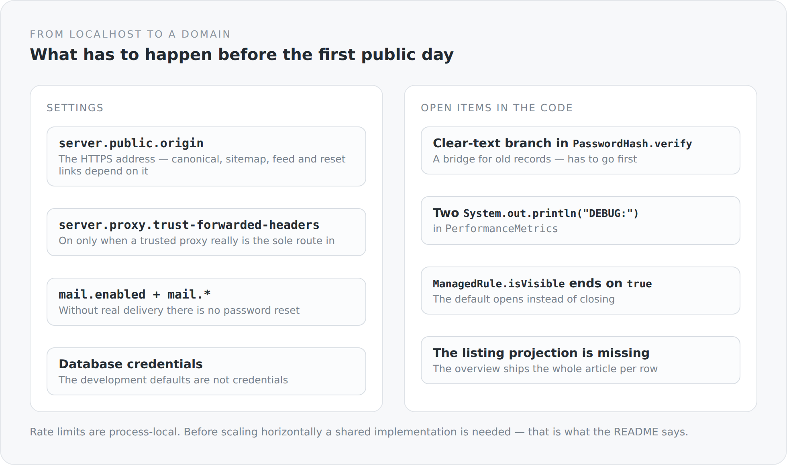

This blog has been running at `http://localhost:8080` for months. That is a comfortable state: everything works, nobody sees it, and nothing is binding.

This final article of the series is about what changes when it gets an address — and about what remains open until then.

## What has to be configured

{width=720}

**`server.public.origin`.** The externally visible HTTPS address. The previous article showed everything hanging on it: canonical links, hreflang, sitemap, Atom feed, the links in password-reset mails. A wrong value is consistently wrong — which is better than partly wrong, and still wrong.

**`server.proxy.trust-forwarded-headers`.** Off by default, and it should stay that way until the application really is reachable only through a trusted proxy. Switched on, the first `X-Forwarded-For` value determines who counts as the client for rate limits — a header anyone can set who reaches the application directly.

**`mail.enabled` and the SMTP settings.** While delivery is off there is no password reset and no registration confirmation. Both features exist in the code and do nothing.

**Real database credentials.** The development defaults are not credentials.

And the rate limits are process-local, which the README states: a shared implementation is needed before scaling horizontally.

## What is open in the code

I named these points in their respective articles. Here they are together, because a list that is scattered is not a list.

**The clear-text branch in `PasswordHash.verify`.** A bridge for records from before hashing existed, marked with a comment and a constant-time comparison. Before the first public day that branch has to go, and the old records with it.

**Two `System.out.println("DEBUG: …")` in `PerformanceMetrics`.** Leftover debugging, of all places in the class meant to measure timings.

**`ManagedRule.isVisible` ends on `true`.** A field for which the owner has set neither "visible to all" nor a person list would be visible. Harmless, because `OwnerRule` is used everywhere — the default is still the wrong way round.

**The listing page has no projection of its own.** The listing endpoint delivers the complete article per row, including every translation as a Lexical tree. The two entity graphs `BlogPost.list` and `BlogPost.full` have different names and identical contents.

**No way to delete a passkey.** There is a way in and no way out.

**An "edit" toggle for anonymous readers.** Purely local, with no right to save — and still a contradiction of the principle that the interface shows what the relations permit.

**The navigation is monolingual.** Titles and summaries in the catalog sit as English strings while the rest of the frontend is translated.

**And a docblock in `app/head.ts` claims there is no SEO output.** There is.

On top of that, the names: `QuarkusTransactionFilter`, `QuarkusGlobalExceptionMappers`, `QuarkusMapperMessageBodyWriter` — in a project where no Quarkus runs.

## What is deliberately missing

A list of open items is only worth something when a second list stands next to it: what is not coming.

No newsletter. No article series as a data model. No reading-time indicator. No "related articles". No analytics. No scheduled publishing. No full-text search index. No revision history in the blog itself — git keeps that in the content repository.

Every one of those would be feasible and some would be nice. They are missing because a system that can do everything stops being a statement.

## What this series was meant to show

Thirty-two articles about a blog is an absurd ratio. That was precisely the intention.

A large system can hide its decisions behind its size. You can work in a project for years and never see the place where it is decided when a transaction commits. In a small system that excuse does not exist. Every decision is visible, and every one has to justify itself.

I tried to do the same three things in every article: show how it is built; say what it costs; and name where it is not right yet. The third was the most important. An architecture description in which everything works out is not a description but advertising.

## What I learned along the way

Three things I would have seen differently before.

**The build is architecture.** Four `dependsOn` say more about the structure of a system than any diagram — because they are enforced and a diagram is not.

**Visibility belongs on the field.** Not in the controller, not in a matrix, not in a check method. The moment the rule sits where the data sits, it applies when reading, when writing and in the form at the same time.

**And a seam matters more than a layer.** The most interesting place in this system is not `domain` and not `system`, but the one function that takes a path and returns HTML. Everything before and after it is arranged so that this seam stays narrow.

## And the writing itself

While writing this series I found the `ManagedRule` bug, the wrong docblock in `head.ts` and the leftover debug output. None of it had come up in a review.

The reason is simple: in a review you read code against an expectation. When writing it up you have to explain it to somebody who does not know it. And at the point where the explanation stalls, something is wrong.

That is perhaps the best thing about this series in the end — not that it explains the architecture, but that it checked it.

Simplicity is not the absence of complexity, but the result of mastering it. Whether I managed that is not decided by this text. It is decided by the code, in two years, when I want to change something.
