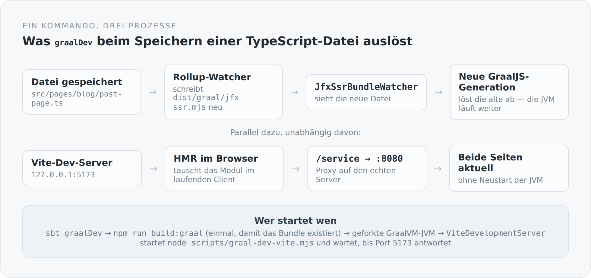

Es gibt eine Art von Reibung, die man erst bemerkt, wenn sie weg ist. Zwei Terminals, in denen zwei Dinge laufen müssen. Die Frage, welches man nach einer Änderung neu starten muss. Der Moment, in dem eines von beiden abgestürzt ist und man es nicht gemerkt hat, weil das andere weiterlief.

Der Entwicklungsmodus dieses Blogs besteht aus einem Kommando:

```powershell
sbtn "project simplicity-blog-backend; graalDev"
```

Danach läuft der Blog auf `http://localhost:8080`, und jede Änderung an TypeScript ist ohne Neustart sichtbar — im Browser *und* im serverseitig gerenderten HTML. Dieser Artikel erklärt, was dafür passieren muss.

## Was der Task tut

```scala
graalDev := Def.uncached {
  val graalHome = configuredGraalVmHome.getOrElse(
    sys.error("Set GRAALVM_HOME to a GraalVM 25 installation before running graalDev")
  )
  val javaExecutable = graalHome / "bin" / (if (scala.util.Properties.isWin) "java.exe" else "java")
  if (!javaExecutable.isFile) {
    sys.error(s"Configured GraalVM has no Java executable: ${javaExecutable.getAbsolutePath}")
  }
  graalSsrBundle.value
  (Compile / runMain).toTask(" com.anjunar.simplicityblog.GraalDevelopmentMain").value
}
```

Zuerst wird geprüft, ob es überhaupt eine GraalVM gibt und ob darin ein ausführbares `java` liegt. Dann wird das SSR-Bundle einmal gebaut — nicht als Nebenwirkung, sondern weil der Server ohne diese Datei bewusst nicht startet. Und dann wird eine geforkte JVM mit einer eigenen `main`-Methode gestartet.

Diese `main`-Methode ist kein zweiter Server. Sie setzt nur Schalter und ruft dann die richtige:

```scala
System.setProperty("server.frontend.source.path", frontend.toString)
System.setProperty("server.static.path", frontend.resolve("dist").resolve("client").toString)
System.setProperty("server.ssr.bundle", frontend.resolve("dist").resolve("graal").resolve("jfx-ssr.mjs").toString)
System.setProperty("server.ssr.reload", "true")
System.setProperty("server.vite.origin", "http://127.0.0.1:5173")
System.setProperty("server.vite.start", "true")
ApplicationMain.main(args)
```

Sechs Properties. Der Unterschied zwischen Entwicklung und Produktion ist damit vollständig beschrieben — es gibt keinen zweiten Codepfad, kein `if (development)` mitten in der Anwendung, kein Profil. Der Server liest Konfiguration, und die Konfiguration ist hier eine andere.

## Der Server startet Vite

Der übliche Weg wäre, Vite in einem eigenen Terminal zu starten. Hier startet der Server ihn selbst:

```scala
val process = new ProcessBuilder("node", "scripts/graal-dev-vite.mjs")
  .directory(frontendDirectory.toFile)
  .inheritIO()
  .start()
```

Und wartet dann darauf, dass der Port wirklich antwortet — nicht darauf, dass der Prozess existiert:

```scala
while (!ready && process.isAlive && System.nanoTime() < deadline) {
  try {
    val socket = new Socket()
    try {
      socket.connect(new InetSocketAddress(uri.getHost, uri.getPort), 1000)
      ready = true
    } finally socket.close()
  } catch { case _: Exception => Thread.sleep(100) }
}
if (!ready) throw IllegalStateException("Vite development server did not become ready")
```

Der Unterschied zwischen „der Prozess läuft" und „der Port antwortet" ist genau der Unterschied zwischen einem Entwicklungsmodus, der manchmal funktioniert, und einem, der immer funktioniert. Und wenn der Server heruntergefahren wird, nimmt er Vite mit — inklusive aller Kindprozesse, notfalls mit `destroyForcibly`. Ein `Ctrl+C` beendet alles.

## Zwei Kreisläufe, die nichts voneinander wissen

Jetzt der eigentliche Punkt. Nach einer Änderung an einer TypeScript-Datei passieren zwei Dinge gleichzeitig, und sie sind völlig unabhängig.

{width=720}

Der Browser bekommt sein Update über den Vite-Dev-Server und Hot Module Replacement. Das ist der normale, bekannte Weg.

Der Server bekommt sein Update über einen Rollup-Watcher, der das SSR-Bundle neu schreibt, und über einen Datei-Beobachter in der JVM, der die neue Datei bemerkt und eine neue GraalJS-Generation lädt. Die alte wird abgelöst, die JVM läuft weiter. Kein Neustart, keine verlorene Datenbankverbindung, kein Warten auf sbt.

Beides wird von einem einzigen Node-Skript in Gang gesetzt, das den Dev-Server und den Watcher nebeneinander hält:

```js
const server = await createServer({ root, configFile, appType: "custom",
  server: { host: "127.0.0.1", port: 5173, strictPort: true } });
await server.listen();

const bundleWatcher = await build({ root, configFile, mode: "graal",
  build: { emptyOutDir: false, watch: {} } });
```

In diesem Skript steckt eine Erfahrung, die man in dem Kommentar daneben nachlesen kann. `emptyOutDir` ist hier ausgeschaltet, weil Vite sonst genau in dem Moment aufräumt, in dem der Server startet und das Bundle sucht. Der Watcher würde es Sekunden später neu schreiben — aber der Server wäre schon mit einer Fehlermeldung ausgestiegen.

Solche Zeilen mag ich. Sie sehen nach nichts aus und sind das Protokoll eines Nachmittags.

## Warum das Frontend im Entwicklungsmodus anders eingebunden wird

Das erste HTML enthält Verweise auf Stylesheet und Script. In der Produktion kommen die aus dem Vite-Manifest, in der Entwicklung direkt vom Dev-Server:

```scala
def vite(origin: String): String = {
  val base = origin.stripSuffix("/")
  entries(
    stylesheet = s"$base/src/styles/style.css",
    scripts = Seq(s"$base/@vite/client", s"$base/src/entry-client.ts")
  )
}

def production(clientDist: Path): String = {
  val manifestPath = clientDist.resolve(".vite").resolve("manifest.json")
  if (!Files.isRegularFile(manifestPath)) {
    throw IllegalStateException(s"Missing Vite client manifest: $manifestPath")
  }
  // ... liest die gehashten Dateinamen aus dem Manifest
}
```

Auch hier wieder: Wenn das Manifest fehlt, gibt es keine stille Notlösung. Ein Blog, der ohne Stylesheet ausgeliefert wird, weil eine Datei nicht gefunden wurde, ist ein Fehler, der niemandem auffällt, bis es zu spät ist.

## Was daran nicht schön ist

Der Entwicklungsmodus hält drei Dinge gleichzeitig am Leben, und wenn eines davon in einen ungewöhnlichen Zustand gerät, ist die Fehlersuche unangenehm. Ein kaputtes SSR-Bundle bringt keine Compilerfehlermeldung im Terminal, sondern eine Seite, die im Browser funktioniert und serverseitig nicht.

Außerdem ist der ganze Mechanismus selbstgebaut. Ein Bundle-Watcher, eine austauschbare GraalJS-Generation, ein Prozess, der einen anderen startet und auf einen Port wartet — das steht in keiner Dokumentation außer dieser hier. Wer das Projekt übernimmt, muss es lesen.

Der Tausch ist derselbe wie überall in diesem Projekt: mehr eigener Code, dafür keine Stelle, an der etwas passiert, das ich nicht erklären kann.

## Das eigentliche Ziel

Ein Entwicklungsmodus ist kein Komfortthema. Er entscheidet darüber, wie oft man etwas ausprobiert.

Wenn zwischen einer Idee und dem sichtbaren Ergebnis ein Neustart liegt, probiert man weniger aus. Man denkt länger nach, bevor man etwas ändert, und man lässt Dinge stehen, die man eigentlich noch einmal anfassen müsste. Wenn dazwischen eine Sekunde liegt, arbeitet man anders.

Das ist mir die Komplexität wert — vor allem, weil sie an einer Stelle liegt, die man einmal baut und dann nicht mehr anfasst.
