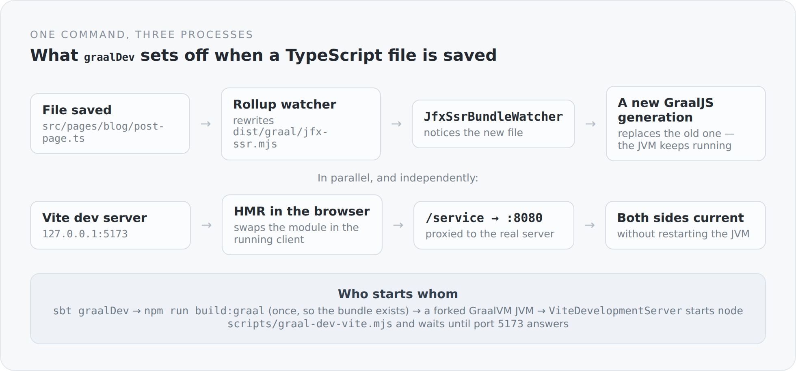

There is a kind of friction you only notice once it is gone. Two terminals with two things that have to be running. The question of which one you have to restart after a change. The moment when one of them has crashed and you did not notice, because the other kept going.

The development mode of this blog is one command:

```powershell
sbtn "project simplicity-blog-backend; graalDev"
```

After that the blog runs on `http://localhost:8080`, and every change to TypeScript is visible without a restart — in the browser *and* in the server-rendered HTML. This article explains what has to happen for that.

## What the task does

```scala
graalDev := Def.uncached {
  val graalHome = configuredGraalVmHome.getOrElse(
    sys.error("Set GRAALVM_HOME to a GraalVM 25 installation before running graalDev")
  )
  val javaExecutable = graalHome / "bin" / (if (scala.util.Properties.isWin) "java.exe" else "java")
  if (!javaExecutable.isFile) {
    sys.error(s"Configured GraalVM has no Java executable: ${javaExecutable.getAbsolutePath}")
  }
  graalSsrBundle.value
  (Compile / runMain).toTask(" com.anjunar.simplicityblog.GraalDevelopmentMain").value
}
```

First it checks whether there is a GraalVM at all and whether it contains an executable `java`. Then the SSR bundle is built once — not as a side effect, but because the server deliberately refuses to start without that file. And then a forked JVM is launched with a `main` method of its own.

That `main` method is not a second server. It only sets switches and then calls the real one:

```scala
System.setProperty("server.frontend.source.path", frontend.toString)
System.setProperty("server.static.path", frontend.resolve("dist").resolve("client").toString)
System.setProperty("server.ssr.bundle", frontend.resolve("dist").resolve("graal").resolve("jfx-ssr.mjs").toString)
System.setProperty("server.ssr.reload", "true")
System.setProperty("server.vite.origin", "http://127.0.0.1:5173")
System.setProperty("server.vite.start", "true")
ApplicationMain.main(args)
```

Six properties. The difference between development and production is thereby described completely — there is no second code path, no `if (development)` in the middle of the application, no profile. The server reads configuration, and here the configuration is different.

## The server starts Vite

The usual route would be to start Vite in a terminal of its own. Here the server starts it:

```scala
val process = new ProcessBuilder("node", "scripts/graal-dev-vite.mjs")
  .directory(frontendDirectory.toFile)
  .inheritIO()
  .start()
```

And then waits for the port to actually answer — not for the process to exist:

```scala
while (!ready && process.isAlive && System.nanoTime() < deadline) {
  try {
    val socket = new Socket()
    try {
      socket.connect(new InetSocketAddress(uri.getHost, uri.getPort), 1000)
      ready = true
    } finally socket.close()
  } catch { case _: Exception => Thread.sleep(100) }
}
if (!ready) throw IllegalStateException("Vite development server did not become ready")
```

The difference between "the process is running" and "the port answers" is exactly the difference between a development mode that sometimes works and one that always works. And when the server shuts down it takes Vite with it — including every child process, forcibly if necessary. One `Ctrl+C` ends everything.

## Two loops that know nothing about each other

Now the actual point. After a change to a TypeScript file, two things happen at once, and they are completely independent.

{width=720}

The browser gets its update through the Vite dev server and hot module replacement. That is the normal, familiar route.

The server gets its update through a Rollup watcher that rewrites the SSR bundle, and through a file watcher inside the JVM that notices the new file and loads a new GraalJS generation. The old one is replaced, the JVM keeps running. No restart, no lost database connection, no waiting for sbt.

Both are set in motion by a single Node script that keeps the dev server and the watcher side by side:

```js
const server = await createServer({ root, configFile, appType: "custom",
  server: { host: "127.0.0.1", port: 5173, strictPort: true } });
await server.listen();

const bundleWatcher = await build({ root, configFile, mode: "graal",
  build: { emptyOutDir: false, watch: {} } });
```

That script contains one experience you can read in the comment next to it. `emptyOutDir` is switched off here, because otherwise Vite cleans up at exactly the moment the server starts and looks for the bundle. The watcher would rewrite it seconds later — but the server would already have exited with an error message.

I like lines like that. They look like nothing and they are the record of an afternoon.

## Why the frontend is wired in differently during development

The first HTML contains references to stylesheet and script. In production they come from the Vite manifest, in development straight from the dev server:

```scala
def vite(origin: String): String = {
  val base = origin.stripSuffix("/")
  entries(
    stylesheet = s"$base/src/styles/style.css",
    scripts = Seq(s"$base/@vite/client", s"$base/src/entry-client.ts")
  )
}

def production(clientDist: Path): String = {
  val manifestPath = clientDist.resolve(".vite").resolve("manifest.json")
  if (!Files.isRegularFile(manifestPath)) {
    throw IllegalStateException(s"Missing Vite client manifest: $manifestPath")
  }
  // ... reads the hashed file names from the manifest
}
```

Here too: if the manifest is missing, there is no quiet fallback. A blog shipped without a stylesheet because a file could not be found is a failure nobody notices until it is too late.

## What is not beautiful about it

Development mode keeps three things alive at once, and when one of them enters an unusual state, debugging is unpleasant. A broken SSR bundle does not produce a compiler error in the terminal but a page that works in the browser and not on the server.

Also, the whole mechanism is home-made. A bundle watcher, a replaceable GraalJS generation, a process that starts another one and waits for a port — none of that is documented anywhere except here. Whoever takes over the project has to read it.

The trade is the same as everywhere in this project: more code of my own, in exchange for no place where something happens that I cannot explain.

## The actual goal

A development mode is not a comfort topic. It decides how often you try something out.

When a restart sits between an idea and its visible result, you try fewer things. You think longer before changing anything, and you leave things standing that you should really touch again. When a second sits between them, you work differently.

That is worth the complexity to me — above all because it sits somewhere you build once and then never touch again.
