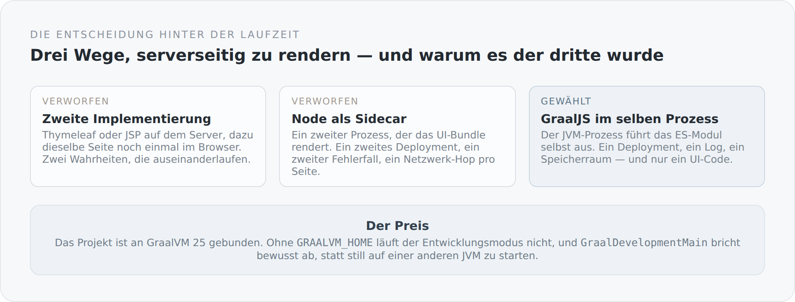

Die meisten JVM-Projekte treffen keine Entscheidung über die Laufzeit. Sie nehmen ein aktuelles OpenJDK, und das ist auch völlig richtig so. Dieser Blog nimmt GraalVM 25, und zwar nicht optional, sondern verbindlich. Das ist eine Festlegung, und Festlegungen sollte man begründen können.

## Das Problem, das dahintersteht

Ein Blog ist zuerst ein Dokument. Er soll gelesen und gefunden werden können, bevor irgendein Client-Code läuft. Das heißt: Das erste HTML muss vollständig sein. Es muss serverseitig entstehen.

Nun gibt es aber schon ein Frontend, geschrieben in TypeScript, das genau weiß, wie eine Artikelseite aussieht. Die Frage ist nicht, *ob* serverseitig gerendert wird, sondern *womit*.

{width=720}

Der erste Weg wäre eine zweite Implementierung gewesen: Thymeleaf auf dem Server, TypeScript im Browser. Die Bibliothek liegt sogar im Classpath. Aber dann gäbe es die Artikelseite zweimal, in zwei Sprachen, und jede Änderung müsste an zwei Stellen passieren. Es dauert erfahrungsgemäß etwa drei Wochen, bis die beiden auseinanderlaufen.

Der zweite Weg wäre ein Node-Prozess neben der JVM gewesen. Das ist der übliche Weg, und er funktioniert. Aber er verdoppelt den Betrieb: zwei Prozesse, zwei Logs, zwei Neustarts, ein Netzwerk-Hop pro Seitenaufruf und ein neuer Fehlerfall — was passiert, wenn der Renderer antwortet, aber der Server nicht, oder umgekehrt.

Der dritte Weg ist GraalVM. Die JVM kann JavaScript ausführen. Nicht als Kuriosität, sondern als Sprache mit ordentlicher Performance, im selben Prozess, im selben Speicherraum.

## Wie sich das im Build niederschlägt

Der Build sucht GraalVM aktiv:

```scala
def configuredGraalVmHome: Option[File] =
  sys.env.get("GRAALVM_HOME").orElse(sys.props.get("simplicity.graal.path")).map(file).orElse {
    Seq(file("D:/Development"), file("C:/Program Files/Java"))
      .filter(_.isDirectory)
      .flatMap(directory => Option(directory.listFiles()).toSeq.flatten)
      .filter(path => path.isDirectory && path.getName.toLowerCase.startsWith("graalvm-25"))
      .sortBy(_.getName)
      .lastOption
  }
```

Erst die Umgebungsvariable, dann eine System-Property, und wenn beides fehlt, ein Blick in zwei übliche Installationsverzeichnisse. Das ist bewusst pragmatisch: Auf meinem Rechner soll es ohne Setup funktionieren, auf jedem anderen mit einer Variablen.

Der gefundene Pfad wird dann zum `javaHome` des `run`-Tasks, und die JVM bekommt zwei Flags mit:

```scala
Compile / run / javaHome := configuredGraalVmHome,
Compile / run / javaOptions ++= Seq(
  "--enable-native-access=ALL-UNNAMED",
  "-XX:+EnableJVMCI",
  s"-Dserver.http.port=${graalDevPort.value}"
)
```

`-XX:+EnableJVMCI` ist das eigentliche Stichwort. Es schaltet die Schnittstelle frei, über die GraalVMs Compiler und die Polyglot-Laufzeit arbeiten. Ohne dieses Flag ist die JavaScript-Ausführung entweder nicht verfügbar oder deutlich langsamer.

## Der Abbruch, der wichtiger ist als er aussieht

Die interessanteste Zeile in diesem Zusammenhang steht nicht im Build, sondern in einer eigenen `main`-Methode für den Entwicklungsmodus:

```scala
val vendorVersion = Option(System.getProperty("java.vendor.version")).getOrElse("")
if (!vendorVersion.contains("GraalVM")) {
  throw IllegalStateException(
    s"graalDev requires GraalVM, but this JVM reports java.vendor.version=$vendorVersion"
  )
}
```

Der Entwicklungsmodus weigert sich, auf einer anderen JVM zu starten. Er versucht es nicht und scheitert später irgendwo tief in der Polyglot-Initialisierung mit einer Meldung, die niemand versteht. Er sagt sofort, was er braucht.

Das ist für mich ein architektonisches Muster, kein Detail: Eine Annahme, die stillschweigend gilt, ist eine Falle. Eine Annahme, die beim Start geprüft wird und den Grund nennt, ist eine Dokumentation, die nicht veralten kann.

Dieselbe Haltung findet sich an mehreren Stellen im Start. Wenn das SSR-Bundle fehlt, startet der Server nicht:

```scala
if (!Files.isRegularFile(serverConfig.ssrBundle)) {
  throw IllegalStateException(s"Missing GraalJS SSR bundle: ${serverConfig.ssrBundle}")
}
```

Ein Blog, der stumm ohne serverseitiges Rendering hochkommt, wäre schlimmer als einer, der gar nicht startet. Man würde es wochenlang nicht merken — bis auffällt, dass keine Seite mehr indexiert wird.

## Was diese Bindung kostet

Jetzt der unangenehme Teil.

**Das Projekt braucht eine bestimmte JVM.** Nicht „irgendein JDK 25", sondern GraalVM 25. Wer den Blog auscheckt und ein normales OpenJDK hat, kommt nicht weit. Das ist eine echte Einstiegshürde, und sie ist nicht wegzudiskutieren.

**Die Suchpfade sind meine.** `D:/Development` und `C:/Program Files/Java` sind zwei Verzeichnisse von meinem Rechner. Für alle anderen ist der Fallback die Umgebungsvariable. Das ist ehrlich dokumentiert im README, aber es ist trotzdem eine Stelle, an der das Projekt sein Zuhause verrät.

**JVMCI ist ein Flag mehr.** Jeder Start, jeder Debug-Lauf, jedes Produktionsskript muss es tragen. Vergisst man es, verhält sich das System anders — und zwar nicht mit einem Fehler, sondern mit schlechterer Performance. Das ist die unangenehmste Art von Abhängigkeit.

**Und die Polyglot-Laufzeit kostet Speicher.** Ein JavaScript-Kontext im JVM-Prozess ist nicht gratis. Für einen Blog auf einer kleinen Maschine ist das vertretbar, aber es ist keine Null.

## Warum ich trotzdem dabei bleibe

Weil die Alternative teurer ist, nur an einer Stelle, die man später bezahlt.

Ein zweiter Prozess ist im ersten Monat bequem und im zweiten Jahr eine eigene Betriebsdisziplin. Zwei Implementierungen derselben Seite sind am Anfang schneller und danach dauerhaft falsch. Die GraalVM-Bindung dagegen ist unbequem, aber sie ist an einer Stelle, an der ich sie sehe: beim Auschecken, beim Start, im README.

Das ist das Muster, das sich durch dieses ganze Projekt zieht. Ich versuche nicht, Kosten zu vermeiden. Ich versuche, sie an eine sichtbare Stelle zu legen.

Wie sich diese Entscheidung im Alltag anfühlt — wenn man eine TypeScript-Datei speichert und der Server sie eine Sekunde später serverseitig rendert, ohne neu zu starten — ist das Thema des nächsten Artikels.
