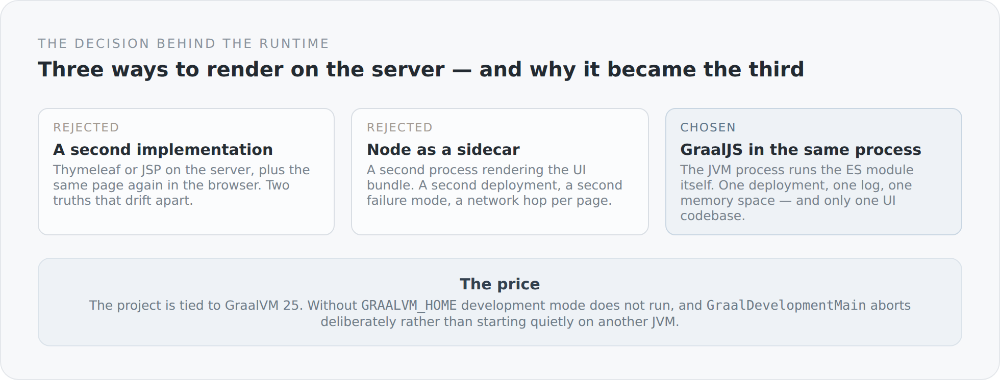

Most JVM projects make no decision about the runtime. They take a current OpenJDK, and that is entirely right. This blog takes GraalVM 25, and not optionally but as a requirement. That is a commitment, and commitments should be defensible.

## The problem behind it

A blog is a document first. It should be findable and readable before any client code runs. Which means the first HTML has to be complete. It has to be produced on the server.

But there is already a frontend, written in TypeScript, that knows exactly what an article page looks like. So the question is not *whether* to render server-side, but *with what*.

{width=720}

The first way would have been a second implementation: Thymeleaf on the server, TypeScript in the browser. The library is even on the classpath. But then the article page would exist twice, in two languages, and every change would have to happen in two places. In my experience it takes about three weeks before the two drift apart.

The second way would have been a Node process next to the JVM. That is the usual route, and it works. But it doubles operations: two processes, two logs, two restarts, a network hop per page view, and a new failure mode — what happens when the renderer answers but the server does not, or the other way round.

The third way is GraalVM. The JVM can execute JavaScript. Not as a curiosity, but as a language with proper performance, in the same process, in the same memory space.

## How that shows up in the build

The build actively looks for GraalVM:

```scala
def configuredGraalVmHome: Option[File] =
  sys.env.get("GRAALVM_HOME").orElse(sys.props.get("simplicity.graal.path")).map(file).orElse {
    Seq(file("D:/Development"), file("C:/Program Files/Java"))
      .filter(_.isDirectory)
      .flatMap(directory => Option(directory.listFiles()).toSeq.flatten)
      .filter(path => path.isDirectory && path.getName.toLowerCase.startsWith("graalvm-25"))
      .sortBy(_.getName)
      .lastOption
  }
```

First the environment variable, then a system property, and if both are missing, a look into two common installation directories. That is deliberately pragmatic: on my machine it should work without setup, on every other machine with one variable.

The path it finds becomes the `javaHome` of the `run` task, and the JVM gets two flags:

```scala
Compile / run / javaHome := configuredGraalVmHome,
Compile / run / javaOptions ++= Seq(
  "--enable-native-access=ALL-UNNAMED",
  "-XX:+EnableJVMCI",
  s"-Dserver.http.port=${graalDevPort.value}"
)
```

`-XX:+EnableJVMCI` is the actual keyword. It enables the interface through which GraalVM's compiler and the polyglot runtime work. Without that flag, JavaScript execution is either unavailable or noticeably slower.

## The abort that matters more than it looks

The most interesting line in this context is not in the build but in a `main` method written for development mode:

```scala
val vendorVersion = Option(System.getProperty("java.vendor.version")).getOrElse("")
if (!vendorVersion.contains("GraalVM")) {
  throw IllegalStateException(
    s"graalDev requires GraalVM, but this JVM reports java.vendor.version=$vendorVersion"
  )
}
```

Development mode refuses to start on any other JVM. It does not try and then fail somewhere deep inside polyglot initialization with a message nobody understands. It says immediately what it needs.

To me that is an architectural pattern, not a detail: an assumption that holds silently is a trap. An assumption that is checked at startup and states its reason is documentation that cannot go stale.

The same attitude appears at several points in the startup. If the SSR bundle is missing, the server does not start:

```scala
if (!Files.isRegularFile(serverConfig.ssrBundle)) {
  throw IllegalStateException(s"Missing GraalJS SSR bundle: ${serverConfig.ssrBundle}")
}
```

A blog that quietly comes up without server-side rendering would be worse than one that does not come up at all. You would not notice for weeks — until you realized that no page was being indexed any more.

## What the commitment costs

Now the unpleasant part.

**The project needs a particular JVM.** Not "some JDK 25", but GraalVM 25. Anyone who checks the blog out with a normal OpenJDK does not get far. That is a real barrier to entry, and it cannot be argued away.

**The search paths are mine.** `D:/Development` and `C:/Program Files/Java` are two directories from my machine. For everyone else the fallback is the environment variable. That is honestly documented in the README, but it is still a place where the project reveals where it lives.

**JVMCI is one more flag.** Every start, every debug run, every production script has to carry it. Forget it, and the system behaves differently — not with an error, but with worse performance. That is the most unpleasant kind of dependency.

**And the polyglot runtime costs memory.** A JavaScript context in the JVM process is not free. For a blog on a small machine that is acceptable, but it is not zero.

## Why I stay with it anyway

Because the alternative is more expensive, only in a place where you pay later.

A second process is convenient in month one and a discipline of its own by year two. Two implementations of the same page are faster at the start and permanently wrong afterwards. The GraalVM commitment, by contrast, is inconvenient — but it sits somewhere I can see it: at checkout, at startup, in the README.

That is the pattern running through this entire project. I do not try to avoid costs. I try to put them somewhere visible.

What this decision feels like day to day — when you save a TypeScript file and the server renders it server-side a second later, without restarting — is the subject of the next article.
