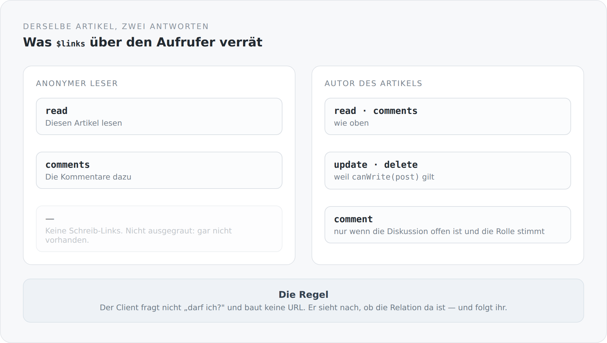

HATEOAS ist der Teil von REST, den fast alle weglassen. Meistens zu Recht: Der Aufwand ist hoch, der Nutzen bleibt abstrakt, und am Ende hat man Links, denen niemand folgt, weil der Client die URLs ohnehin kennt.

Ich habe es trotzdem gemacht, und dieser Artikel soll zeigen, wann es sich lohnt — nämlich genau dann, wenn man die Links nicht als Navigation begreift, sondern als Antwort auf die Frage „was darf ich hier eigentlich".

## Zwei Antworten auf dieselbe Anfrage

{width=720}

Derselbe Artikel, dieselbe URL, zwei verschiedene Antworten — nicht im Inhalt, sondern in den Möglichkeiten.

Für einen anonymen Leser stehen in `$links` genau zwei Relationen: `read` und `comments`. Für den Autor stehen dort außerdem `update`, `delete` und `comment`.

Das Entscheidende ist, dass die fehlenden Links nicht als „nicht erlaubt" markiert sind. Sie sind nicht da. Ein Client, der `$links` liest, muss keine Berechtigungslogik kennen und keine Rollen auswerten. Er muss nachsehen, ob die Relation existiert.

## Wie die Links entstehen

```scala
private def decorate(post: BlogPost): Unit = {
  post.commentCount = visibleCommentCount(post)

  val commentSearch = new BlogCommentSearch()
  commentSearch.post = post

  post.addLinks(
    LinkBuilder.create[BlogPostController](_.read(post, null)).build(),
    LinkBuilder.create[BlogCommentsController](_.comments(commentSearch))
      .withRel("comments").build()
  )

  if (canWrite(post)) {
    post.addLinks(
      LinkBuilder.create[BlogPostController](_.update(null)).build(),
      LinkBuilder.create[BlogPostController](_.delete(post)).build()
    )
  }

  if (BlogCommentAccess.canComment(post, currentIdentity)) {
    post.addLinks(
      LinkBuilder.create[BlogCommentController](_.save(post, null))
        .withRel("comment").build()
    )
  }
}
```

Zwei `if`, und die Antwort beschreibt sich selbst. Das ist der ganze Mechanismus auf der Controller-Seite.

## Der Link entsteht aus einem Methodenaufruf

Die interessante Stelle ist `LinkBuilder.create[BlogPostController](_.read(post, null))`. Das sieht aus wie ein Aufruf, ist aber keiner:

```scala
inline def create[C](inline call: C => Any): LinkBuilder =
  ${ createMacroImpl[C]('call) }
```

Ein Scala-3-Makro. Zur Kompilierzeit wird der Ausdruck auseinandergenommen: Welche Methode ist gemeint, welche `@Path`-Annotation trägt sie, welche HTTP-Methode, welche Parameter werden übergeben, welche Pfadvariablen kommen darin vor.

```scala
val (methodSym, argExprs) = extractMethodCall(callExpr)
val (httpMethod, hrefTemplate) = extractMappingAnnotation(methodSym)
val paramBindings = extractParameters(methodSym, argExprs)
val pathVariables = extractPathVariables(hrefTemplate)
```

Damit ist die URL nicht mehr eine Zeichenkette, die neben der Ressource lebt und irgendwann nicht mehr zu ihr passt. Sie *ist* die Ressource, gelesen vom Compiler.

Wenn ich `@Path("/blog/posts/post")` ändere, ändern sich alle Links, die auf diesen Controller zeigen. Wenn ich die Methode umbenenne, kompiliert der Aufruf nicht mehr. Wenn ich einen Pfadparameter ergänze und nicht binde, merkt es das Makro.

Das ist der Punkt, an dem HATEOAS von einer Fleißaufgabe zu etwas wird, das man gerne benutzt: Der Link kostet nicht mehr als ein Methodenaufruf, und er kann nicht veralten.

Das Makro kann sogar mehr, als man ihm ansieht:

```scala
val extraBindings = unboundPathVariables.flatMap { varName =>
  paramBindings.collectFirst {
    case (_, expr) if hasField(expr.asTerm.tpe, varName) =>
      (varName, accessField(expr.asTerm, varName))
  }
}
```

Eine Pfadvariable, die nicht direkt gebunden ist, wird auf einem übergebenen Objekt gesucht. `_.read(post, null)` bindet `{id}`, ohne dass jemand `post.id` schreiben muss.

## Links auf Feldebene

Es hört bei den Objekt-Links nicht auf. `SchemaHateoas.enhance` läuft über das Schema einer Entität und erzeugt pro Feld einen `SchemaProperty` — inklusive eigener `$links`:

```scala
source.properties.foreach { (name, property) =>
  val nestedInstance = extractNestedInstance(property, instance)
  val nestedOwner = Option(resolveOwner(nestedInstance)).getOrElse(currentOwner)
  schema.entries.add(mapProperty(property, currentOwner, nestedInstance, nestedOwner, currentUser))
}
```

Der Besitzer wird dabei durch verschachtelte Objekte durchgereicht: Ein Objekt ohne eigenen Besitzer erbt den des Containers. Eine Übersetzung gehört dem Autor des Artikels, ohne dass jemand das noch einmal aufschreiben muss.

Damit kann ein Formular nicht nur wissen, welche Felder es gibt, sondern auch, welche davon dieser Benutzer bearbeiten darf — ohne eine einzige Berechtigungsregel im Frontend.

## Was daran wirklich hilft

Ich war anfangs skeptisch, ob sich das lohnt. Drei Dinge haben mich überzeugt.

**Es gibt keine zweite Wahrheit über Berechtigungen.** In den meisten Systemen steht die Regel zweimal: einmal im Server als Prüfung, einmal im Client als `if` um einen Button. Die beiden laufen auseinander. Hier gibt es einen Button, wenn es eine Relation gibt.

**Der Client wird kleiner.** Er baut keine URLs, er kennt keine Pfadschemata, er hat keine Konstantendatei mit Endpunkten. Er hat eine Funktion, die eine Relation sucht und ihr folgt.

**Fehlerbilder verschieben sich nach vorne.** Eine falsche URL ist in diesem System kein 404 zur Laufzeit, sondern ein Compilerfehler.

## Was es kostet

**Antworten sind größer.** Jedes Objekt trägt seine Möglichkeiten mit sich, jedes Schema seine Feldbeschreibungen. Bei einer Liste multipliziert sich das.

**Die Berechnung kostet.** Für jedes Objekt und jedes Feld muss entschieden werden, was erlaubt ist. Bei zwanzig Zeilen mit je zwanzig Feldern sind das vierhundert Entscheidungen pro Antwort.

**Und es ist ungewöhnlich.** Wer diese API benutzen will, muss das Prinzip verstehen. Eine API mit festen URLs kann man raten. Diese nicht.

## Wo es noch nicht gilt

Eine ehrliche Einschränkung: Nicht jede Stelle im System ist so streng. Auf der Artikelseite gibt es einen Schalter, der den Fließtext im Browser bearbeitbar macht — rein lokal, ohne Speicherrecht, aber er ist auch für anonyme Leser da, obwohl der eigentliche „Artikel bearbeiten"-Link korrekt an der `update`-Relation hängt.

Das ist inhaltlich harmlos und trotzdem falsch. Wenn das Prinzip lautet „die Oberfläche zeigt, was die Relationen erlauben", dann muss es überall gelten. Sonst ist es kein Prinzip, sondern eine Gewohnheit.

Im nächsten Artikel geht es eine Ebene tiefer: zu den Regeln, aus denen sich ergibt, ob ein einzelnes Feld überhaupt in einer Antwort auftaucht.
