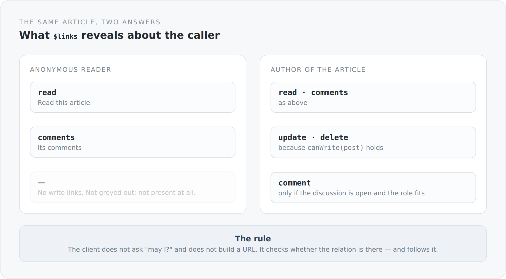

HATEOAS is the part of REST almost everyone leaves out. Usually rightly so: the effort is high, the benefit stays abstract, and in the end you have links nobody follows, because the client knows the URLs anyway.

I did it anyway, and this article is meant to show when it pays off — namely exactly when you stop treating the links as navigation and treat them as the answer to the question "what am I actually allowed to do here".

## Two answers to the same request

{width=720}

The same article, the same URL, two different answers — not in the content, but in the possibilities.

For an anonymous reader, `$links` contains exactly two relations: `read` and `comments`. For the author it also contains `update`, `delete` and `comment`.

The crucial part is that the missing links are not marked as "not permitted". They are not there. A client reading `$links` needs no authorization logic and evaluates no roles. It checks whether the relation exists.

## How the links come about

```scala
private def decorate(post: BlogPost): Unit = {
  post.commentCount = visibleCommentCount(post)

  val commentSearch = new BlogCommentSearch()
  commentSearch.post = post

  post.addLinks(
    LinkBuilder.create[BlogPostController](_.read(post, null)).build(),
    LinkBuilder.create[BlogCommentsController](_.comments(commentSearch))
      .withRel("comments").build()
  )

  if (canWrite(post)) {
    post.addLinks(
      LinkBuilder.create[BlogPostController](_.update(null)).build(),
      LinkBuilder.create[BlogPostController](_.delete(post)).build()
    )
  }

  if (BlogCommentAccess.canComment(post, currentIdentity)) {
    post.addLinks(
      LinkBuilder.create[BlogCommentController](_.save(post, null))
        .withRel("comment").build()
    )
  }
}
```

Two `if` statements, and the response describes itself. That is the entire mechanism on the controller side.

## The link comes from a method call

The interesting bit is `LinkBuilder.create[BlogPostController](_.read(post, null))`. That looks like a call and is not one:

```scala
inline def create[C](inline call: C => Any): LinkBuilder =
  ${ createMacroImpl[C]('call) }
```

A Scala 3 macro. At compile time the expression is taken apart: which method is meant, which `@Path` annotation it carries, which HTTP method, which parameters are passed, which path variables occur in it.

```scala
val (methodSym, argExprs) = extractMethodCall(callExpr)
val (httpMethod, hrefTemplate) = extractMappingAnnotation(methodSym)
val paramBindings = extractParameters(methodSym, argExprs)
val pathVariables = extractPathVariables(hrefTemplate)
```

The URL is therefore no longer a string that lives next to the resource and at some point stops matching it. It *is* the resource, read by the compiler.

If I change `@Path("/blog/posts/post")`, every link pointing at that controller changes. If I rename the method, the call no longer compiles. If I add a path parameter and do not bind it, the macro notices.

That is the point where HATEOAS turns from a chore into something you enjoy using: a link costs no more than a method call, and it cannot go stale.

The macro can even do more than it looks:

```scala
val extraBindings = unboundPathVariables.flatMap { varName =>
  paramBindings.collectFirst {
    case (_, expr) if hasField(expr.asTerm.tpe, varName) =>
      (varName, accessField(expr.asTerm, varName))
  }
}
```

A path variable that is not bound directly is looked for on a passed object. `_.read(post, null)` binds `{id}` without anyone writing `post.id`.

## Links at field level

It does not stop at object links. `SchemaHateoas.enhance` walks the schema of an entity and creates a `SchemaProperty` per field — including `$links` of its own:

```scala
source.properties.foreach { (name, property) =>
  val nestedInstance = extractNestedInstance(property, instance)
  val nestedOwner = Option(resolveOwner(nestedInstance)).getOrElse(currentOwner)
  schema.entries.add(mapProperty(property, currentOwner, nestedInstance, nestedOwner, currentUser))
}
```

The owner is passed down through nested objects: an object without an owner of its own inherits the container's. A translation belongs to the author of the article without anyone writing that down again.

A form can therefore know not only which fields exist, but also which of them this user may edit — without a single authorization rule in the frontend.

## What really helps about it

I was sceptical at first about whether it was worth it. Three things convinced me.

**There is no second truth about permissions.** In most systems the rule exists twice: once in the server as a check, once in the client as an `if` around a button. The two drift apart. Here there is a button when there is a relation.

**The client gets smaller.** It builds no URLs, knows no path schemes, has no constants file of endpoints. It has a function that looks up a relation and follows it.

**Failure modes move earlier.** A wrong URL in this system is not a runtime 404 but a compile error.

## What it costs

**Responses are larger.** Every object carries its possibilities, every schema its field descriptions. In a list that multiplies.

**The computation costs.** For every object and every field it has to be decided what is permitted. With twenty rows of twenty fields each, that is four hundred decisions per response.

**And it is unusual.** Anyone who wants to use this API has to understand the principle. An API with fixed URLs can be guessed at. This one cannot.

## Where it does not hold yet

An honest limitation: not every place in the system is this strict. On the article page there is a toggle that makes the running text editable in the browser — purely local, with no right to save, but it is there for anonymous readers too, even though the actual "edit article" link correctly hangs on the `update` relation.

That is harmless in substance and still wrong. If the principle is "the interface shows what the relations permit", then it has to hold everywhere. Otherwise it is not a principle but a habit.

The next article goes one level deeper: to the rules that determine whether an individual field appears in a response at all.
