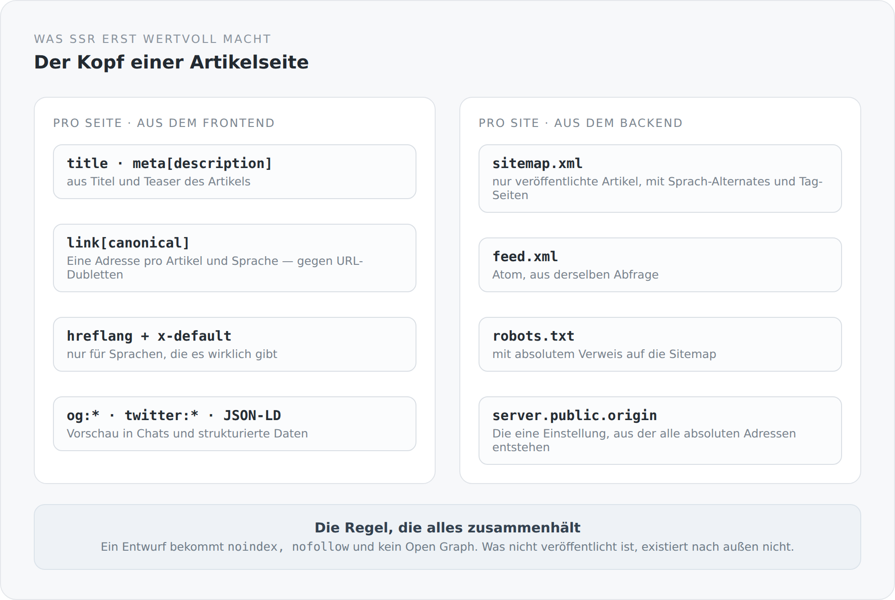

Ein serverseitig gerendertes HTML, dessen `<head>` auf jeder Seite gleich aussieht, ist fast wertlos. Der ganze Aufwand — GraalVM, Bundle-Tausch, Hydration — dient dazu, dass eine Maschine, die kein JavaScript ausführt, eine vollständige Seite bekommt. Wenn diese Seite dann `<title>Anjunar Blog</title>` und sonst nichts trägt, hat man Aufwand betrieben, um nichts auszuliefern.

Genau das war hier eine Zeitlang der Fall. Dieser Artikel beschreibt, was daraus geworden ist.

## Der Kopf einer Artikelseite

{width=720}

```ts
export function articleSeo(post: BlogPost): void {
  const published = post.status.get === "PUBLISHED";
  const contentLocale = normalizeLocale(post.locale.get);
  const canonical = canonicalBlogPostUrl(post.slug.get, contentLocale);
  const description = post.teaser.get?.trim() || post.title.get;
  const entries: HeadEntry[] = [
    title(`${post.title.get} · ${siteName}`),
    meta("description", description),
    meta("robots", published ? "index, follow" : "noindex, nofollow"),
  ];
```

Drei Einträge, die es immer gibt — und die dritte ist die wichtigste.

Ein Entwurf bekommt `noindex, nofollow`. Was nicht veröffentlicht ist, existiert nach außen nicht. Und alles Weitere steht in einem `if (published)`: kein Canonical, kein Open Graph, kein JSON-LD für einen Entwurf.

Das ist die richtige Reihenfolge. Ein Entwurf, der versehentlich indexiert wird, ist schwer wieder loszuwerden.

Die Beschreibung fällt auf den Titel zurück, wenn kein Teaser da ist. Eine `meta[description]`, die leer ist, ist schlechter als eine, die den Titel wiederholt — Suchmaschinen erfinden dann selbst eine.

## Die Sprache, die tatsächlich geliefert wurde

```ts
const contentLocale = normalizeLocale(post.locale.get);
```

Hier zahlt sich die Entscheidung aus dem Artikel über die Übersetzungen aus. `post.locale` ist die Sprache des Textes, den der Leser bekommt — nicht die, die er angefragt hat.

Alles Weitere hängt daran: der Canonical, `og:locale`, `inLanguage` in den strukturierten Daten. Würde hier die angefragte Sprache stehen, bekäme eine Suchmaschine bei einem fehlenden Übersetzungsstand die Auskunft, ein englischer Text sei deutsch.

Und das `lang`-Attribut kommt aus derselben Quelle:

```ts
const activeLocale = locale();
documentHeadHandle.htmlAttribute("lang", activeLocale.get);
disposeWith(activeLocale.observeWithoutInitial((code) => documentHeadHandle.htmlAttribute("lang", code)));
```

Nicht einmal gesetzt, sondern gebunden. Wechselt jemand im Browser die Sprache, ändert sich das Attribut mit.

## Alternates nur für das, was es gibt

```ts
const locales = [...new Set(post.availableLocales.get.map(normalizeLocale))];
for (const locale of locales) entries.push(alternate(locale, canonicalBlogPostUrl(post.slug.get, locale)));
const fallback = locales.includes("en") ? "en" : locales[0];
if (fallback !== undefined) entries.push(alternate("x-default", canonicalBlogPostUrl(post.slug.get, fallback)));
```

`hreflang` wird nur für Sprachen ausgegeben, die tatsächlich existieren. Ein `hreflang="de"` auf eine Seite, die englischen Text liefert, ist schlechter als gar keins.

Deshalb ist `availableLocales` am Artikel kein Anzeigedetail für den Sprachumschalter, sondern eine Angabe, die bis in den Seitenkopf durchschlägt.

`x-default` bevorzugt Englisch und nimmt sonst die erste vorhandene Sprache. Auch das ist wieder: lieber eine getroffene Entscheidung als ein fehlendes Element.

## Strukturierte Daten mit Bedingungen

```ts
const structured: Record<string, unknown> = {
  "@context": "https://schema.org",
  "@type": "Article",
  headline: post.title.get,
  description,
  inLanguage: contentLocale,
  mainEntityOfPage: canonical,
  author: { "@type": "Person", name: author },
};
if (post.publishedAt.get) structured.datePublished = post.publishedAt.get;
if (post.modified.get) structured.dateModified = post.modified.get;
if (post.coverImage.get?.id) {
  const image = publicUrl(`/service/core/media/${encodeURIComponent(post.coverImage.get.id)}`);
  structured.image = image;
  entries.push(metaProperty("og:image", image),
    meta("twitter:card", "summary_large_image"), meta("twitter:image", image));
}
```

Optionale Felder werden nur gesetzt, wenn es sie gibt. Ein `datePublished: null` ist schlechter als ein fehlendes `datePublished`.

Und das Titelbild ändert gleich drei Dinge auf einmal: `image` in den strukturierten Daten, `og:image` und der Wechsel der Twitter-Karte von `summary` auf `summary_large_image`. Eine Bedingung, drei Wirkungen — genau so, wie es sein sollte, wenn die Bedingung eine fachliche ist.

## Und die Site-weite Seite

Was pro Seite entsteht, kommt aus dem Frontend. Was für die ganze Site gilt, kommt aus dem Backend:

```scala
final class BlogSeo(entityManagerFactory: () => EntityManagerFactory) {
  def sitemap(origin: String): String = renderSitemap(canonicalOrigin(origin), publishedEntries(), publishedTagSlugs())
  def feed(origin: String): String = renderFeed(canonicalOrigin(origin), publishedEntries())
  def robots(origin: String): String = renderRobots(canonicalOrigin(origin))
}
```

Drei Ausgaben, eine Datenquelle:

```sql
select p.id, p.slug, t.locale, t.title, t.teaser,
       p.publishedAt, p.modified, p.created, a.nickName
from BlogPost p join p.translations t join p.author a
where p.status = :status
and p.slug is not null and trim(p.slug) <> ''
and t.title is not null and trim(t.title) <> ''
order by coalesce(p.publishedAt, p.modified, p.created) desc, p.slug asc, t.locale asc
```

Die Abfrage ist bewusst misstrauisch. Nur veröffentlichte Artikel, nur solche mit einem nicht leeren Slug, nur Übersetzungen mit einem nicht leeren Titel. Ein Artikel ohne Titel in der Sitemap ist ein defekter Eintrag, den man später mühsam wieder loswird.

Die Sortierung fällt gestaffelt zurück: Veröffentlichungsdatum, sonst Änderungsdatum, sonst Erstellungsdatum. Ein Datensatz ohne Datum fällt nicht heraus und landet nicht an einer zufälligen Stelle.

Und die Sitemap enthält Sprach-Alternates und die Tag-Seiten. Feed und Sitemap kommen aus derselben Abfrage, können also nicht auseinanderlaufen.

## Eine Einstellung, aus der alles folgt

```scala
def sitemap(origin: String): String = renderSitemap(canonicalOrigin(origin), ...)
```

Der Ursprung wird hineingereicht, nicht ausgerechnet. Er kommt aus `server.public.origin` — oder, wenn `trust-forwarded-headers` an ist, aus den Proxy-Headern.

Aus dieser einen Einstellung entstehen: alle Canonical-URLs, alle `hreflang`-Alternates, alle Einträge in Sitemap und Feed, der Verweis in `robots.txt` und die Links in Passwort-Reset-Mails.

Steht dort der falsche Wert, ist alles konsistent falsch. Das ist die richtige Bauweise — ein falscher Wert an einer Stelle ist besser als fünf Stellen, von denen drei richtig sind.

## Ein Kommentar, der nicht mehr stimmt

Über `app/head.ts` steht ein längerer Docblock, der erklärt, dass die SEO-Felder — Open Graph, JSON-LD, hreflang, Canonical — hier bewusst *nicht* enthalten sind, weil sie eine Konfiguration bräuchten, die es in diesem Projekt nicht gibt.

Das stimmt nicht mehr. `app/seo.ts` macht genau das, und `BlogSeo` liefert Sitemap, Feed und robots.txt.

Der Kommentar ist ein Fossil aus der Zeit, als der Blog eine Demo war. Er ist harmlos und trotzdem die schlechteste Art von Dokumentation: eine, die aktiv das Gegenteil dessen behauptet, was der Code tut. Wer ihn liest, sucht die SEO-Ausgabe woanders — oder baut sie noch einmal.

Er kommt weg. Er steht hier, weil das Aufschreiben einer Architektur genau dazu gut ist: Man liest den eigenen Code mit den Augen von jemandem, der ihn nicht kennt.

Der letzte Artikel dieser Reihe geht den Weg von `localhost` zu einer echten Adresse — und zählt auf, was bis dahin noch offen ist.
