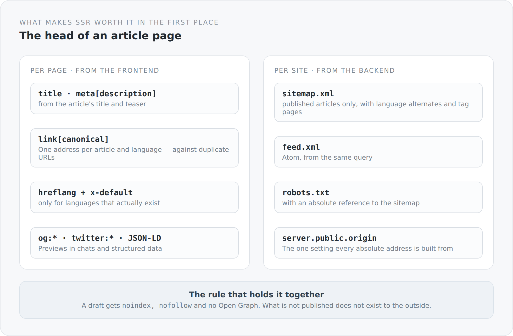

Server-rendered HTML whose `<head>` looks the same on every page is almost worthless. The entire effort — GraalVM, bundle swapping, hydration — exists so that a machine which runs no JavaScript receives a complete page. If that page then carries `<title>Anjunar Blog</title>` and nothing else, you have gone to some trouble in order to deliver nothing.

That was the case here for a while. This article describes what became of it.

## The head of an article page

{width=720}

```ts
export function articleSeo(post: BlogPost): void {
  const published = post.status.get === "PUBLISHED";
  const contentLocale = normalizeLocale(post.locale.get);
  const canonical = canonicalBlogPostUrl(post.slug.get, contentLocale);
  const description = post.teaser.get?.trim() || post.title.get;
  const entries: HeadEntry[] = [
    title(`${post.title.get} · ${siteName}`),
    meta("description", description),
    meta("robots", published ? "index, follow" : "noindex, nofollow"),
  ];
```

Three entries that always exist — and the third is the most important.

A draft gets `noindex, nofollow`. What is not published does not exist to the outside. And everything further sits inside an `if (published)`: no canonical, no Open Graph, no JSON-LD for a draft.

That is the right order. A draft accidentally indexed is hard to get rid of again.

The description falls back to the title when there is no teaser. An empty `meta[description]` is worse than one repeating the title — search engines then invent one themselves.

## The language actually delivered

```ts
const contentLocale = normalizeLocale(post.locale.get);
```

This is where the decision from the article about translations pays off. `post.locale` is the language of the text the reader receives — not the one they requested.

Everything else hangs on it: the canonical, `og:locale`, `inLanguage` in the structured data. If the requested language stood here, a search engine would be told an English text was German whenever a translation was missing.

And the `lang` attribute comes from the same source:

```ts
const activeLocale = locale();
documentHeadHandle.htmlAttribute("lang", activeLocale.get);
disposeWith(activeLocale.observeWithoutInitial((code) => documentHeadHandle.htmlAttribute("lang", code)));
```

Not set once, but bound. When somebody switches language in the browser, the attribute follows.

## Alternates only for what exists

```ts
const locales = [...new Set(post.availableLocales.get.map(normalizeLocale))];
for (const locale of locales) entries.push(alternate(locale, canonicalBlogPostUrl(post.slug.get, locale)));
const fallback = locales.includes("en") ? "en" : locales[0];
if (fallback !== undefined) entries.push(alternate("x-default", canonicalBlogPostUrl(post.slug.get, fallback)));
```

`hreflang` is emitted only for languages that actually exist. An `hreflang="de"` pointing at a page that serves English text is worse than none at all.

That is why `availableLocales` on the article is not a display detail for the language switcher but a statement reaching all the way into the page head.

`x-default` prefers English and otherwise takes the first available language. Again: better a decision made than an element missing.

## Structured data with conditions

```ts
const structured: Record<string, unknown> = {
  "@context": "https://schema.org",
  "@type": "Article",
  headline: post.title.get,
  description,
  inLanguage: contentLocale,
  mainEntityOfPage: canonical,
  author: { "@type": "Person", name: author },
};
if (post.publishedAt.get) structured.datePublished = post.publishedAt.get;
if (post.modified.get) structured.dateModified = post.modified.get;
if (post.coverImage.get?.id) {
  const image = publicUrl(`/service/core/media/${encodeURIComponent(post.coverImage.get.id)}`);
  structured.image = image;
  entries.push(metaProperty("og:image", image),
    meta("twitter:card", "summary_large_image"), meta("twitter:image", image));
}
```

Optional fields are set only when they exist. A `datePublished: null` is worse than a missing `datePublished`.

And the cover image changes three things at once: `image` in the structured data, `og:image`, and the switch of the Twitter card from `summary` to `summary_large_image`. One condition, three effects — exactly as it should be when the condition is a domain one.

## And the site-wide side

What is produced per page comes from the frontend. What applies to the whole site comes from the backend:

```scala
final class BlogSeo(entityManagerFactory: () => EntityManagerFactory) {
  def sitemap(origin: String): String = renderSitemap(canonicalOrigin(origin), publishedEntries(), publishedTagSlugs())
  def feed(origin: String): String = renderFeed(canonicalOrigin(origin), publishedEntries())
  def robots(origin: String): String = renderRobots(canonicalOrigin(origin))
}
```

Three outputs, one data source:

```sql
select p.id, p.slug, t.locale, t.title, t.teaser,
       p.publishedAt, p.modified, p.created, a.nickName
from BlogPost p join p.translations t join p.author a
where p.status = :status
and p.slug is not null and trim(p.slug) <> ''
and t.title is not null and trim(t.title) <> ''
order by coalesce(p.publishedAt, p.modified, p.created) desc, p.slug asc, t.locale asc
```

The query is deliberately suspicious. Only published articles, only ones with a non-empty slug, only translations with a non-empty title. An article without a title in the sitemap is a broken entry you get rid of again only with effort.

The ordering falls back in stages: publication date, else modification date, else creation date. A record without a date does not drop out and does not land in an arbitrary position.

And the sitemap contains language alternates and the tag pages. Feed and sitemap come from the same query, so they cannot drift apart.

## One setting everything follows from

```scala
def sitemap(origin: String): String = renderSitemap(canonicalOrigin(origin), ...)
```

The origin is passed in, not computed. It comes from `server.public.origin` — or, when `trust-forwarded-headers` is on, from the proxy headers.

From that one setting come: all canonical URLs, all `hreflang` alternates, all entries in sitemap and feed, the reference in `robots.txt` and the links in password-reset mails.

Put the wrong value there and everything is consistently wrong. That is the right way to build it — one wrong value in one place is better than five places of which three are right.

## A comment that is no longer true

Above `app/head.ts` sits a longer docblock explaining that the SEO fields — Open Graph, JSON-LD, hreflang, canonical — are deliberately *not* included here, because they would need a configuration this project does not have.

That is no longer true. `app/seo.ts` does exactly that, and `BlogSeo` delivers sitemap, feed and robots.txt.

The comment is a fossil from the time when the blog was a demo. It is harmless and still the worst kind of documentation: one that actively claims the opposite of what the code does. Whoever reads it goes looking for the SEO output elsewhere — or builds it a second time.

It is going. It is here because writing up an architecture is good for exactly this: you read your own code with the eyes of someone who does not know it.

The final article of the series walks the road from `localhost` to a real address — and lists what remains open until then.
