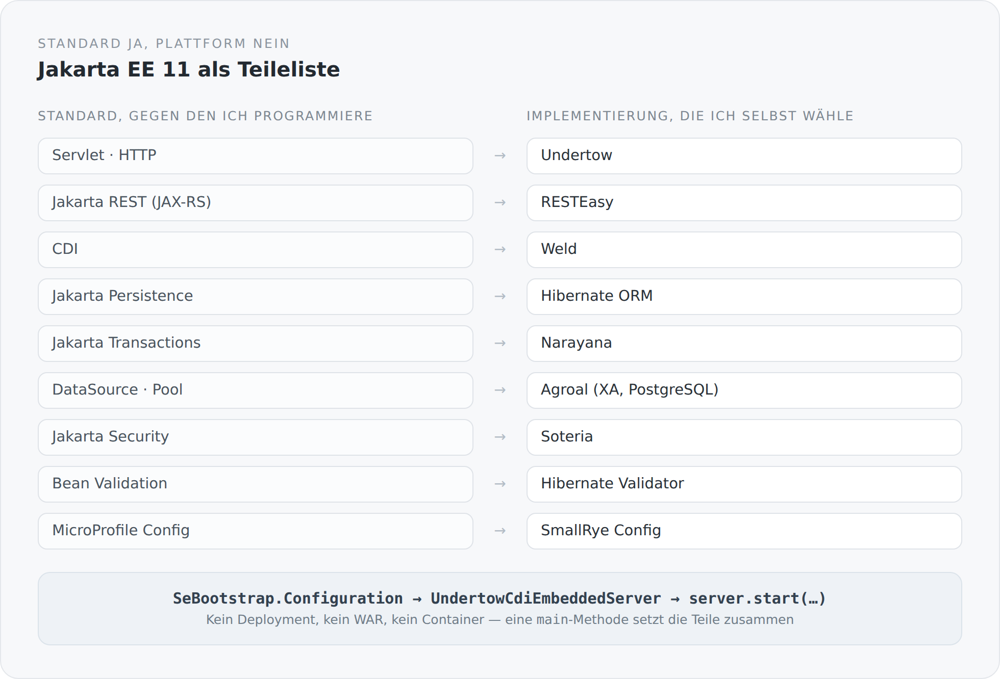

Wenn man heute ein Backend auf der JVM anfängt, ist der Weg vorgezeichnet. Man nimmt Spring Boot oder Quarkus, bekommt in einer Stunde einen laufenden Server und muss nie darüber nachdenken, wie die Teile zusammengekommen sind. Das ist ein gutes Angebot. Für die meisten Projekte ist es das richtige.

Ich habe es trotzdem nicht angenommen, und dieser Artikel erklärt warum.

## Zwei Dinge, die immer zusammen verkauft werden

Ein Applikationsserver ist eigentlich zwei Dinge in einem Paket.

Das erste ist eine Teileliste: ein HTTP-Server, eine JAX-RS-Implementierung, ein CDI-Container, ein ORM, ein Transaktionsmanager, ein Connection-Pool, Security, Validation, Konfiguration. Jemand hat entschieden, welche Implementierung welcher Spezifikation genommen wird, und hat sie so zusammengestellt, dass sie sich vertragen. Das ist echte Arbeit und viel wert.

Das zweite ist ein Betriebsmodell: Es gibt einen Server, der schon läuft, und ich liefere etwas in ihn hinein. Ein Deployment. Ein WAR. Ein Container, dessen Lebenszyklus über meinem steht. Meine Anwendung ist Gast.

Ich wollte das erste und nicht das zweite. Ich wollte die Standards, aber ich wollte selbst der Ort sein, an dem sie zusammenkommen.

## Die Teileliste

Jakarta EE ist eine Sammlung von Spezifikationen. Für jede gibt es Implementierungen, und man kann sie einzeln in den Classpath legen. Genau das passiert hier.

{width=720}

Interessant ist die linke Spalte. Ich programmiere gegen `jakarta.ws.rs`, `jakarta.enterprise`, `jakarta.persistence`, `jakarta.transaction`, `jakarta.security.enterprise`. Nirgendwo im Fachcode steht Undertow, RESTEasy, Weld oder Narayana. Diese Namen tauchen genau einmal auf: in der `build.sbt` und in den paar Klassen, die den Server starten.

Das ist kein Zufall, sondern der eigentliche Gewinn. Standards altern langsamer als Frameworks. Ein Controller, der nur `jakarta.ws.rs` kennt, überlebt einen Wechsel der Implementierung darunter. Ein Controller, der eine Framework-Annotation trägt, tut das nicht.

## Der Start

So beginnt der ganze Server:

```scala
val serverConfig = ServerConfig.load()
val configuration = SeBootstrap.Configuration
  .builder()
  .host(serverConfig.host)
  .port(serverConfig.port)
  .rootPath(serverConfig.rootPath)
  .build()

val server = new UndertowCdiEmbeddedServer()
server.getDeployment.setApplication(new ServerApplication)
server.start(configuration)
```

Das ist alles. Eine Konfiguration, ein eingebetteter Server, ein Start. Danach hängt die `main`-Methode noch ein paar eigene Undertow-Handler daneben — statische Dateien, `sitemap.xml`, den Atom-Feed, `robots.txt` und den Handler, der jede übrige Anfrage serverseitig rendert.

Die JAX-RS-Anwendung selbst ist eine einzige Klasse:

```scala
@ApplicationPath("service")
class ServerApplication extends Application {
  override def getClasses: util.Set[Class[?]] =
    ResteasyComponentIndex.allClasses.toSet.asJava
}
```

Alles unter `/service` ist API. Alles andere ist Seite. Diese Trennung ist damit an einer einzigen Stelle festgelegt und nicht über Konfigurationsdateien verstreut.

## Der Preis, ehrlich benannt

Was ein Applikationsserver sonst still erledigt, muss ich selbst schreiben. Zum Beispiel die Datenquelle. In einem Server steht dafür eine Zeile in einer XML-Datei. Hier steht sie im Code:

```scala
val transactionIntegration = new NarayanaTransactionIntegration(
  transactionManager, transactionSynchronizationRegistry
)

val connectionFactoryConfig = new AgroalConnectionFactoryConfigurationSupplier()
  .connectionProviderClass(classOf[PGXADataSource])
  .jdbcUrl(serverConfig.datasourceUrl)
  .principal(new NamePrincipal(serverConfig.datasourceUsername))
  .credential(new SimplePassword(serverConfig.datasourcePassword))

val poolConfig = new AgroalConnectionPoolConfigurationSupplier()
  .maxSize(serverConfig.hikariMaximumPoolSize)
  .transactionRequirement(TransactionRequirement.WARN)
  .connectionFactoryConfiguration(connectionFactoryConfig)
  .transactionIntegration(transactionIntegration)
```

Das ist mehr Code als eine XML-Zeile. Aber es ist Code, den ich lesen kann. Ich sehe, dass der Pool über eine XA-Datenquelle geht. Ich sehe, dass er an Narayana angebunden ist. Ich sehe, was passiert, wenn eine Operation ohne Transaktion läuft. In einem Applikationsserver wüsste ich das alles auch — aber ich müsste es in einer Dokumentation nachlesen statt in meinem eigenen Projekt.

Dazu kommt Verkabelung, die niemand sieht: ein Request-Filter, der Transaktionen öffnet und schließt. Message-Body-Reader und -Writer für das eigene JSON-Format. Eine CDI-Extension, die REST-Komponenten einsammelt. Exception-Mapper. Das ist das Modul `system`, und es ist im Grunde ein sehr kleines, sehr bewusst gehaltenes Framework. Es bekommt in dieser Reihe eine eigene Staffel.

## Was ich dafür bekomme

Vier Dinge, in der Reihenfolge ihrer Wichtigkeit für mich.

**Sichtbarkeit.** Es gibt keine Stelle im System, an der etwas passiert, das ich nicht aufschreiben musste. Wenn eine Transaktion nicht committet, muss ich nicht raten, welche Schicht sie geöffnet hat. Ich kann hinsehen.

**Austauschbarkeit.** Die Implementierungen stehen in der `build.sbt`, nicht im Code. Undertow gegen etwas anderes zu tauschen ist eine Änderung an zwei Dateien, nicht an zweihundert.

**Ein Prozess.** Kein Deployment-Zyklus, kein Redeploy, kein Server, der schon läuft, bevor mein Code existiert. Ich starte eine JVM mit einem Classpath und einer `main`-Methode. Das macht den Entwicklungsmodus einfach und das Debuggen ehrlich.

**Keine Magie an der falschen Stelle.** Ich habe nichts gegen Abstraktion. Ich habe etwas gegen Abstraktion, die verbirgt, wo etwas schiefgehen kann. CDI ist eine Abstraktion, die ich behalte, weil sie erklärt. Ein Deployment-Container ist eine, die mir mehr wegnimmt, als sie mir gibt.

## Warum nicht Spring Boot, warum nicht Quarkus

Weil beide sehr gut genau das tun, was ich hier nicht will: die Schicht verstecken, die ich zeigen möchte.

Das ist kein Vorwurf. In einem Produktteam ist genau das die richtige Entscheidung — man will nicht, dass jeder Entwickler den Transaktionsfilter versteht, man will, dass er funktioniert. Aber dieser Blog ist kein Produktteam. Er ist der Versuch, ein System so zu bauen, dass man es ganz sehen kann.

Es gibt noch ein zweites Argument, und das ist weniger persönlich. Ein Framework definiert seine eigene Welt und behält die Deutungshoheit darüber. Ein Standard nicht. Wenn ich gegen `jakarta.ws.rs` schreibe, gehört mein Code mir. Wenn ich gegen die Konventionen eines Frameworks schreibe, gehört er ein Stück weit dem Framework.

## Standard ohne Plattform

Das ist die Formel, auf die es hinausläuft. Ich nehme alles, was die Standardisierung an Ordnung gebracht hat, und lasse das Betriebsmodell weg, das historisch damit verbunden war.

Das Ergebnis ist ein Blog, der aus einem Verzeichnis heraus startet, in einem Prozess läuft, und dessen gesamte Verkabelung im eigenen Quelltext steht. Nicht weil das moderner wäre. Sondern weil ich dann für jede Stelle sagen kann, warum sie so ist.

Im nächsten Artikel sehen wir uns an, wie dieser Code in vier Module zerfällt — und warum die Richtung dieser Abhängigkeiten wichtiger ist als ihre Anzahl.
