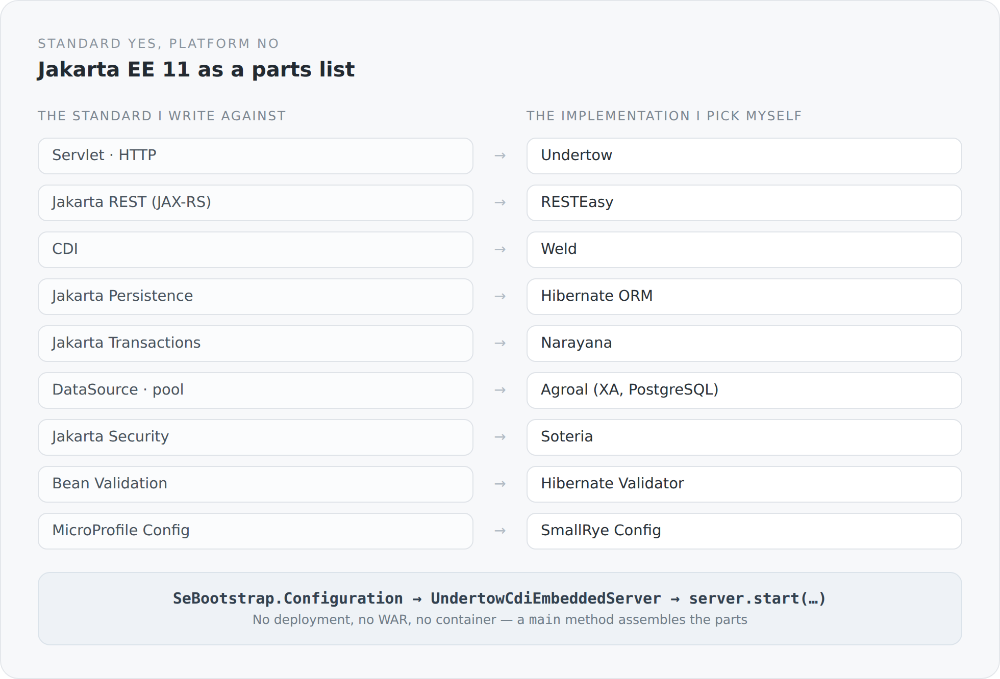

When you start a JVM backend today, the road is well marked. You take Spring Boot or Quarkus, you have a running server within the hour, and you never have to think about how the parts came together. That is a good offer. For most projects it is the right one.

I did not take it, and this article explains why.

## Two things always sold together

An application server is really two things in one package.

The first is a parts list: an HTTP server, a JAX-RS implementation, a CDI container, an ORM, a transaction manager, a connection pool, security, validation, configuration. Somebody decided which implementation goes with which specification and assembled them so they get along. That is real work and it is worth a lot.

The second is an operating model: there is a server that already runs, and I deliver something into it. A deployment. A WAR. A container whose lifecycle sits above mine. My application is a guest.

I wanted the first without the second. I wanted the standards, but I wanted to be the place where they come together.

## The parts list

Jakarta EE is a collection of specifications. Each has implementations, and you can put them on the classpath one at a time. That is exactly what happens here.

{width=720}

The left column is the interesting one. I program against `jakarta.ws.rs`, `jakarta.enterprise`, `jakarta.persistence`, `jakarta.transaction`, `jakarta.security.enterprise`. Nowhere in the domain code does the word Undertow, RESTEasy, Weld or Narayana appear. Those names show up in exactly two places: in `build.sbt` and in the handful of classes that start the server.

That is not an accident, it is the actual gain. Standards age more slowly than frameworks. A controller that only knows `jakarta.ws.rs` survives a change of the implementation beneath it. A controller carrying a framework annotation does not.

## Startup

This is how the whole server begins:

```scala
val serverConfig = ServerConfig.load()
val configuration = SeBootstrap.Configuration
  .builder()
  .host(serverConfig.host)
  .port(serverConfig.port)
  .rootPath(serverConfig.rootPath)
  .build()

val server = new UndertowCdiEmbeddedServer()
server.getDeployment.setApplication(new ServerApplication)
server.start(configuration)
```

That is all. A configuration, an embedded server, a start. After that the `main` method hangs a few Undertow handlers of its own next to it — static files, `sitemap.xml`, the Atom feed, `robots.txt`, and the handler that renders every remaining request server-side.

The JAX-RS application itself is a single class:

```scala
@ApplicationPath("service")
class ServerApplication extends Application {
  override def getClasses: util.Set[Class[?]] =
    ResteasyComponentIndex.allClasses.toSet.asJava
}
```

Everything under `/service` is API. Everything else is a page. That separation is thus fixed in one place instead of being scattered across configuration files.

## The price, named honestly

What an application server otherwise handles quietly, I have to write. The data source, for example. Inside a server that is one line in an XML file. Here it is in code:

```scala
val transactionIntegration = new NarayanaTransactionIntegration(
  transactionManager, transactionSynchronizationRegistry
)

val connectionFactoryConfig = new AgroalConnectionFactoryConfigurationSupplier()
  .connectionProviderClass(classOf[PGXADataSource])
  .jdbcUrl(serverConfig.datasourceUrl)
  .principal(new NamePrincipal(serverConfig.datasourceUsername))
  .credential(new SimplePassword(serverConfig.datasourcePassword))

val poolConfig = new AgroalConnectionPoolConfigurationSupplier()
  .maxSize(serverConfig.hikariMaximumPoolSize)
  .transactionRequirement(TransactionRequirement.WARN)
  .connectionFactoryConfiguration(connectionFactoryConfig)
  .transactionIntegration(transactionIntegration)
```

That is more code than one line of XML. But it is code I can read. I can see that the pool goes through an XA data source. I can see it is bound to Narayana. I can see what happens when an operation runs without a transaction. Inside an application server I would know all of that too — but I would have to look it up in documentation instead of in my own project.

On top of that comes wiring nobody ever sees: a request filter that opens and closes transactions. Message body readers and writers for the project's own JSON format. A CDI extension that collects REST components. Exception mappers. That is the `system` module, and it is in essence a very small, very deliberately kept framework. It gets its own arc in this series.

## What I get in return

Four things, in the order they matter to me.

**Visibility.** There is no place in the system where something happens that I did not have to write down. If a transaction fails to commit, I do not have to guess which layer opened it. I can look.

**Replaceability.** The implementations live in `build.sbt`, not in the code. Swapping Undertow for something else is a change to two files, not two hundred.

**One process.** No deployment cycle, no redeploy, no server that runs before my code exists. I start a JVM with a classpath and a `main` method. That makes development mode simple and debugging honest.

**No magic in the wrong place.** I have nothing against abstraction. I have something against abstraction that hides where things can go wrong. CDI is an abstraction I keep, because it explains. A deployment container is one that takes more from me than it gives.

## Why not Spring Boot, why not Quarkus

Because both are very good at exactly what I do not want here: hiding the layer I want to show.

That is not a criticism. Inside a product team it is precisely the right decision — you do not want every developer to understand the transaction filter, you want it to work. But this blog is not a product team. It is an attempt to build a system you can see all of.

There is a second argument, and it is less personal. A framework defines its own world and keeps interpretive authority over it. A standard does not. When I write against `jakarta.ws.rs`, my code belongs to me. When I write against a framework's conventions, it belongs partly to the framework.

## Standard without platform

That is the formula it comes down to. I take everything that standardization brought in the way of order, and I leave out the operating model that was historically attached to it.

The result is a blog that starts from a directory, runs in one process, and whose entire wiring lives in its own source. Not because that is more modern. Because it means I can say, for every single place, why it is the way it is.

In the next article we look at how this code falls into four modules — and why the direction of those dependencies matters more than their number.
