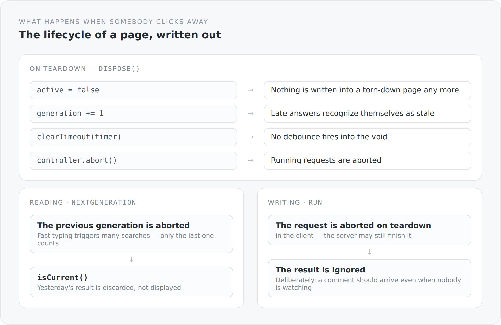

There is a class of bugs that occurs in almost every web application and that is rarely named as such. Somebody types into a search field, clicks on, and a second later a late response writes its result into a page that no longer exists. Or the answer to the third keystroke arrives before the answer to the second, and the list ends up showing the wrong thing.

React solves that with cleanup functions in `useEffect` — and that is exactly where many bugs come from, because cleaning up looks optional.

In JFX the lifecycle is not an option. It is an object.

## What a page owns

```ts
export function asyncLifecycle(): AsyncLifecycle {
  const restore = capture();
  let active = true;
  let timer: ReturnType<typeof setTimeout> | undefined;
  let generation = 0;
  let generationController: AbortController | undefined;
  const operations = new Set<AbortController>();

  disposeWith({
    dispose(): void {
      active = false;
      generation += 1;
      if (timer !== undefined) clearTimeout(timer);
      generationController?.abort();
      for (const controller of operations) controller.abort();
      operations.clear();
    },
  });
  // ...
}
```

The comment above the function says it in one sentence: *Owns timers and requests created by one mounted page/component.*

A page has timers and requests, and both belong to it. When it is torn down, they disappear.

{width=720}

`capture()` in the first line is the subtlest part. It remembers the context this page was built in — the element it hangs under, its language, its environment. `commit` restores that context later:

```ts
const commit = (action: () => void): void => {
  if (active) restore(() => { if (active) action(); });
};
```

`active` is checked twice: once before restoring, once after. That is not an oversight. Between the two checks the page can have been torn down.

Without `capture` a response arriving a second later would land in a world where nobody knows any more where it belongs. With `capture` the callback runs in the right context — or not at all.

## Reading and writing are different

That is the distinction that makes this file interesting.

```ts
nextGeneration(): RequestGeneration {
  generationController?.abort();
  generationController = createAbortController();
  const ownGeneration = ++generation;
  return {
    signal: generationController.signal,
    isCurrent: () => active && ownGeneration === generation,
  };
}
```

A new read generation aborts the previous one. Fast typing triggers many searches; only the last one may show its result. And because `isCurrent()` checks in addition, a response that still arrives despite the abort can recognize itself as stale.

```ts
run<T>(load, success, failure): void {
  if (!active) return;
  const controller = createAbortController();
  operations.add(controller);
  void load(controller.signal).then(
    (value) => commit(() => success(value)),
    (error) => { if (!isAbortError(error)) commit(() => failure(error)); },
  ).finally(() => operations.delete(controller));
}
```

Writes work differently. They do not abort each other — they are collected and aborted when the page is torn down.

And there is a sentence in the comment that is a real domain decision:

> Writes use `run`: their client request is aborted on disposal, while the server may still commit it; the detached result is intentionally ignored.

Somebody who submits a comment and immediately clicks away has still submitted the comment. The client stops listening; the server finishes.

The alternative would have been to really cancel the write. That sounds cleaner and is not: you can abort an HTTP request on the client, but you cannot know whether the server has already processed it. An "aborted" write would be a state nobody can say anything definite about.

So the honest variant: we stop watching, and we write into the code that we do that deliberately.

## An abort that works even where there is none

```ts
/** GraalJS has no browser AbortController; its request-time fetch ignores the
 * signal, while generation guards still prevent stale commits. */
function createAbortController(): AbortController {
  if (typeof AbortController !== "undefined") return new AbortController();
  // ... a minimal stand-in
}
```

GraalJS is an ECMAScript runtime without web APIs. `AbortController` does not exist there.

You could check at every site whether it exists. Instead there is a stand-in with the right shape that does nothing — and the comment says exactly what is lost by it: the request is not really aborted on the server. What remains are the generation guards, and those are enough to discard stale results.

That is an honest dummy. It does not claim to do the same thing. It only keeps the shape, so the code above it stays identical in both places.

## The debounce belongs to it too

```ts
debounce(delayMs, action): void {
  if (timer !== undefined) clearTimeout(timer);
  timer = setTimeout(() => {
    timer = undefined;
    commit(action);
  }, delayMs);
}
```

Five lines, and they are why a debounced search in this system is not a failure source of its own. The timer belongs to the page, is cleared on teardown, and even if it still fires it runs through `commit` — so only when the page is still there.

In most projects the same logic is rewritten in every component, each time with a `useEffect` that cleans up. And in one of them the cleanup is missing.

## The price

**You have to remember it.** A page that does not use `asyncLifecycle()` and calls `fetch` directly has all of these problems again. The framework forces nothing.

**It is more code than `useEffect`.** A hundred and fifty lines for something another framework ships with.

**And it is unfamiliar.** Somebody coming from React looks for the cleanup function and finds an object with five methods.

## Why I want it this way anyway

Because I know the alternative. In a system with automatic cleanup you do not know *when* something is cleaned up — you trust that it is. And when it once is not, you search for a very long time.

Here it sits in one file. `dispose()` is seven lines long, and you can read them and say: after this, nothing runs any more.

That is the same thought as with the transaction filter in the backend. Not less complexity — the same complexity, in a place you can look at.

The next article is about the list from which this frontend derives almost everything it knows about itself.
