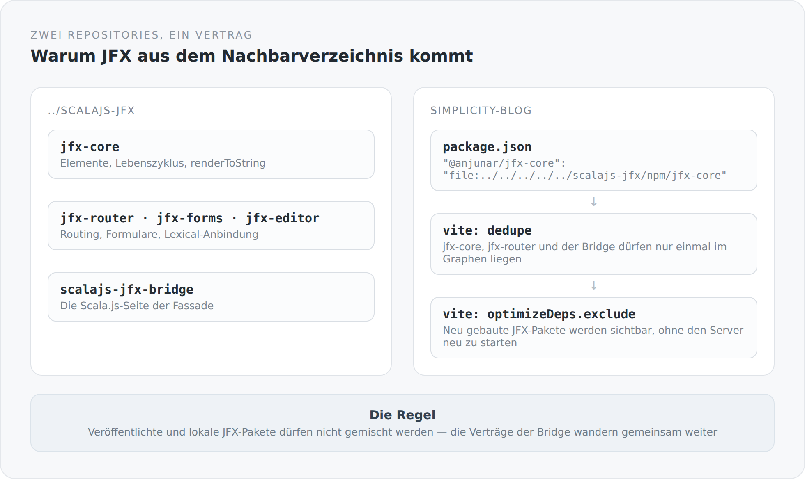

In der `package.json` dieses Blogs steht etwas, das in den meisten Projekten ein Warnzeichen wäre:

```json
{
  "dependencies": {
    "@anjunar/jfx-core": "file:../../../../../scalajs-jfx/npm/jfx-core",
    "@anjunar/jfx-router": "file:../../../../../scalajs-jfx/npm/jfx-router",
    "@anjunar/jfx-editor": "file:../../../../../scalajs-jfx/npm/jfx-editor",
    "@anjunar/scalajs-jfx-bridge": "file:../../../../../scalajs-jfx/npm/scalajs-jfx-bridge"
  }
}
```

Fünf Ebenen nach oben und in ein Nachbarverzeichnis. Keine Versionsnummern, keine Registry, kein Tag. Das ist ungewöhnlich genug, dass es eine Erklärung braucht.

## Zwei Projekte, ein Vertrag

Der Blog benutzt JFX 3, ein UI-Framework, das ich selbst entwickle. Es liegt in einem eigenen Repository, `scalajs-jfx`, und besteht aus zwei Hälften: einer Scala.js-Laufzeit und einer TypeScript-Fassade darüber.

{width=720}

Das Entscheidende: Diese beiden Hälften sind nicht unabhängig. Die Bridge zwischen Scala.js und TypeScript ist ein Vertrag, und wenn er sich ändert, ändert er sich auf beiden Seiten gleichzeitig. Das README des Blogs sagt das so deutlich, wie man es sagen kann:

> Veröffentlichte und lokale JFX-Pakete dürfen nicht gemischt werden, weil ihre Bridge-Verträge gemeinsam weiterwandern.

Genau darum geht es. Wenn ein Teil der Pakete aus der Registry käme und ein anderer aus dem lokalen Checkout, würde man zwei Generationen desselben Vertrags in einem Bundle mischen. Der Fehler, der daraus entsteht, ist keiner, den ein Typsystem findet. Es ist ein Laufzeitfehler an einer unerwarteten Stelle, Wochen später.

## Warum nicht einfach veröffentlichen

Die naheliegende Frage. Man könnte die JFX-Pakete versionieren, in die Registry legen und im Blog eine Version festschreiben. Das wäre sauberer.

Es wäre auch langsamer. JFX und dieser Blog entstehen zusammen. Ich merke im Blog, dass eine Komponente etwas nicht kann, ändere sie im Nachbarrepository, und sehe das Ergebnis eine Sekunde später. Bei einer Registry-Version wären das drei Schritte mehr: bauen, veröffentlichen, aktualisieren. Pro Änderung.

Solange das Framework und sein erster ernsthafter Anwender gemeinsam wachsen, ist der lokale Pfad der ehrlichere Ausdruck dessen, was hier passiert. Sie sind ein Projekt in zwei Verzeichnissen.

Das wird sich ändern. Wenn JFX stabil genug ist, dass ich es nicht mehr täglich anfasse, gehört es in eine Registry mit echten Versionen. Bis dahin ist die `file:`-Referenz nicht Schlamperei, sondern die zutreffende Beschreibung.

## Was Vite dafür wissen muss

Lokale Pakete sind Symlinks, und Symlinks bringen Bundler durcheinander. In der `vite.config.ts` stehen deshalb zwei Blöcke, die ohne diesen Kontext willkürlich aussehen:

```ts
resolve: {
  alias: { "@lexical/code": "@lexical/code-core" },
  dedupe: [
    "@anjunar/jfx-core",
    "@anjunar/jfx-router",
    "@anjunar/scalajs-jfx-bridge",
  ],
},
optimizeDeps: {
  exclude: ["@anjunar/jfx-core", "@anjunar/jfx-controls",
            "@anjunar/jfx-editor", "@anjunar/scalajs-jfx-bridge"],
},
```

`dedupe` sorgt dafür, dass diese Pakete genau einmal im Modulgraphen landen. Über einen Symlink kann dasselbe Paket sonst unter zwei Pfaden auftauchen, und dann gibt es zwei Instanzen desselben Moduls. Bei einem UI-Framework mit Lebenszyklus und Kontext heißt das: zwei getrennte Welten, die sich gegenseitig nicht sehen. Ein Fehlerbild, das man einmal debuggt und danach nie wieder haben will.

`optimizeDeps.exclude` nimmt genau diese Pakete aus Vites Abhängigkeits-Vorbündelung heraus. Der Kommentar im Code erklärt es: Neu gebaute JFX-Controls und Bridge-Code werden dadurch sichtbar, ohne dass der ganze Server neu starten muss. Genau der Kreislauf, den ich haben will.

Der Alias auf `@lexical/code-core` ist noch spezieller. Er hält einen Paketvertrag stabil, obwohl der lokale Scala.js-Bridge über einen `file:`-Symlink eingebunden ist — und wird in der `package.json` durch ein `overrides` gespiegelt, damit npm dieselbe Auflösung wählt wie Vite. Zwei Werkzeuge, dieselbe Regel, an zwei Stellen aufgeschrieben. Das ist unschön, und es steht so im Code, weil es die Wahrheit ist.

## Was das kostet

Der Preis ist konkret und trifft jeden, der das Projekt neu auscheckt.

Man braucht ein zweites Repository am richtigen Ort: `../scalajs-jfx`, als Geschwisterverzeichnis. Man muss dort erst die TypeScript-Pakete und die Scala.js-Bridge bauen, bevor hier `npm install` sinnvoll ist. Und die `package-lock.json` des Blogs enthält lokale Dateipfade, was bedeutet: Sie beschreibt einen Rechner, nicht ein Universum.

Das ist die unangenehmste Stelle im ganzen Build. Ich weiß das. Sie steht deshalb ausführlich im README und nicht in einer Fußnote.

## Der Punkt dahinter

Ich hätte diese Abhängigkeit verstecken können — eine Version einfrieren, einmal veröffentlichen, so tun, als wäre JFX ein fremdes Paket. Das hätte das Projekt beim ersten Blick einfacher aussehen lassen.

Aber es wäre nicht wahr gewesen. JFX ist kein fremdes Paket. Es entsteht gerade, und dieser Blog ist der Ort, an dem es sich beweisen muss.

Eine Abhängigkeit, die man sieht, kann man auflösen. Eine, die man kaschiert hat, findet man erst wieder, wenn sie bricht.
