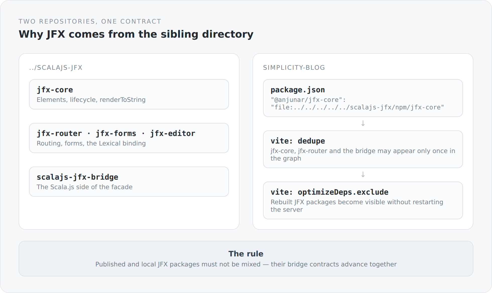

The `package.json` of this blog contains something that would be a warning sign in most projects:

```json
{
  "dependencies": {
    "@anjunar/jfx-core": "file:../../../../../scalajs-jfx/npm/jfx-core",
    "@anjunar/jfx-router": "file:../../../../../scalajs-jfx/npm/jfx-router",
    "@anjunar/jfx-editor": "file:../../../../../scalajs-jfx/npm/jfx-editor",
    "@anjunar/scalajs-jfx-bridge": "file:../../../../../scalajs-jfx/npm/scalajs-jfx-bridge"
  }
}
```

Five levels up and into a sibling directory. No version numbers, no registry, no tag. That is unusual enough to need an explanation.

## Two projects, one contract

The blog uses JFX 3, a UI framework I develop myself. It lives in its own repository, `scalajs-jfx`, and consists of two halves: a Scala.js runtime and a TypeScript facade on top of it.

{width=720}

The crucial part: those two halves are not independent. The bridge between Scala.js and TypeScript is a contract, and when it changes, it changes on both sides at once. The blog's README puts it as plainly as it can be put:

> Published and local JFX packages must not be mixed because their bridge contracts advance together.

That is exactly the point. If some packages came from the registry and others from the local checkout, you would be mixing two generations of the same contract inside one bundle. The resulting failure is not one a type system finds. It is a runtime error in an unexpected place, weeks later.

## Why not simply publish

The obvious question. You could version the JFX packages, put them in a registry and pin a version in the blog. That would be cleaner.

It would also be slower. JFX and this blog come into being together. I notice in the blog that a component cannot do something, change it in the neighbouring repository, and see the result a second later. With a registry version that would be three extra steps: build, publish, update. Per change.

As long as the framework and its first serious consumer grow together, the local path is the more honest expression of what is going on here. They are one project in two directories.

That will change. Once JFX is stable enough that I do not touch it daily, it belongs in a registry with real versions. Until then the `file:` reference is not sloppiness but an accurate description.

## What Vite has to know about it

Local packages are symlinks, and symlinks confuse bundlers. That is why `vite.config.ts` contains two blocks that look arbitrary without this context:

```ts
resolve: {
  alias: { "@lexical/code": "@lexical/code-core" },
  dedupe: [
    "@anjunar/jfx-core",
    "@anjunar/jfx-router",
    "@anjunar/scalajs-jfx-bridge",
  ],
},
optimizeDeps: {
  exclude: ["@anjunar/jfx-core", "@anjunar/jfx-controls",
            "@anjunar/jfx-editor", "@anjunar/scalajs-jfx-bridge"],
},
```

`dedupe` makes sure those packages land in the module graph exactly once. Through a symlink the same package can otherwise appear under two paths, and then there are two instances of the same module. For a UI framework with lifecycle and context that means two separate worlds that cannot see each other. A failure you debug once and never want again.

`optimizeDeps.exclude` takes exactly those packages out of Vite's dependency pre-bundling. The comment in the code explains it: rebuilt JFX controls and bridge code become visible that way without restarting the whole server. Exactly the loop I want.

The alias onto `@lexical/code-core` is more specialized still. It keeps a package contract stable even though the local Scala.js bridge is linked through a `file:` symlink — and it is mirrored by an `overrides` entry in `package.json` so npm resolves the same way Vite does. Two tools, one rule, written down in two places. That is ugly, and it lives in the code that way because it is the truth.

## What it costs

The price is concrete and hits everyone who checks the project out fresh.

You need a second repository in the right place: `../scalajs-jfx`, as a sibling directory. You have to build the TypeScript packages and the Scala.js bridge there before `npm install` makes any sense here. And the blog's `package-lock.json` contains local file paths, which means it describes one machine rather than a universe.

This is the most unpleasant spot in the whole build. I know that. Which is why it is described at length in the README and not in a footnote.

## The point behind it

I could have hidden this dependency — freeze a version, publish once, pretend JFX were a foreign package. That would have made the project look simpler at first glance.

But it would not have been true. JFX is not a foreign package. It is being built right now, and this blog is where it has to prove itself.

A dependency you can see is one you can resolve. One you have papered over is one you find again only when it breaks.
