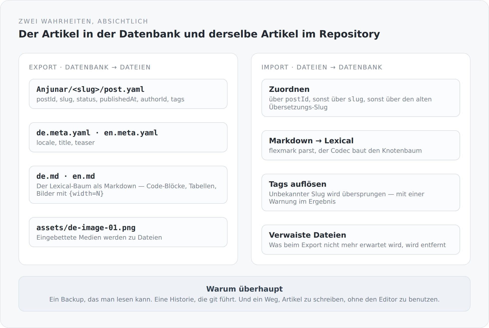

Jeder Blog, der Inhalte in einer Datenbank hält, hat dasselbe stille Problem: Die Texte leben in einem System, aus dem man sie nur mit diesem System wieder herausbekommt. Ein Backup ist ein Datenbank-Dump. Eine Historie gibt es nur, wenn man sie eingebaut hat. Und ein Artikel außerhalb des Editors zu schreiben ist nicht vorgesehen.

Dieser Blog hat deshalb eine zweite Existenz für jeden Artikel: als Dateien in einem Git-Repository.

## Die Ablage

{width=720}

Pro Artikel ein Verzeichnis, benannt nach dem Autor und dem Slug. Darin:

```text
Anjunar/markdown-as-a-second-truth/
  post.yaml         postId, slug, status, publishedAt, authorId, tags
  de.meta.yaml      locale, title, teaser
  de.md             der Text
  en.meta.yaml
  en.md
  assets/
    de-image-01.png
```

Die Aufteilung folgt genau der Aufteilung im Modell. `post.yaml` trägt, was am Artikel hängt. Die `*.meta.yaml` tragen, was an der Übersetzung hängt. Und der eigentliche Text steht in einer Datei, die man auch dann noch lesen kann, wenn es diesen Blog nicht mehr gibt.

Das ist mir der wichtigste Punkt an der ganzen Sache. Ein Artikel, den ich in fünf Jahren nur mit einer laufenden PostgreSQL-Instanz und einem Scala-Build wieder aufmachen kann, ist nicht wirklich meiner.

## Der Codec

Zwischen Lexical-Baum und Markdown steht `BlogMarkdownCodec` — mit rund tausend Zeilen die größte Datei im Domänenmodul. Er kann beide Richtungen.

Vom Baum zum Text:

```scala
case node if node.`type` == "code" || node.`type` == "codemirror" =>
  val language = Option(node.language).filter(_.trim.nonEmpty).getOrElse("")
  Some(s"```$language\n$content\n```".trim)
```

Und für Bilder, samt Breite:

```scala
val width = Option(node.widthPx).map(_.longValue()).filter(_ > 0)
  .map(value => s"{width=$value}").getOrElse("")
s"$width"
```

Vom Text zum Baum geht es über flexmark, und die Breitenangabe wird beim Einlesen wieder eingesammelt:

```scala
private val Width = """^\{width=([1-9][0-9]*)\}(.*)$""".r
```

Das `{width=720}` hinter einem Bild ist kein Standard-Markdown. Es ist eine Erweiterung, die dieser Codec versteht — genau eine, bewusst klein, und in beide Richtungen verlustfrei. Wer die Datei in einem normalen Markdown-Viewer öffnet, sieht das Bild und eine kleine Textmarke dahinter. Das ist der Preis, und er ist niedrig.

Bilder, die im Editor eingebettet wurden, werden beim Export zu echten Dateien:

```scala
val fileName = s"${markdownPath.getFileName.toString.stripSuffix(".md")}-image-${"%02d".format(nextIndex)}.$extension"
```

Aus einem Medium in der Datenbank wird `de-image-01.png` neben dem Text. Beim Import wieder zurück. Ein Artikel-Verzeichnis ist damit vollständig — man kann es kopieren und alles ist dabei.

## Der Import und seine Toleranz

```scala
private def resolvePost(...) =
  findPostById(metadata.postId) orElse findPostBySlug(metadata.slug) orElse findLegacyTranslationSlug(metadata.slug)
```

Drei Wege, einen bestehenden Artikel wiederzufinden: über die Id, über den Slug, über den alten Slug aus der Zeit, als Übersetzungen eigene Slugs hatten.

Das ist ein Zugeständnis an die Wirklichkeit. Ein Import, der nur exakte Ids akzeptiert, ist unbrauchbar, sobald jemand eine Datei von Hand angelegt hat. Einer, der gar nicht zuordnet, legt Duplikate an.

Ähnlich bei Tags:

```scala
matches.asScala.headOption match {
  case Some(tag) => post.tags.add(tag)
  case None => result.warnings.add(s"Unknown tag '$slug' on post '${post.slug}'; assignment skipped.")
}
```

Ein unbekannter Tag bricht den Import nicht ab. Er wird übersprungen, und das Ergebnis sagt, dass er übersprungen wurde.

`BlogContentSyncResult` ist überhaupt eine Klasse, die ich mag: `filesProcessed`, `postsProcessed`, `createdPosts`, `updatedPosts`, `deletedFiles`, `committed`, `commitId`, `summary` — und eine Liste von Warnungen. Der Sync sagt nicht „fertig". Er sagt, was er getan hat.

## Und der Export räumt auf

```scala
expectedFiles.add(file.getParent.resolve("post.yaml").toAbsolutePath.normalize())
expectedFiles.add(file.getParent.resolve(s"$locale.meta.yaml").toAbsolutePath.normalize())
```

Der Export merkt sich, welche Dateien er erwartet, und entfernt danach alles, was er verwaltet und nicht mehr erwartet. Dazu gehören `*.md`, `*.meta.yaml`, `post.yaml` und alles unter `assets/`. Leere Verzeichnisse verschwinden.

Was *nicht* dazugehört, bleibt liegen: eine `LICENSE`, eine `README`, `.gitignore`. Das ist der Unterschied zwischen einem Werkzeug, das ein Verzeichnis verwaltet, und einem, das es besitzt.

## Git ist Teil des Modells

```scala
def pullFromGitHub(): BlogContentSyncResult
def pushToGitHub(message: String): BlogContentSyncResult
def importFromMarkdown(actor: User, pullFirst: Boolean): BlogContentSyncResult
def exportToMarkdown(pushAfter: Boolean): BlogContentSyncResult
```

Vier Operationen, und zwei davon rufen `git` als Prozess auf. Der Sync klont bei Bedarf, holt, committet und schiebt.

Das ist eine ungewöhnliche Abhängigkeit für ein Domänenmodul — es setzt voraus, dass auf dem Server ein `git` liegt. Ich habe mich trotzdem dafür entschieden, weil die Alternative eine Java-Git-Bibliothek gewesen wäre, mit eigenem Verhalten, eigenen Fehlerbildern und einer weiteren Abhängigkeit. Ein Prozessaufruf ist ehrlicher: Was passiert, ist genau das, was auch auf der Kommandozeile passieren würde.

Konfiguriert wird über vier Properties mit brauchbaren Vorgaben — unter anderem sucht der Standardpfad das Content-Repository als Geschwisterverzeichnis des Projekts. Dasselbe Muster wie bei den JFX-Paketen.

## Welche Wahrheit gilt

Das ist die Frage, die man bei zwei Wahrheiten immer stellen muss, und die Antwort ist unbequem: Es kommt darauf an, in welche Richtung man synchronisiert.

Es gibt keinen automatischen Abgleich, keine Konfliktauflösung, kein Zusammenführen. Wer im Editor schreibt und dann importiert, verliert die Änderung im Editor. Wer eine Datei ändert und dann exportiert, verliert die Datei.

Das ist eine echte Einschränkung, und ich will sie nicht kleinreden. Sie ist tragbar, solange eine Person schreibt und weiß, was sie gerade tut. Bei zwei Autoren wäre sie ein Problem.

Was sie erträglich macht, ist git. Wenn ein Export etwas überschreibt, was ich in der Datei geändert hatte, steht es noch in der Historie. Die zweite Wahrheit hat ein Gedächtnis, das die erste nicht hat.

## Was das ermöglicht

Drei Dinge, die vorher nicht gingen.

Ein Backup, das man liest. Kein Dump, sondern Text und Bilder in einer Ordnerstruktur.

Eine Historie umsonst. Jede Änderung an einem Artikel ist ein Commit, mit Diff. Ich habe nie eine Revisionsverwaltung in den Blog eingebaut — und habe trotzdem eine.

Und ein zweiter Weg, Artikel zu schreiben. Dieser Artikel zum Beispiel ist als Datei entstanden, nicht im Editor. Der Blog musste dafür nicht laufen.

Damit ist die Fachlichkeit beschrieben: ein Artikel, sein Inhalt als Baum, seine Sprachen, seine zweite Existenz als Datei. Ab dem nächsten Artikel geht es darum, wie all das nach außen sichtbar wird — und was ein Client davon eigentlich wissen darf.
