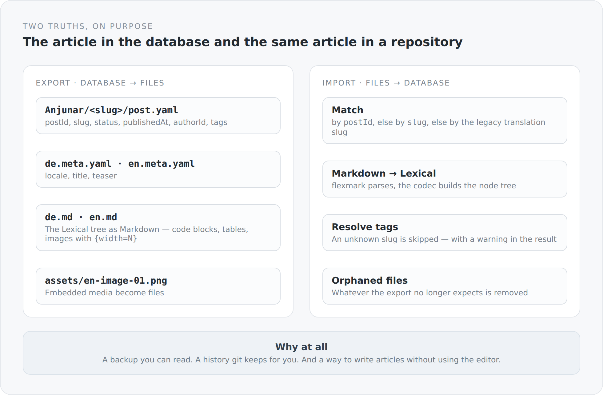

Every blog that keeps its content in a database has the same quiet problem: the texts live in a system you can only get them out of with that same system. A backup is a database dump. A history exists only if you built one. And writing an article outside the editor is not provided for.

That is why every article in this blog has a second existence: as files in a Git repository.

## The layout

{width=720}

One directory per article, named after the author and the slug. Inside:

```text
Anjunar/markdown-as-a-second-truth/
  post.yaml         postId, slug, status, publishedAt, authorId, tags
  de.meta.yaml      locale, title, teaser
  de.md             the text
  en.meta.yaml
  en.md
  assets/
    en-image-01.png
```

The split follows the split in the model exactly. `post.yaml` carries what hangs on the article. The `*.meta.yaml` files carry what hangs on the translation. And the actual text sits in a file you can still open when this blog no longer exists.

That is the most important part of the whole thing to me. An article I can only reopen in five years with a running PostgreSQL instance and a Scala build is not really mine.

## The codec

Between the Lexical tree and Markdown sits `BlogMarkdownCodec` — at around a thousand lines the largest file in the domain module. It goes both ways.

From tree to text:

```scala
case node if node.`type` == "code" || node.`type` == "codemirror" =>
  val language = Option(node.language).filter(_.trim.nonEmpty).getOrElse("")
  Some(s"```$language\n$content\n```".trim)
```

And for images, including the width:

```scala
val width = Option(node.widthPx).map(_.longValue()).filter(_ > 0)
  .map(value => s"{width=$value}").getOrElse("")
s"$width"
```

From text to tree it goes through flexmark, and the width marker is collected again on the way in:

```scala
private val Width = """^\{width=([1-9][0-9]*)\}(.*)$""".r
```

The `{width=720}` after an image is not standard Markdown. It is an extension this codec understands — exactly one, deliberately small, and lossless in both directions. Anyone opening the file in an ordinary Markdown viewer sees the image and a small text marker behind it. That is the price, and it is low.

Images embedded in the editor become real files on export:

```scala
val fileName = s"${markdownPath.getFileName.toString.stripSuffix(".md")}-image-${"%02d".format(nextIndex)}.$extension"
```

A medium in the database becomes `en-image-01.png` next to the text. On import, back again. An article directory is therefore complete — you can copy it and everything is there.

## Import and its tolerance

```scala
private def resolvePost(...) =
  findPostById(metadata.postId) orElse findPostBySlug(metadata.slug) orElse findLegacyTranslationSlug(metadata.slug)
```

Three ways to find an existing article again: by id, by slug, by the legacy slug from the days when translations had slugs of their own.

That is a concession to reality. An import that only accepts exact ids is useless the moment someone creates a file by hand. One that does not match at all creates duplicates.

Similarly with tags:

```scala
matches.asScala.headOption match {
  case Some(tag) => post.tags.add(tag)
  case None => result.warnings.add(s"Unknown tag '$slug' on post '${post.slug}'; assignment skipped.")
}
```

An unknown tag does not abort the import. It is skipped, and the result says it was skipped.

`BlogContentSyncResult` is generally a class I like: `filesProcessed`, `postsProcessed`, `createdPosts`, `updatedPosts`, `deletedFiles`, `committed`, `commitId`, `summary` — and a list of warnings. The sync does not say "done". It says what it did.

## And the export cleans up

```scala
expectedFiles.add(file.getParent.resolve("post.yaml").toAbsolutePath.normalize())
expectedFiles.add(file.getParent.resolve(s"$locale.meta.yaml").toAbsolutePath.normalize())
```

The export remembers which files it expects and afterwards removes everything it manages and no longer expects. That includes `*.md`, `*.meta.yaml`, `post.yaml` and everything under `assets/`. Empty directories disappear.

What is *not* included stays: a `LICENSE`, a `README`, `.gitignore`. That is the difference between a tool that manages a directory and one that owns it.

## Git is part of the model

```scala
def pullFromGitHub(): BlogContentSyncResult
def pushToGitHub(message: String): BlogContentSyncResult
def importFromMarkdown(actor: User, pullFirst: Boolean): BlogContentSyncResult
def exportToMarkdown(pushAfter: Boolean): BlogContentSyncResult
```

Four operations, two of which invoke `git` as a process. The sync clones when needed, fetches, commits and pushes.

That is an unusual dependency for a domain module — it assumes a `git` on the server. I chose it anyway, because the alternative would have been a Java Git library, with its own behaviour, its own failure modes and one more dependency. A process call is more honest: what happens is exactly what would happen on the command line.

Configuration goes through four properties with usable defaults — among them a default path that looks for the content repository as a sibling directory of the project. The same pattern as with the JFX packages.

## Which truth wins

That is the question you always have to ask with two truths, and the answer is uncomfortable: it depends which direction you synchronize.

There is no automatic reconciliation, no conflict resolution, no merge. Write in the editor and then import, and you lose the editor change. Change a file and then export, and you lose the file.

That is a real limitation, and I do not want to talk it down. It is bearable as long as one person writes and knows what they are doing at any moment. With two authors it would be a problem.

What makes it tolerable is git. If an export overwrites something I had changed in the file, it is still in the history. The second truth has a memory the first one does not.

## What it enables

Three things that were not possible before.

A backup you can read. Not a dump, but text and images in a folder structure.

A history for free. Every change to an article is a commit, with a diff. I never built revision management into the blog — and I have one anyway.

And a second way to write articles. This article, for example, came into being as a file, not in the editor. The blog did not have to be running.

That completes the domain: an article, its content as a tree, its languages, its second existence as a file. From the next article on it is about how all of that becomes visible to the outside — and what a client is actually allowed to know about it.
