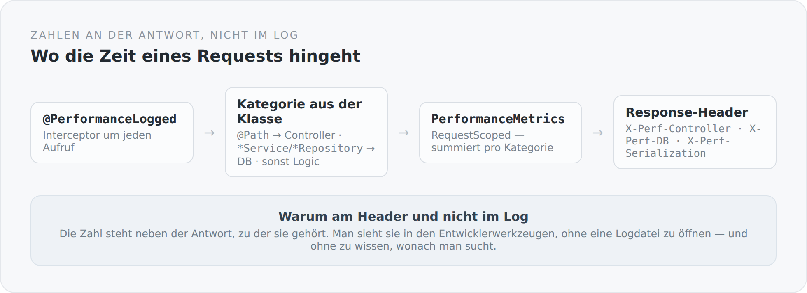

Die häufigste Aussage über Performance ist eine Vermutung. „Das ist wahrscheinlich die Datenbank." „Da wird zu viel serialisiert." „Das Rendering ist langsam." Manchmal stimmt es. Man weiß es nur nicht.

Der übliche Ausweg ist ein APM-Werkzeug: Agent installieren, Dashboard aufmachen, Traces ansehen. Für einen Blog auf einer kleinen Maschine ist das ein bisschen viel. Also gibt es hier eine sehr kleine Variante — knapp achtzig Zeilen, verteilt auf vier Klassen.

## Die Idee

{width=720}

Jeder Aufruf wird gemessen, nach Kategorie summiert und am Ende als Header an die Antwort gehängt. Man öffnet die Entwicklerwerkzeuge des Browsers und sieht bei jeder Anfrage, wo die Zeit geblieben ist.

## Der Interceptor

```scala
@AroundInvoke
def intercept(context: InvocationContext): AnyRef = {
  if (isRequestContextActive) {
    val start = System.currentTimeMillis()
    try {
      context.proceed()
    } finally {
      val duration = System.currentTimeMillis() - start
      val javaClass = context.getMethod.getDeclaringClass
      val className = javaClass.getSimpleName

      val category =
        if (javaClass.isAnnotationPresent(classOf[Path])) "Controller"
        else if (className.endsWith("Repository") || className.endsWith("Service")) "DB"
        else "Logic"

      metrics.addTiming(category, duration)
    }
  } else {
    context.proceed()
  }
}
```

Drei Kategorien, abgeleitet aus dem, was die Klasse ohnehin über sich verrät: `@Path` heißt Controller, ein Name auf `Service` oder `Repository` heißt Datenbanknähe, alles andere ist Logik.

Das ist eine Heuristik, und sie ist es bewusst. Die Alternative wäre gewesen, jede Klasse mit einer Kategorie zu annotieren — mehr Genauigkeit, mehr Zeremonie, und eine Annotation, die irgendwann irgendwo fehlt. Für die Frage, die dieses Werkzeug beantworten soll, reicht die Näherung.

Der Rest ist Einsammeln:

```scala
@RequestScoped
class PerformanceMetrics {
  private val timings = new ConcurrentHashMap[String, java.lang.Long]()

  def addTiming(key: String, durationMs: Long): Unit =
    timings.merge(key, durationMs, (oldVal, newVal) => oldVal + newVal)
}
```

Und Ausliefern:

```scala
@Provider @ApplicationScoped @Priority(6000)
class PerformanceResponseFilter extends ContainerResponseFilter {
  override def filter(requestContext: ContainerRequestContext,
                      responseContext: ContainerResponseContext): Unit =
    metrics.getTimings.asScala.foreach { case (key, value) =>
      responseContext.getHeaders.add(s"X-Perf-$key", s"${value}ms")
    }
}
```

Dazu kommt eine vierte Zahl, die nicht vom Interceptor stammt: Der JSON-Mapper misst sich selbst und schreibt `X-Perf-Serialization`. Das war kein Zufall — die Vermutung „das ist wahrscheinlich die Serialisierung" wollte ich prüfen können, statt sie zu glauben.

## Warum ein Header und nicht ein Log

Ein Log ist ein Ort, an dem man sucht. Ein Header ist ein Ort, an dem man findet.

Wenn eine Seite sich langsam anfühlt, öffne ich den Netzwerk-Tab und sehe bei genau dieser Anfrage vier Zahlen. Ich muss keine Logdatei öffnen, keinen Request korrelieren, keine Uhrzeit abgleichen und nicht wissen, wonach ich suche.

Das ist derselbe Gedanke wie bei `$links`: Die Information steht an dem Objekt, zu dem sie gehört, und nicht in einem parallelen System, das man erst befragen muss.

## Was daran nicht in Ordnung ist

Und jetzt der ehrliche Teil, denn dieser Code hat einen Fehler, den ich hier nicht verschweigen will.

```scala
def addTiming(key: String, durationMs: Long): Unit = {
  timings.merge(key, durationMs, (oldVal, newVal) => oldVal + newVal)
  System.out.println(s"DEBUG: Added timing $key: ${durationMs}ms [${System.identityHashCode(this)}]")
}

def getTimings: util.Map[String, java.lang.Long] = {
  System.out.println(s"DEBUG: Getting timings: $timings [${System.identityHashCode(this)}]")
  timings
}
```

Zwei `System.out.println` mit `DEBUG:` davor und einem `identityHashCode`. Das ist kein Logging. Das ist die stehen gebliebene Fehlersuche von dem Tag, an dem ich wissen wollte, ob der request-scoped Proxy wirklich dieselbe Instanz liefert.

Sie laufen bei jedem gemessenen Aufruf. Sie schreiben auf `System.out` statt über den Logger, der im Projekt vorhanden ist. Sie sind nicht abschaltbar. Und sie stehen ausgerechnet in der Klasse, die messen soll, wie schnell etwas ist — ein synchroner Konsolen-Schreibvorgang pro Messung ist genau die Art von Beobachtung, die das Beobachtete verändert.

Ich schreibe das hier nicht als Selbstkritik-Geste. Ich schreibe es, weil eine Artikelreihe über die eigene Architektur wertlos wird, wenn sie nur die Stellen zeigt, an denen alles aufgeht. Dieser Blog hat einen Werkzeugkasten, in dem ein Werkzeug noch schmutzig ist.

Es kommt auf die Liste. Aber es kommt auf die Liste in diesem Artikel und nicht in einem privaten Notizbuch.

## Was dieses kleine Werkzeug schon gebracht hat

Es hat eine Vermutung widerlegt.

Die Übersichtsseite fühlte sich träge an, und die naheliegende Erklärung war die Datenbank. Die Zahlen sagten etwas anderes: Der größte Posten war die Serialisierung. Der Grund dahinter ist echte Architektur und kein Tuning-Thema — der Listen-Endpunkt liefert pro Zeile den vollständigen Artikel samt aller Übersetzungen als Lexical-Baum, obwohl die Übersicht Titel, Teaser, Slug, Datum und Autor braucht.

Ohne die vier Header hätte ich an der Datenbank optimiert. Mit ihnen weiß ich, dass die Übersicht eine eigene Projektion braucht.

Genau dafür ist so ein Werkzeug da. Nicht, um Performance zu verbessern. Sondern um zu verhindern, dass man das Falsche verbessert.

## Ende der Staffel

Damit ist das Fundament beschrieben: ein selbst zusammengesteckter Server, Transaktionen an der Request-Grenze, ein JSON-Mapper, der Entitäten kennt, drei Antwortformen, eine Suche als Objekt und ein Maßband.

Nichts davon weiß, was ein Blog ist. Das ist die Bedingung, unter der dieses Modul ganz unten liegen darf.

Ab dem nächsten Artikel geht es um Fachlichkeit. Zuerst um die Frage, was ein Artikel eigentlich ist — wenn er weder eine Datenbankzeile noch ein JSON-Objekt sein soll.
