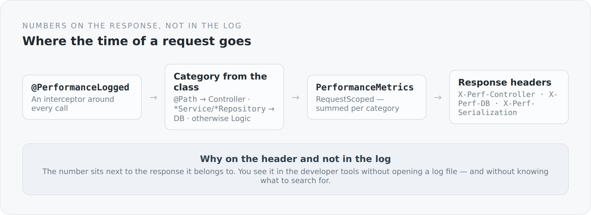

The most common statement about performance is a guess. "That is probably the database." "Too much serialization there." "Rendering is slow." Sometimes it is right. You just do not know.

The usual way out is an APM tool: install an agent, open a dashboard, look at traces. For a blog on a small machine that is a bit much. So there is a very small variant here — barely eighty lines across four classes.

## The idea

{width=720}

Every call is measured, summed by category and attached to the response as headers at the end. You open the browser's developer tools and see, for each request, where the time went.

## The interceptor

```scala
@AroundInvoke
def intercept(context: InvocationContext): AnyRef = {
  if (isRequestContextActive) {
    val start = System.currentTimeMillis()
    try {
      context.proceed()
    } finally {
      val duration = System.currentTimeMillis() - start
      val javaClass = context.getMethod.getDeclaringClass
      val className = javaClass.getSimpleName

      val category =
        if (javaClass.isAnnotationPresent(classOf[Path])) "Controller"
        else if (className.endsWith("Repository") || className.endsWith("Service")) "DB"
        else "Logic"

      metrics.addTiming(category, duration)
    }
  } else {
    context.proceed()
  }
}
```

Three categories, derived from what the class already reveals about itself: `@Path` means controller, a name ending in `Service` or `Repository` means database proximity, everything else is logic.

That is a heuristic, and deliberately so. The alternative would have been to annotate every class with a category — more precision, more ceremony, and an annotation that eventually goes missing somewhere. For the question this tool is meant to answer, the approximation is enough.

The rest is collecting:

```scala
@RequestScoped
class PerformanceMetrics {
  private val timings = new ConcurrentHashMap[String, java.lang.Long]()

  def addTiming(key: String, durationMs: Long): Unit =
    timings.merge(key, durationMs, (oldVal, newVal) => oldVal + newVal)
}
```

And delivering:

```scala
@Provider @ApplicationScoped @Priority(6000)
class PerformanceResponseFilter extends ContainerResponseFilter {
  override def filter(requestContext: ContainerRequestContext,
                      responseContext: ContainerResponseContext): Unit =
    metrics.getTimings.asScala.foreach { case (key, value) =>
      responseContext.getHeaders.add(s"X-Perf-$key", s"${value}ms")
    }
}
```

There is a fourth number that does not come from the interceptor: the JSON mapper times itself and writes `X-Perf-Serialization`. That was no accident — I wanted to be able to check the guess "that is probably the serialization" instead of believing it.

## Why a header and not a log

A log is a place where you search. A header is a place where you find.

When a page feels slow, I open the network tab and see four numbers on exactly that request. I do not have to open a log file, correlate a request, match a timestamp, or know what I am looking for.

That is the same idea as with `$links`: the information sits on the object it belongs to, and not in a parallel system you first have to query.

## What is not okay about it

And now the honest part, because this code has a flaw I do not want to leave out.

```scala
def addTiming(key: String, durationMs: Long): Unit = {
  timings.merge(key, durationMs, (oldVal, newVal) => oldVal + newVal)
  System.out.println(s"DEBUG: Added timing $key: ${durationMs}ms [${System.identityHashCode(this)}]")
}

def getTimings: util.Map[String, java.lang.Long] = {
  System.out.println(s"DEBUG: Getting timings: $timings [${System.identityHashCode(this)}]")
  timings
}
```

Two `System.out.println` with `DEBUG:` in front and an `identityHashCode`. That is not logging. That is the leftover debugging session from the day I wanted to know whether the request-scoped proxy really returns the same instance.

They run on every measured call. They write to `System.out` instead of through the logger that exists in this project. They cannot be switched off. And they sit, of all places, in the class meant to measure how fast something is — a synchronous console write per measurement is exactly the kind of observation that changes what it observes.

I am not writing this as a gesture of self-criticism. I am writing it because a series about one's own architecture becomes worthless when it only shows the places where everything works out. This blog has a toolbox with one tool still dirty.

It goes on the list. But it goes on the list in this article and not in a private notebook.

## What this small tool has already delivered

It disproved a guess.

The listing page felt sluggish, and the obvious explanation was the database. The numbers said otherwise: the biggest item was serialization. The reason behind that is real architecture and not a tuning topic — the listing endpoint delivers the complete article per row, including every translation as a Lexical tree, although the listing needs title, teaser, slug, date and author.

Without those four headers I would have optimized the database. With them I know the listing needs a projection of its own.

That is what such a tool is for. Not to improve performance. But to prevent improving the wrong thing.

## End of the arc

That completes the foundation: a self-assembled server, transactions at the request boundary, a JSON mapper that knows entities, three response shapes, search as an object, and a tape measure.

None of it knows what a blog is. That is the condition under which this module is allowed to sit at the bottom.

From the next article on it is about the domain. First about the question of what an article really is — if it is meant to be neither a database row nor a JSON object.
