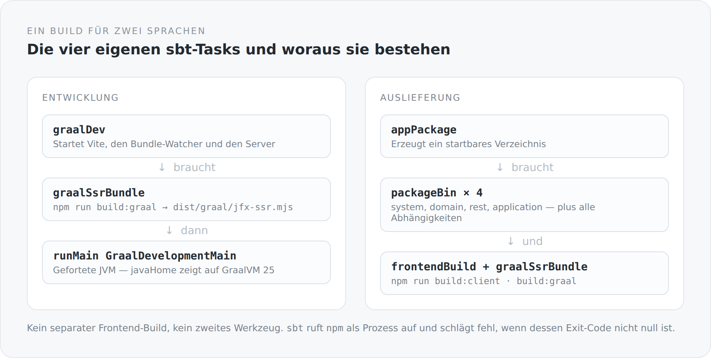

Die meisten Projekte, die ein Frontend und ein Backend haben, haben auch zwei Builds. Auf der einen Seite Maven oder Gradle, auf der anderen npm. Beide wissen nichts voneinander. Zusammengehalten werden sie von einer CI-Pipeline, die erst das eine und dann das andere aufruft, und von einer Anleitung im README, die erklärt, in welcher Reihenfolge man was starten muss.

Das funktioniert. Aber es bedeutet, dass niemand das Gesamtsystem beschreiben kann. Es gibt keine Datei, in der steht, was dieses Projekt eigentlich ist.

In diesem Blog gibt es sie: die `build.sbt`.

## Vier Module und vier eigene Tasks

Der Scala-Teil ist schnell erzählt — vier Projekte in einer Abhängigkeitskette, darüber ein `root`, das aggregiert und selbst nichts veröffentlicht. Interessanter ist, was daneben liegt:

```scala
lazy val frontendBuild   = taskKey[File]("Builds the frontend with Vite")
lazy val graalSsrBundle  = taskKey[File]("Builds the TypeScript SSR bundle for GraalJS")
lazy val graalDev        = taskKey[Unit]("Runs Vite and the backend with GraalVM/GraalJS hot reload")
lazy val appPackage      = taskKey[File]("Builds a distributable application directory")
```

Vier eigene Tasks, und alle vier haben mit TypeScript zu tun. Damit ist das Frontend kein Nachbar mehr, sondern ein Teil des Builds mit eigenen Abhängigkeiten.

{width=720}

## sbt ruft npm auf

Die Verbindung selbst ist unspektakulär. sbt startet npm als Prozess und wertet den Exit-Code aus:

```scala
graalSsrBundle := Def.uncached {
  val log = streams.value.log
  val frontendDirectory = baseDirectory.value / "src" / "main" / "typescript"
  val npmExecutable = if (scala.util.Properties.isWin) "npm.cmd" else "npm"
  val exitCode = Process(Seq(npmExecutable, "run", "build:graal"), frontendDirectory)
    .!(ProcessLogger(log.info(_), log.error(_)))
  if (exitCode != 0) sys.error("GraalJS SSR bundle build failed")
  frontendDirectory / "dist" / "graal" / "jfx-ssr.mjs"
}
```

Drei Dinge daran sind mir wichtig.

Der Task gibt einen `File` zurück, nicht `Unit`. Damit ist das Ergebnis ein Wert im Build und nicht ein Seiteneffekt, den man später irgendwo suchen muss. `appPackage` schreibt `graalSsrBundle.value` und bekommt den Pfad zur fertigen Datei — es muss nicht wissen, wie sie entsteht.

Der Task bricht ab, wenn npm abbricht. Das klingt banal, ist aber die Stelle, an der viele zweigeteilte Builds versagen: Der Frontend-Schritt schlägt fehl, die Pipeline läuft weiter, und ausgeliefert wird ein Backend mit dem Frontend von gestern.

Und `npm.cmd` auf Windows. Eine kleine, unglamouröse Zeile, die zeigt, dass dieser Build auf einem echten Rechner laufen muss und nicht nur in einem Linux-Container.

## Zwei Entscheidungen, die man leicht übersieht

Ganz oben in der `build.sbt` stehen zwei Zeilen, die aussehen wie Kleinkram und keiner sind:

```scala
serverConnectionType := ConnectionType.Tcp
ThisBuild / exportJars := false
```

Die zweite hat einen Kommentar, den ich hier ausschreibe, weil er eine echte Erfahrung dokumentiert: Projekt-zu-Projekt-Abhängigkeiten laufen während der Entwicklung über Klassenverzeichnisse statt über JARs. Grund dafür ist, dass eine geforkte JVM unter Windows eine JAR-Datei offen hält — und der nächste Build sie dann nicht ersetzen kann.

Das ist keine schöne Regel. Es ist eine, die aus einem konkreten Ärgernis entstanden ist. Aber sie steht im Build, sie hat einen Kommentar, und sie gilt für alle. Das ist mir lieber als ein Wiki-Eintrag mit dem Titel „Bekanntes Problem unter Windows".

## Warum sbt und nicht Gradle

Ehrliche Antwort zuerst: weil das Projekt Scala 3 ist und sbt für Scala das direkteste Werkzeug bleibt.

Die interessantere Antwort ist die Task-Algebra. In sbt sind Tasks Werte, die voneinander abhängen, und die Abhängigkeit entsteht dadurch, dass man `.value` schreibt. `appPackage` sagt nicht „führe vorher den Frontend-Build aus". Es sagt „ich brauche das Ergebnis des Frontend-Builds", und sbt entscheidet, ob es dafür etwas tun muss.

Dieselbe Denkweise wie bei den Modulen: Ich beschreibe, was wovon abhängt, und die Reihenfolge folgt daraus. Ich beschreibe keine Schritte.

## Der Preis

Ich will auch hier nicht verschweigen, was das kostet.

`sbt` ist langsam beim Kaltstart, und es hilft nur begrenzt, dass hier `sbtn` benutzt wird. Wer den Blog frisch auscheckt, braucht GraalVM 25, Node, npm, ein Nachbar-Repository für die JFX-Pakete und Geduld. Ein Projekt mit zwei getrennten Builds hätte eine niedrigere Einstiegshürde für jemanden, der nur am Frontend arbeiten will.

Und die eigenen Tasks sind Code, den niemand außer mir kennt. `frontendBuild`, `graalSsrBundle`, `appPackage` stehen in keinem Handbuch. Wer das Projekt übernimmt, muss die `build.sbt` lesen. Das ist der Preis dafür, dass sie überhaupt etwas aussagt.

Mir ist dieser Tausch die Sache wert. Denn die Alternative ist nicht „kein Wissen nötig", sondern „dasselbe Wissen, verteilt auf CI-Konfiguration, README und Gewohnheit".

## Eine Datei, die das Projekt beschreibt

Am Ende läuft es auf einen einzigen Satz hinaus, den ich über den Build sagen können möchte: Wenn ich wissen will, woraus dieses System besteht, gibt es genau einen Ort, an dem ich nachsehe.

Vier Module mit einer Richtung. Zwei npm-Aufrufe an definierten Stellen. Ein Entwicklungsmodus. Ein Paket, das ausgeliefert wird. Nichts davon steht in einer Pipeline, die jemand anders wartet.

Der nächste Artikel geht eine Ebene tiefer und beschäftigt sich mit der Laufzeit, auf der das alles läuft — und mit der Bindung, die ich mir damit eingehandelt habe.
