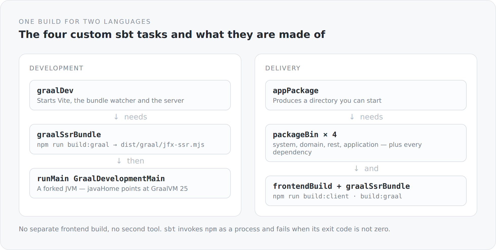

Most projects that have a frontend and a backend also have two builds. Maven or Gradle on one side, npm on the other. Neither knows about the other. What holds them together is a CI pipeline that calls one and then the other, and a note in the README explaining which order to start things in.

That works. But it means nobody can describe the whole system. There is no file that says what this project actually is.

In this blog there is: `build.sbt`.

## Four modules and four custom tasks

The Scala part is quickly told — four projects in a dependency chain, with a `root` above that aggregates and publishes nothing itself. What sits next to it is more interesting:

```scala
lazy val frontendBuild   = taskKey[File]("Builds the frontend with Vite")
lazy val graalSsrBundle  = taskKey[File]("Builds the TypeScript SSR bundle for GraalJS")
lazy val graalDev        = taskKey[Unit]("Runs Vite and the backend with GraalVM/GraalJS hot reload")
lazy val appPackage      = taskKey[File]("Builds a distributable application directory")
```

Four custom tasks, and all four have to do with TypeScript. The frontend is therefore no longer a neighbour but part of the build, with dependencies of its own.

{width=720}

## sbt calls npm

The connection itself is unremarkable. sbt starts npm as a process and evaluates the exit code:

```scala
graalSsrBundle := Def.uncached {
  val log = streams.value.log
  val frontendDirectory = baseDirectory.value / "src" / "main" / "typescript"
  val npmExecutable = if (scala.util.Properties.isWin) "npm.cmd" else "npm"
  val exitCode = Process(Seq(npmExecutable, "run", "build:graal"), frontendDirectory)
    .!(ProcessLogger(log.info(_), log.error(_)))
  if (exitCode != 0) sys.error("GraalJS SSR bundle build failed")
  frontendDirectory / "dist" / "graal" / "jfx-ssr.mjs"
}
```

Three things about it matter to me.

The task returns a `File`, not `Unit`. The result is therefore a value in the build rather than a side effect you have to go looking for afterwards. `appPackage` writes `graalSsrBundle.value` and receives the path to the finished file — it does not have to know how that file comes about.

The task fails when npm fails. That sounds trivial, but it is exactly the place where many split builds break down: the frontend step fails, the pipeline carries on, and what ships is a backend with yesterday's frontend.

And `npm.cmd` on Windows. A small, unglamorous line showing that this build has to run on a real machine and not only inside a Linux container.

## Two decisions that are easy to miss

Right at the top of `build.sbt` there are two lines that look like trivia and are not:

```scala
serverConnectionType := ConnectionType.Tcp
ThisBuild / exportJars := false
```

The second has a comment I will spell out here, because it documents a real experience: project-to-project dependencies use class directories rather than JARs during development. The reason is that a forked JVM on Windows keeps a JAR file open — and the next build then cannot replace it.

That is not a beautiful rule. It is one that came out of a concrete annoyance. But it lives in the build, it has a comment, and it applies to everyone. I prefer that to a wiki entry titled "Known problem on Windows".

## Why sbt and not Gradle

The honest answer first: because the project is Scala 3 and sbt remains the most direct tool for Scala.

The more interesting answer is the task algebra. In sbt, tasks are values that depend on one another, and the dependency comes into existence by writing `.value`. `appPackage` does not say "run the frontend build first". It says "I need the result of the frontend build", and sbt decides whether anything has to happen for that.

The same way of thinking as with the modules: I describe what depends on what, and the ordering follows. I do not describe steps.

## The price

I do not want to hide what this costs here either.

`sbt` is slow on a cold start, and `sbtn` only helps so far. Anyone checking the blog out fresh needs GraalVM 25, Node, npm, a sibling repository for the JFX packages, and patience. A project with two separate builds would have a lower barrier for someone who only wants to work on the frontend.

And the custom tasks are code nobody but me knows. `frontendBuild`, `graalSsrBundle`, `appPackage` appear in no manual. Whoever takes over the project has to read `build.sbt`. That is the price of it saying anything at all.

To me the trade is worth it. Because the alternative is not "no knowledge required", but "the same knowledge, spread across CI configuration, README and habit".

## One file that describes the project

In the end it comes down to a single sentence I want to be able to say about the build: if I want to know what this system consists of, there is exactly one place to look.

Four modules with one direction. Two npm invocations at defined points. One development mode. One package that ships. None of it lives in a pipeline maintained by somebody else.

The next article goes one level down, to the runtime all of this runs on — and to the commitment I took on with it.
