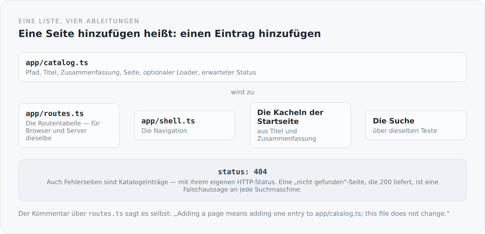

In den meisten Frontends existiert eine Seite an vier Stellen. Es gibt einen Eintrag in der Routentabelle. Es gibt einen Link in der Navigation. Es gibt vielleicht eine Kachel auf der Startseite. Und es gibt einen Eintrag in irgendeiner Suchfunktion oder Sitemap.

Wenn man eine Seite hinzufügt, muss man an alle vier denken. Wenn man eine entfernt, erst recht.

In diesem Frontend gibt es eine Liste.

## Ein Eintrag

```ts
{
  path: "/blog/posts/post/:slug",
  title: "Article",
  summary: "Read an article and join its discussion.",
  doc: () => {},
  load: blogPostLoad,
},
```

Pfad, Titel, Zusammenfassung, Seite und ein optionaler Loader — für Seiten, deren serverseitig gerenderter Inhalt von der URL abhängt.

Und für Fehlerseiten kommt ein Feld dazu:

```ts
{
  path: "/404",
  title: "Not found",
  summary: "An unknown route, answered with its own HTTP status.",
  doc: notFoundDoc,
  status: 404,
},
```

{width=720}

## Was daraus entsteht

Der Kommentar über `routes.ts` beschreibt das Prinzip in zwei Sätzen:

```ts
/**
 * The route table, built from the catalog -- nothing else. Adding a page
 * means adding one entry to app/catalog.ts; this file does not change.
 */
export const appRoutes: readonly RouteDefinition[] = catalog.map((entry) => {
  const children = entry.children?.map((child) =>
    view(child.path, child.doc, child.constraints ? { constraints: child.constraints } : {})
  );

  return entry.status !== undefined && entry.status >= 400
    ? errorRoute(entry.path, entry.status, () => entry.doc)
    : view(entry.path, entry.load ?? (() => entry.doc), children ? { children } : {});
});
```

Zehn Zeilen, und die Routentabelle ist fertig. Sie ändert sich nie wieder.

Dieselbe Liste liefert die Navigation in `app/shell.ts`, die Kacheln der Startseite und die Suche über Titel und Zusammenfassungen. Vier Ableitungen, eine Quelle.

Das ist kein besonders raffiniertes Muster. Es ist nur konsequent durchgehalten, und genau das macht den Unterschied. In den meisten Projekten gibt es diese Liste auch — aber nur für die Routen, und die Navigation steht daneben und wird von Hand gepflegt.

## Fehlerseiten sind Seiten

`errorRoute(entry.path, entry.status, ...)` ist die Zeile, die mir an dieser Datei am besten gefällt.

Eine 404-Seite ist keine Spezialbehandlung im Router und kein Sonderfall im Server. Sie ist ein Katalogeintrag, der einen anderen Status hat.

Das hat eine unmittelbare Folge: Der Server liefert für `/gibtesnicht` wirklich einen HTTP-404 aus, nicht eine 200 mit einer Seite, auf der „nicht gefunden" steht. Für einen Menschen sieht beides gleich aus; für eine Suchmaschine ist das erste eine Auskunft und das zweite eine Falschaussage.

Dasselbe gilt für 401, 403 und 500. Alle vier stehen als gewöhnliche Einträge im Katalog, mit Titel und Zusammenfassung wie jede andere Seite.

## Wo die Fehler herkommen

Der Router bekommt zusätzlich eine Konfiguration, die beschreibt, was bei einem Fehlschlag passiert:

```ts
export const routerConfig: RouterConfig = {
  basePath,
  onFailure: (failure) => {
    if (failure.kind === "not-matched") return "/404";
    if (!(failure.error instanceof ApiError)) return "/500";
    if (failure.error.status === 401) return "/401";
    if (failure.error.status === 403) return "/403";
    if (failure.error.status === 404) return "/404";
    return "/500";
  },
  renderErrorsOnServer: true,
};
```

Sechs Zeilen, und die gesamte Fehlerbehandlung des Frontends ist beschrieben. Keine Route trifft, oder ein Loader wirft — beides landet auf einer Seite, die im selben Katalog steht.

`renderErrorsOnServer: true` ist die Ergänzung dazu: Auch Fehlerseiten werden serverseitig gerendert. Sonst käme bei einem 404 ein leeres Dokument, das erst im Browser zu einer Fehlerseite wird — mit dem Status 200, weil zum Zeitpunkt der Antwort noch niemand wusste, dass es ein Fehler ist.

Und der Kommentar am Ende der Datei: *Shared by both entry points; the server adds `url` per request.* Dieselbe Konfiguration für Browser und Server. Der einzige Unterschied ist ein Feld.

## Ein Sonderfall, der als solcher markiert ist

```ts
/**
 * A route reachable only from within its parent, not a catalog entry of
 * its own (CLAUDE_DEMO_PLAN.md §5) -- today's one exception to flat
 * routing, kept until nested parent routes land in the router (E-5).
 */
readonly children?: readonly DocChild[];
```

Es gibt verschachtelte Routen, und sie sind explizit als Ausnahme gekennzeichnet — inklusive der Bedingung, unter der die Ausnahme wegfällt.

Das ist eine Form von Dokumentation, die ich für unterschätzt halte. Nicht „hier ist ein Sonderfall", sondern „hier ist ein Sonderfall, und er verschwindet, wenn X passiert". Der Unterschied ist, ob ein späterer Leser weiß, ob er etwas aufräumen darf.

## Was nicht schön ist

**Der Katalog ist eine große Datei.** Zwanzig Einträge, jeder mit fünf Feldern, plus ein Import pro Seite ganz oben. Sie wächst linear mit dem System.

**Und die Texte sind nicht übersetzt.** `title` und `summary` stehen als englische Zeichenketten im Katalog, während der Rest des Frontends durch `translated(...)` läuft. Für die Navigation heißt das: Sie ist einsprachig, obwohl der Blog es nicht ist.

Das ist eine echte Lücke, und sie hat einen technischen Grund — der Katalog ist eine Konstante auf Modulebene, und `translated` braucht einen Kontext, den es zu diesem Zeitpunkt noch nicht gibt. Lösbar wäre es, indem die Einträge Funktionen statt Zeichenketten tragen. Es ist noch nicht gelöst, und die Reihe wäre unehrlich, wenn ich es hier nicht sagen würde.

## Warum das Prinzip trotzdem stimmt

Weil eine Ableitung nicht veralten kann.

Wenn die Navigation aus dem Katalog entsteht, gibt es keine Seite ohne Link und keinen Link ohne Seite. Wenn die Routen aus dem Katalog entstehen, gibt es keinen Pfad, den der Router kennt und die Navigation nicht.

Und wenn beides dieselbe Quelle hat, dann ist die Frage „gibt es diese Seite" an genau einer Stelle beantwortet — für den Browser und für den Server gleichzeitig.

Im nächsten Artikel geht es darum, wie diese Seiten an ihre Daten kommen: ohne eine einzige URL zu bauen.
