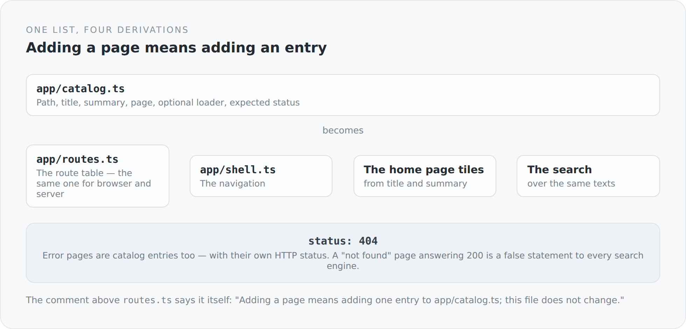

In most frontends a page exists in four places. There is an entry in the route table. There is a link in the navigation. There is perhaps a tile on the home page. And there is an entry in some search function or sitemap.

When you add a page, you have to remember all four. When you remove one, even more so.

In this frontend there is one list.

## One entry

```ts
{
  path: "/blog/posts/post/:slug",
  title: "Article",
  summary: "Read an article and join its discussion.",
  doc: () => {},
  load: blogPostLoad,
},
```

Path, title, summary, page and an optional loader — for pages whose server-rendered body depends on the URL.

And for error pages one more field appears:

```ts
{
  path: "/404",
  title: "Not found",
  summary: "An unknown route, answered with its own HTTP status.",
  doc: notFoundDoc,
  status: 404,
},
```

{width=720}

## What comes out of it

The comment above `routes.ts` describes the principle in two sentences:

```ts
/**
 * The route table, built from the catalog -- nothing else. Adding a page
 * means adding one entry to app/catalog.ts; this file does not change.
 */
export const appRoutes: readonly RouteDefinition[] = catalog.map((entry) => {
  const children = entry.children?.map((child) =>
    view(child.path, child.doc, child.constraints ? { constraints: child.constraints } : {})
  );

  return entry.status !== undefined && entry.status >= 400
    ? errorRoute(entry.path, entry.status, () => entry.doc)
    : view(entry.path, entry.load ?? (() => entry.doc), children ? { children } : {});
});
```

Ten lines, and the route table is finished. It never changes again.

The same list produces the navigation in `app/shell.ts`, the home page tiles, and the search over titles and summaries. Four derivations, one source.

That is not a particularly clever pattern. It is simply carried through consistently, and that is what makes the difference. In most projects this list exists too — but only for the routes, and the navigation sits next to it and is maintained by hand.

## Error pages are pages

`errorRoute(entry.path, entry.status, ...)` is the line I like best in this file.

A 404 page is not a special case in the router and not a special case in the server. It is a catalog entry with a different status.

That has an immediate consequence: for `/doesnotexist` the server really returns an HTTP 404, not a 200 with a page saying "not found". To a human both look the same; to a search engine the first is information and the second a false statement.

The same applies to 401, 403 and 500. All four sit as ordinary entries in the catalog, with title and summary like any other page.

## Where the failures come from

The router additionally receives a configuration describing what happens on failure:

```ts
export const routerConfig: RouterConfig = {
  basePath,
  onFailure: (failure) => {
    if (failure.kind === "not-matched") return "/404";
    if (!(failure.error instanceof ApiError)) return "/500";
    if (failure.error.status === 401) return "/401";
    if (failure.error.status === 403) return "/403";
    if (failure.error.status === 404) return "/404";
    return "/500";
  },
  renderErrorsOnServer: true,
};
```

Six lines, and the entire error handling of the frontend is described. No route matches, or a loader throws — both land on a page that lives in the same catalog.

`renderErrorsOnServer: true` is the complement: error pages are rendered on the server as well. Otherwise a 404 would arrive as an empty document that only becomes an error page in the browser — with status 200, because at the time of the response nobody knew yet that it was an error.

And the comment at the end of the file: *Shared by both entry points; the server adds `url` per request.* The same configuration for browser and server. The only difference is one field.

## A special case marked as one

```ts
/**
 * A route reachable only from within its parent, not a catalog entry of
 * its own (CLAUDE_DEMO_PLAN.md §5) -- today's one exception to flat
 * routing, kept until nested parent routes land in the router (E-5).
 */
readonly children?: readonly DocChild[];
```

There are nested routes, and they are explicitly marked as an exception — including the condition under which the exception goes away.

That is a form of documentation I consider underrated. Not "here is a special case", but "here is a special case, and it disappears when X happens". The difference is whether a later reader knows they are allowed to clean something up.

## What is not beautiful

**The catalog is a large file.** Twenty entries, each with five fields, plus one import per page at the top. It grows linearly with the system.

**And the texts are not translated.** `title` and `summary` sit as English strings in the catalog, while the rest of the frontend goes through `translated(...)`. For the navigation that means: it is monolingual, although the blog is not.

That is a real gap, and it has a technical cause — the catalog is a module-level constant, and `translated` needs a context that does not exist yet at that point. It would be solvable by having the entries carry functions instead of strings. It is not solved yet, and the series would be dishonest if I did not say so here.

## Why the principle is right anyway

Because a derivation cannot go stale.

When the navigation comes from the catalog, there is no page without a link and no link without a page. When the routes come from the catalog, there is no path the router knows and the navigation does not.

And when both have the same source, the question "does this page exist" is answered in exactly one place — for the browser and the server at the same time.

The next article is about how those pages get their data: without building a single URL.
