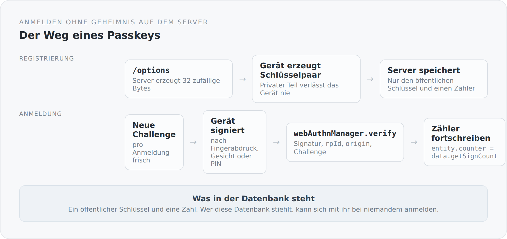

Ein Passwort ist ein Geheimnis, das zwei Parteien kennen müssen. Genau darin liegt das Problem. Der Server muss etwas aufbewahren, aus dem sich prüfen lässt, ob das Passwort stimmt — und was man aufbewahrt, kann man verlieren.

Passkeys drehen das um. Der Server bewahrt nichts Geheimes auf.

## Was gespeichert wird

Bei der Registrierung erzeugt das Gerät ein Schlüsselpaar. Der private Teil bleibt dort, in der Secure Enclave oder im TPM, und verlässt es nie. Der Server bekommt den öffentlichen Teil und eine Zahl.

{width=720}

Wer diese Datenbank stiehlt, kann sich damit bei niemandem anmelden. Nicht hier, und schon gar nicht anderswo — es gibt kein wiederverwendetes Passwort mehr.

## Die Optionen

```scala
private val timeoutMillis = 60000
private val challengeLength = 32
private val pubKeyCredParams = java.util.List.of(
  new PublicKeyCredentialParameters(PublicKeyCredentialType.PUBLIC_KEY, COSEAlgorithmIdentifier.ES256),
  new PublicKeyCredentialParameters(PublicKeyCredentialType.PUBLIC_KEY, COSEAlgorithmIdentifier.RS256)
)
```

Zwei Algorithmen, ES256 zuerst. Die Reihenfolge ist eine Präferenz: Elliptische Kurven sind kleiner und schneller, RSA ist der Rückfall für Authentifikatoren, die das nicht können.

32 Bytes Challenge und eine Minute Zeit. Beides sind Werte, die man nicht aus Bequemlichkeit ändern sollte.

```scala
val challengeBytes = createChallenge(email)
val excludeCredentials = loadExcludeCredentials(email)
```

`excludeCredentials` ist ein Detail, das die Benutzererfahrung rettet: Es sagt dem Gerät, welche Passkeys für diesen Benutzer schon existieren. Ohne diese Liste würde ein Gerät fröhlich einen zweiten Passkey für denselben Account anlegen, und niemand wüsste, welcher welcher ist.

## Die Prüfung

```scala
val challenge = webAuthn.challengeStore.get(username)
val serverProperty = new ServerProperty.Builder()
  .origin(new Origin(webAuthn.origin))
  .rpId(webAuthn.rpId)
  .challenge(challenge)
  .build()

val verifiedAuthenticationData = webAuthn.webAuthnManager.verify(authenticationData, authenticationParameters)
```

Drei Dinge werden zusammen geprüft, und alle drei sind nötig.

Die **Challenge** verhindert, dass eine aufgezeichnete Antwort ein zweites Mal funktioniert. Sie ist pro Anmeldung frisch.

Die **`rpId`** bindet den Schlüssel an die Domain. Ein Passkey für `blog.example.com` lässt sich auf einer anderen Seite nicht verwenden — auch dann nicht, wenn der Benutzer darauf hereinfällt. Das ist der Grund, warum Phishing gegen Passkeys strukturell nicht funktioniert: Nicht der Mensch muss die Domain erkennen, sondern der Browser tut es.

Der **`origin`** ist die strengere Prüfung derselben Sache, inklusive Protokoll und Port.

Alles davon macht `webauthn4j`. Ich bin nicht der Meinung, dass man so etwas selbst schreiben sollte — hier ist die richtige Entscheidung, eine Bibliothek zu nehmen und ihre Parameter zu verstehen.

## Der Zähler

```scala
entity.counter = verifiedAuthenticationData.getAuthenticatorData.getSignCount
```

Ein Authentifikator zählt mit, wie oft er signiert hat. Der Server merkt sich den letzten Stand.

Kommt eine Anmeldung mit einem Zähler, der nicht gewachsen ist, ist das ein Hinweis auf eine geklonte Anmeldeinformation. Bei Hardware-Token funktioniert das gut. Bei synchronisierten Passkeys, die zwischen Geräten geteilt werden, ist der Zähler oft konstant null — der Mechanismus verliert dort seine Aussagekraft, und das ist normal.

Wichtig ist nur, dass der Stand fortgeschrieben wird. Wer das vergisst, verschenkt die Prüfung ganz.

## Wo Passkey und Passwort zusammenkommen

Der Login-Controller prüft die Signatur und erzeugt danach ein Credential-Objekt, das der Authentifizierungsmechanismus versteht:

```scala
case value: SimplicityBlogPrincipalCredential =>
  httpMessageContext.setRegisterSession(value.principal.getName, value.principal.roles)
  httpMessageContext.notifyContainerAboutLogin(value.principal, value.principal.roles)
```

Ab hier gibt es keinen Unterschied mehr zwischen den beiden Verfahren. Dieselbe Session, derselbe Principal, dieselben Rollen — und dieselbe `authenticationVersion`, mit der sich die Session später widerrufen lässt.

Das ist der Gewinn aus dem vorigen Artikel, jetzt sichtbar: Weil der Mechanismus selbst geschrieben ist, war ein zweites Anmeldeverfahren ein zusätzlicher `case` und keine zweite Sicherheitsarchitektur.

## Zwei Verfahren, ein Konto

Ein Benutzer kann Passwort *und* Passkey haben. `Credential` ist eine Oberklasse; `PasswordCredential` und `WebAuthnCredential` sind zwei Ausprägungen.

Das ist bewusst so. Ein Blog, der nur Passkeys erlaubt, sperrt jeden aus, der gerade an einem fremden Rechner sitzt. Einer, der nur Passwörter erlaubt, verschenkt das bessere Verfahren.

## Was noch fehlt

Ehrlich, und in dieser Reihenfolge.

**Man kann einen Passkey nicht entfernen.** Es gibt einen Weg hinein und keinen hinaus. Wer sein Gerät verliert, kann den zugehörigen Schlüssel nicht löschen. Die Infrastruktur dafür ist da — `authenticationVersion` würde die Sessions gleich mitschließen —, der Endpunkt fehlt.

**Passkeys haben keine Namen.** Wer drei Geräte registriert hat, sieht drei nicht unterscheidbare Einträge. Ein Feld für einen Namen und ein Datum der letzten Verwendung wären ein Nachmittag Arbeit und würden das Verwalten überhaupt erst möglich machen.

**Und die Registrierung ist offen.** Jeder kann ein Konto anlegen und einen Passkey hinterlegen. Für einen Blog, der Kommentare will, ist das gewollt — aber es macht die Moderationsfunktionen aus dem vorherigen Artikel zur Pflicht und nicht zur Kür.

## Warum das hier steht

Weil Passkeys der seltene Fall sind, in dem das Sicherere gleichzeitig das Bequemere ist. Kein Passwort ausdenken, keins merken, keins wiederverwenden. Ein Blick oder ein Finger.

Und weil es zur Haltung dieses Projekts passt: Das Verfahren selbst kommt aus einer Bibliothek und einem Standard. Was ich geschrieben habe, sind die zwei Endpunkte und die Stelle, an der es mit dem Rest des Systems zusammenläuft.

Damit ist das Backend beschrieben — vom Build über das Fundament und die Fachlichkeit bis zur API und der Identität. Ab dem nächsten Artikel geht es auf die andere Seite: in ein Frontend, das keine Templates kennt und in dem eine Seite eine Funktion ist.
