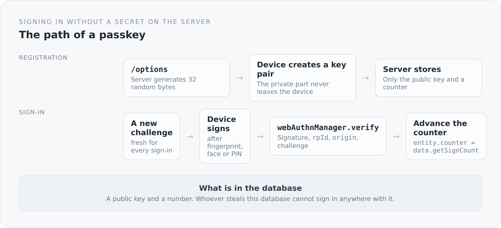

A password is a secret two parties have to know. That is precisely where the problem lies. The server has to keep something it can use to check whether the password is right — and what you keep, you can lose.

Passkeys turn that around. The server keeps nothing secret.

## What gets stored

On registration the device creates a key pair. The private part stays there, in the secure enclave or the TPM, and never leaves. The server receives the public part and a number.

{width=720}

Whoever steals that database cannot sign in with it anywhere. Not here, and certainly not elsewhere — there is no reused password any more.

## The options

```scala
private val timeoutMillis = 60000
private val challengeLength = 32
private val pubKeyCredParams = java.util.List.of(
  new PublicKeyCredentialParameters(PublicKeyCredentialType.PUBLIC_KEY, COSEAlgorithmIdentifier.ES256),
  new PublicKeyCredentialParameters(PublicKeyCredentialType.PUBLIC_KEY, COSEAlgorithmIdentifier.RS256)
)
```

Two algorithms, ES256 first. The order is a preference: elliptic curves are smaller and faster, RSA is the fallback for authenticators that cannot do them.

32 bytes of challenge and one minute of time. Both are values you should not change out of convenience.

```scala
val challengeBytes = createChallenge(email)
val excludeCredentials = loadExcludeCredentials(email)
```

`excludeCredentials` is the detail that saves the user experience: it tells the device which passkeys already exist for this user. Without that list a device would cheerfully create a second passkey for the same account, and nobody would know which was which.

## Verification

```scala
val challenge = webAuthn.challengeStore.get(username)
val serverProperty = new ServerProperty.Builder()
  .origin(new Origin(webAuthn.origin))
  .rpId(webAuthn.rpId)
  .challenge(challenge)
  .build()

val verifiedAuthenticationData = webAuthn.webAuthnManager.verify(authenticationData, authenticationParameters)
```

Three things are checked together, and all three are needed.

The **challenge** prevents a recorded response from working a second time. It is fresh for every sign-in.

The **`rpId`** binds the key to the domain. A passkey for `blog.example.com` cannot be used on another site — not even when the user falls for it. That is why phishing structurally does not work against passkeys: it is not the human who has to recognize the domain, the browser does it.

The **`origin`** is the stricter check of the same thing, including protocol and port.

All of that is done by `webauthn4j`. I do not think you should write something like that yourself — here the right decision is to take a library and understand its parameters.

## The counter

```scala
entity.counter = verifiedAuthenticationData.getAuthenticatorData.getSignCount
```

An authenticator counts how often it has signed. The server remembers the latest value.

A sign-in arriving with a counter that has not grown is a hint at a cloned credential. With hardware tokens that works well. With synced passkeys shared between devices, the counter is often constantly zero — the mechanism loses its meaning there, and that is normal.

What matters is only that the value is carried forward. Forget that and you give the check away entirely.

## Where passkey and password meet

The login controller verifies the signature and then creates a credential object the authentication mechanism understands:

```scala
case value: SimplicityBlogPrincipalCredential =>
  httpMessageContext.setRegisterSession(value.principal.getName, value.principal.roles)
  httpMessageContext.notifyContainerAboutLogin(value.principal, value.principal.roles)
```

From here on there is no difference between the two procedures. The same session, the same principal, the same roles — and the same `authenticationVersion` that makes the session revocable later.

That is the gain from the previous article, now visible: because the mechanism is written by hand, a second sign-in procedure was one additional `case` and not a second security architecture.

## Two procedures, one account

A user can have both a password *and* a passkey. `Credential` is a superclass; `PasswordCredential` and `WebAuthnCredential` are two manifestations.

That is deliberate. A blog allowing only passkeys locks out anyone sitting at a borrowed machine. One allowing only passwords gives away the better procedure.

## What is still missing

Honestly, and in this order.

**You cannot remove a passkey.** There is a way in and no way out. Somebody who loses their device cannot delete the corresponding key. The infrastructure is there — `authenticationVersion` would close the sessions along with it — the endpoint is not.

**Passkeys have no names.** Somebody who has registered three devices sees three indistinguishable entries. A field for a name and a last-used date would be an afternoon's work and would make management possible in the first place.

**And registration is open.** Anyone can create an account and store a passkey. For a blog that wants comments that is intended — but it makes the moderation features from the previous article mandatory rather than optional.

## Why this is here

Because passkeys are the rare case where the safer thing is also the more convenient one. No password to invent, none to remember, none to reuse. A glance or a finger.

And because it fits this project's attitude: the procedure itself comes from a library and a standard. What I wrote are the two endpoints and the place where it joins the rest of the system.

That completes the backend — from the build through the foundation and the domain to the API and identity. From the next article on we go to the other side: into a frontend that knows no templates and in which a page is a function.
