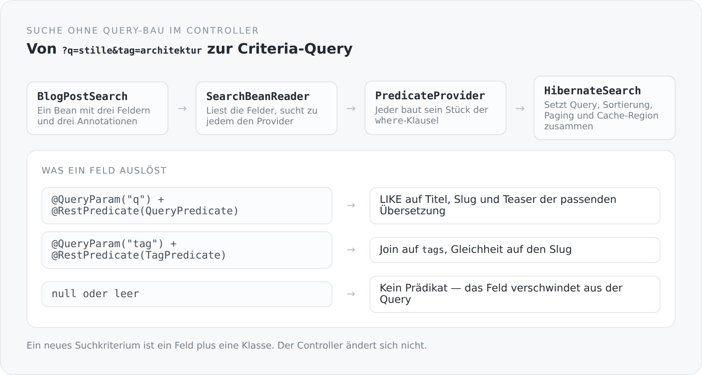

Suchfunktionen wachsen immer gleich. Am Anfang steht ein Parameter und ein `if`. Dann kommt ein zweiter, und man baut den String etwas dynamischer zusammen. Nach einem Jahr steht in einem Controller eine Methode mit hundert Zeilen, sechs Bedingungen, drei Joins und einem Kommentar, der vor drei Refactorings entstanden ist.

Der Grund ist nicht Faulheit. Der Grund ist, dass Suche in dieser Form kein Modell hat. Sie ist eine Menge von Sonderfällen, die zufällig nebeneinander liegen.

In diesem Blog ist eine Suche ein Objekt.

## Der Suchbegriff als Bean

```scala
class BlogPostSearch extends AbstractSearch {

  @QueryParam("q")
  @JsonbProperty
  @RestPredicate(classOf[BlogPostSearch.QueryPredicate])
  var query: String = uninitialized

  @QueryParam("status")
  @JsonbProperty
  @RestPredicate(classOf[BlogPostSearch.StatusPredicate])
  var status: BlogPostStatus = uninitialized

  @QueryParam("tag")
  @JsonbProperty
  @RestPredicate(classOf[BlogPostSearch.TagPredicate])
  var tag: String = uninitialized
}
```

Drei Felder, drei Annotationen pro Feld. `@QueryParam` sagt, woher der Wert kommt. `@RestPredicate` sagt, wer daraus ein Prädikat macht.

Der Controller nimmt dieses Bean entgegen und gibt es weiter. Er sieht keine `where`-Klausel und keinen Join.

{width=720}

## Der Leser

```scala
beanModel.properties.foreach { property =>
  val restPredicate = property.findAnnotation(classOf[RestPredicate])

  if (restPredicate != null) {
    val provider = findProvider(instances, restPredicate.value())
    val value = try property.get(searchBean) catch { case _: Exception => null }

    if (provider != null && value != null) {
      val name = if (restPredicate.name().isBlank) property.name else restPredicate.name()
      provider.build(Context(value, builder, predicates, root, query, selection, name, parameters))
    }
  }
}
```

Der Reader läuft über die Felder, holt sich zu jedem den zugehörigen Provider aus dem CDI-Kontext und lässt ihn sein Stück der Abfrage bauen.

Entscheidend ist die Bedingung `value != null`. Ein Feld, das nicht gesetzt ist, erzeugt kein Prädikat. Es verschwindet aus der Query — nicht als `where 1=1`, sondern gar nicht.

Damit ist die häufigste Fehlerquelle dynamischer Suchen strukturell weg. Es gibt keine Stelle, an der jemand vergisst, den `null`-Fall zu behandeln, weil der `null`-Fall nie zu einem Provider gelangt.

## Ein Provider

```scala
@ApplicationScoped
class TagPredicate extends PredicateProvider[String, BlogPost] {
  override def build(context: Context[String, BlogPost]): Unit = {
    val value = Option(context.value).map(_.trim).getOrElse("")
    if (value.isEmpty) return

    val parameterName = s"${context.name}_tag"
    val parameter = context.builder.parameter(classOf[String], parameterName)
    val tags = context.root.join(BlogPost.schema.tags.name)
    context.parameters.put(parameterName, value)
    context.predicates.add(context.builder.equal(tags.get(BlogTag.schema.slug.name), parameter))
  }
}
```

Zehn Zeilen, ein Zuständigkeitsbereich. Der Provider weiß, wie man nach einem Tag filtert, und sonst nichts.

Zwei Details, die ich hervorheben möchte.

Es wird ein benannter Parameter gebaut, kein Literal in die Query geschrieben. Das ist die Stelle, an der eine handgeschriebene Suche früher oder später eine Injektionslücke bekommt. Hier ist es keine Frage der Disziplin: Der `Context` bietet gar keinen anderen Weg an.

Und `BlogPost.schema.tags.name` statt `"tags"`. Die Feldnamen kommen aus einem generierten Schema-Objekt, nicht aus Zeichenketten. Wenn ich das Feld umbenenne, bricht der Compiler — nicht die Laufzeit.

## Der Volltext

Der interessanteste Provider ist der für `q`, weil er zeigt, dass diese Struktur auch mit fachlicher Komplexität umgehen kann:

```scala
val translations = context.root.join(BlogPost.schema.translations.name)
context.parameters.put(parameterName, s"%$rawValue%")
context.parameters.put(localeName, localeResolver.resolve())

val disjunction = new java.util.ArrayList[Predicate]()
disjunction.add(builder.like(builder.lower(translations.get(title.name)), parameter))
disjunction.add(builder.like(builder.lower(context.root.get(slug.name)), parameter))
disjunction.add(builder.like(builder.lower(translations.get(teaser.name)), parameter))

context.predicates.add(builder.equal(translations.get(locale.name), localeParameter))
context.predicates.add(builder.or(disjunction.toArray(...)*))
```

Gesucht wird in Titel, Slug und Teaser — aber nur in der Übersetzung, die zur aktuellen Sprache gehört. Der Provider injiziert sich dafür einen `BlogPostLocaleResolver`.

Ein Provider ist also eine ganz normale CDI-Bean und darf Abhängigkeiten haben. Das ist der Unterschied zwischen einem Erweiterungspunkt, der nur einfache Fälle trägt, und einem, der auch die schwierigen aushält.

## Der Zusammenbau

```scala
val result = context.apply(builder, query, from)
val order  = context.sort(builder, query, from, result.predicates, result.selection)

select(query, from, result.selection, builder).where(result.predicates).orderBy(order)

val typedQuery = entityManager.createQuery(query)
  .setFirstResult(index)
  .setMaxResults(limit)
  .setHint("org.hibernate.cacheable", java.lang.Boolean.TRUE)
  .setHint("org.hibernate.cacheRegion", s"search.${entityClass.getName}.${projection.getName}.rows")
```

Prädikate, Sortierung, Paging, Cache-Region. Und daneben eine `count`-Methode, die dieselben Prädikate benutzt — was garantiert, dass die Gesamtzahl in einer `Table` wirklich zur gefilterten Menge gehört und nicht zur ganzen Tabelle.

Die Cache-Region wird aus Entitätsklasse und Projektion gebildet. Zwei verschiedene Sichten auf dieselbe Tabelle bekommen also getrennte Regionen, was der Grund dafür ist, dass ein Cache hier überhaupt sinnvoll sein kann.

## Der Preis

**Die Sortierung ist ungewöhnlich.** `SearchBeanReader.order` bricht beim ersten Feld ab, das eine Sortierung liefert. Es gibt also keine mehrstufige Sortierung. Für eine Blogübersicht reicht das; als allgemeiner Mechanismus ist es eine Einschränkung, die man kennen muss.

**Die Provider werden linear durchsucht.** `findProvider` iteriert über alle CDI-Instanzen und nimmt die erste passende. Bei drei Providern ist das egal, bei dreihundert nicht.

**Und der Weg ist länger.** Ein neues Suchkriterium heißt: ein Feld, drei Annotationen, eine Klasse. Ein `if` im Controller wäre schneller geschrieben. Es wäre auch das erste von zwanzig.

## Warum es das wert ist

Weil sich damit die Frage ändert, die man stellt.

Bei einer handgeschriebenen Suche lautet sie: „Was macht diese Methode?" Und die Antwort ist immer eine Rekonstruktion.

Hier lautet sie: „Welche Felder hat das Such-Bean?" Die Antwort steht in fünfzehn Zeilen, und jedes Feld verweist auf genau eine Klasse, die genau eine Sache tut.

Das ist keine Optimierung. Es ist der Unterschied zwischen Code, den man liest, und Code, den man untersucht.

Der nächste Artikel schließt die Staffel über das Fundament ab — mit dem Teil, der misst, wie lange das alles gedauert hat.
