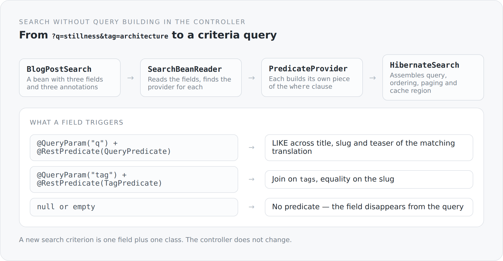

Search functions always grow the same way. At the start there is one parameter and an `if`. Then a second arrives, and you build the string a little more dynamically. After a year a controller holds a hundred-line method with six conditions, three joins and a comment written three refactorings ago.

The reason is not laziness. The reason is that search in that form has no model. It is a set of special cases that happen to sit next to each other.

In this blog a search is an object.

## The search term as a bean

```scala
class BlogPostSearch extends AbstractSearch {

  @QueryParam("q")
  @JsonbProperty
  @RestPredicate(classOf[BlogPostSearch.QueryPredicate])
  var query: String = uninitialized

  @QueryParam("status")
  @JsonbProperty
  @RestPredicate(classOf[BlogPostSearch.StatusPredicate])
  var status: BlogPostStatus = uninitialized

  @QueryParam("tag")
  @JsonbProperty
  @RestPredicate(classOf[BlogPostSearch.TagPredicate])
  var tag: String = uninitialized
}
```

Three fields, three annotations per field. `@QueryParam` says where the value comes from. `@RestPredicate` says who turns it into a predicate.

The controller accepts this bean and passes it on. It sees no `where` clause and no join.

{width=720}

## The reader

```scala
beanModel.properties.foreach { property =>
  val restPredicate = property.findAnnotation(classOf[RestPredicate])

  if (restPredicate != null) {
    val provider = findProvider(instances, restPredicate.value())
    val value = try property.get(searchBean) catch { case _: Exception => null }

    if (provider != null && value != null) {
      val name = if (restPredicate.name().isBlank) property.name else restPredicate.name()
      provider.build(Context(value, builder, predicates, root, query, selection, name, parameters))
    }
  }
}
```

The reader walks the fields, fetches the corresponding provider from the CDI context and lets it build its piece of the query.

The decisive part is the condition `value != null`. A field that is not set produces no predicate. It disappears from the query — not as `where 1=1`, but entirely.

That structurally removes the most common failure mode of dynamic searches. There is no place where somebody forgets to handle the `null` case, because the `null` case never reaches a provider.

## One provider

```scala
@ApplicationScoped
class TagPredicate extends PredicateProvider[String, BlogPost] {
  override def build(context: Context[String, BlogPost]): Unit = {
    val value = Option(context.value).map(_.trim).getOrElse("")
    if (value.isEmpty) return

    val parameterName = s"${context.name}_tag"
    val parameter = context.builder.parameter(classOf[String], parameterName)
    val tags = context.root.join(BlogPost.schema.tags.name)
    context.parameters.put(parameterName, value)
    context.predicates.add(context.builder.equal(tags.get(BlogTag.schema.slug.name), parameter))
  }
}
```

Ten lines, one responsibility. The provider knows how to filter by a tag, and nothing else.

Two details worth highlighting.

A named parameter is built; no literal is written into the query. That is the place where a hand-written search sooner or later grows an injection hole. Here it is not a matter of discipline: the `Context` offers no other route.

And `BlogPost.schema.tags.name` instead of `"tags"`. Field names come from a generated schema object, not from strings. If I rename the field, the compiler breaks — not the runtime.

## Full text

The most interesting provider is the one for `q`, because it shows that this structure also copes with domain complexity:

```scala
val translations = context.root.join(BlogPost.schema.translations.name)
context.parameters.put(parameterName, s"%$rawValue%")
context.parameters.put(localeName, localeResolver.resolve())

val disjunction = new java.util.ArrayList[Predicate]()
disjunction.add(builder.like(builder.lower(translations.get(title.name)), parameter))
disjunction.add(builder.like(builder.lower(context.root.get(slug.name)), parameter))
disjunction.add(builder.like(builder.lower(translations.get(teaser.name)), parameter))

context.predicates.add(builder.equal(translations.get(locale.name), localeParameter))
context.predicates.add(builder.or(disjunction.toArray(...)*))
```

The search runs over title, slug and teaser — but only in the translation belonging to the current language. For that the provider injects a `BlogPostLocaleResolver`.

A provider is therefore an ordinary CDI bean and may have dependencies. That is the difference between an extension point that only carries simple cases and one that also survives the hard ones.

## The assembly

```scala
val result = context.apply(builder, query, from)
val order  = context.sort(builder, query, from, result.predicates, result.selection)

select(query, from, result.selection, builder).where(result.predicates).orderBy(order)

val typedQuery = entityManager.createQuery(query)
  .setFirstResult(index)
  .setMaxResults(limit)
  .setHint("org.hibernate.cacheable", java.lang.Boolean.TRUE)
  .setHint("org.hibernate.cacheRegion", s"search.${entityClass.getName}.${projection.getName}.rows")
```

Predicates, ordering, paging, cache region. And beside it a `count` method using the same predicates — which guarantees that the total in a `Table` really belongs to the filtered set and not to the whole table.

The cache region is derived from entity class and projection. Two different views of the same table therefore get separate regions, which is the reason a cache can be meaningful here at all.

## The price

**The ordering is unusual.** `SearchBeanReader.order` breaks at the first field that yields an ordering. There is no multi-level sort. For a blog listing that is enough; as a general mechanism it is a limitation you have to know about.

**Providers are searched linearly.** `findProvider` iterates over all CDI instances and takes the first matching one. With three providers that is irrelevant, with three hundred it is not.

**And the route is longer.** A new search criterion means: a field, three annotations, a class. An `if` in the controller would be faster to write. It would also be the first of twenty.

## Why it is worth it

Because it changes the question you ask.

With a hand-written search it is: "what does this method do?" And the answer is always a reconstruction.

Here it is: "what fields does the search bean have?" The answer sits in fifteen lines, and every field points at exactly one class that does exactly one thing.

That is not an optimization. It is the difference between code you read and code you investigate.

The next article closes the arc about the foundation — with the part that measures how long all of this took.
