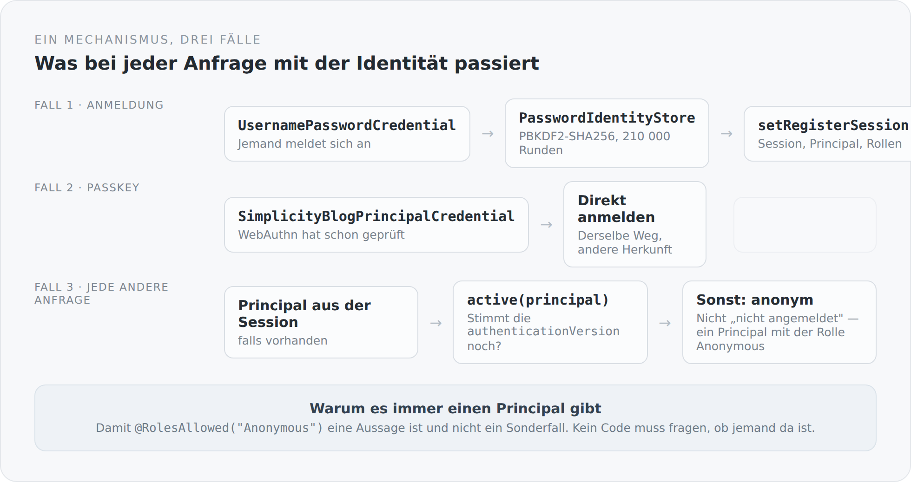

Authentifizierung ist der Teil eines Systems, bei dem man am ehesten geneigt ist, etwas Fertiges zu nehmen. Das ist auch richtig — man baut keine Kryptografie selbst. Was man aber sehr wohl selbst schreiben sollte, ist die Stelle, an der entschieden wird, *wer gerade da ist*.

In Jakarta Security heißt diese Stelle `HttpAuthenticationMechanism`. Sie ist ein Interface mit drei Methoden, und in diesem Blog gibt es genau eine Implementierung.

## Immer ein Principal, auch für niemanden

Der wichtigste Teil steht am Ende:

```scala
case _ =>
  Option(request.getUserPrincipal)
    .collect { case value: SimplicityBlogPrincipal => value }
    .orElse(
      Option(request.getSession(false))
        .flatMap(session => Option(session.getAttribute(SecuritySessionKeys.PrincipalKey)))
        .collect { case value: SimplicityBlogPrincipal => value }
    ) match {
    case Some(principal) if active(principal) =>
      httpMessageContext.notifyContainerAboutLogin(principal, principal.roles)
    case _ =>
      Option(request.getSession(false)).foreach(_.removeAttribute(SecuritySessionKeys.PrincipalKey))
      val principal = SimplicityBlogPrincipal.anonymous
      httpMessageContext.notifyContainerAboutLogin(principal, principal.roles)
  }
```

Eine Anfrage ohne Anmeldung führt nicht dazu, dass niemand da ist. Sie führt zu einem anonymen Principal mit der Rolle `Anonymous`.

Das ist eine kleine Entscheidung mit großer Wirkung. Sie macht aus einem Sonderfall einen Normalfall. Im ganzen System steht nirgends „falls jemand angemeldet ist" als Vorbedingung für eine Rollenprüfung. Stattdessen steht an den Controllern:

```scala
@RolesAllowed(Array("Anonymous", "Guest", "User", "Administrator"))
def read(@PathParam("id") post: BlogPost, ...): Data[BlogPost] = ...

@RolesAllowed(Array("User", "Administrator"))
def save(post: BlogPost): Data[BlogPost] = ...
```

Öffentlich ist nicht „ohne Prüfung". Öffentlich ist eine Rolle, die man aufschreiben muss. Wer einen neuen Endpunkt anlegt und die Annotation vergisst, bekommt keinen offenen Endpunkt, sondern einen geschlossenen.

{width=720}

## Drei Fälle in einem Match

Der Mechanismus unterscheidet drei Situationen, und weil Scala `match` hat, sieht man sie alle drei auf einem Bildschirm.

**Anmeldung mit Passwort.** Der `PasswordIdentityStore` prüft, und bei Erfolg wird eine Session registriert.

**Anmeldung mit Passkey.** Hier kommt kein Passwort an, sondern ein bereits geprüfter Principal — der WebAuthn-Controller hat die Signatur schon verifiziert und reicht das Ergebnis in Form eines eigenen Credential-Typs herein. Ab da läuft es denselben Weg.

Dass zwei völlig verschiedene Verfahren an dieser Stelle zusammenlaufen, ist der Grund, warum es sich lohnt, den Mechanismus selbst zu schreiben. Session-Verwaltung, Rollen, Principal — all das existiert einmal, egal ob jemand ein Passwort getippt oder den Finger auf einen Sensor gelegt hat.

**Jede andere Anfrage.** Principal aus dem Request oder aus der Session, und dann die Prüfung, die mir am wichtigsten ist.

## Die Zeile, die Sessions widerrufbar macht

```scala
private def active(principal: SimplicityBlogPrincipal): Boolean =
  principal.credentialId == null ||
    Option(entityManager.find(classOf[Credential], principal.credentialId))
      .exists(_.authenticationVersion == principal.authenticationVersion)
```

Jedes Credential hat eine `authenticationVersion`. Der Principal in der Session merkt sich, welche Version bei seiner Anmeldung galt. Bei jeder Anfrage wird verglichen.

Wird die Version am Credential erhöht — beim Passwortwechsel, beim Zurücksetzen, beim Entfernen eines Passkeys —, sind alle bestehenden Sessions ungültig. Sofort, ohne Session-Store durchsuchen zu müssen, ohne Token-Blacklist.

Das ist die Antwort auf eine Frage, die Systeme mit JWT typischerweise schlecht beantworten: Wie wirft man jemanden hinaus, der schon angemeldet ist? Hier ist es eine Zahl in einer Zeile und ein Vergleich pro Anfrage.

Der Preis ist eine Datenbankabfrage pro Anfrage. Das ist der Tausch: Ein zustandsloses Token wäre schneller und ließe sich nicht widerrufen.

## Was ein Principal weiß und was nicht

```scala
@RequestScoped
class CurrentIdentity {
  lazy val principal: SimplicityBlogPrincipal = ...
  lazy val user: User = ...
  lazy val credential: Credential = ...

  def isAuthenticated: Boolean = Option(principal).exists(_.userId != null)
  def hasRole(role: String): Boolean = Option(principal).exists(_.roleNames.contains(role))
}
```

Der Principal trägt nur Ids und Rollennamen. Der vollständige Benutzer wird erst geladen, wenn ihn jemand braucht — `lazy val`, request-scoped, also höchstens einmal pro Anfrage.

Damit kostet eine Rollenprüfung nichts. `hasRole("Administrator")` liest eine Menge von Zeichenketten. Erst wenn eine Regel den Benutzer selbst vergleicht, wird geladen — und dann mit dem Entity-Graph `User.full`, also in einer Abfrage statt in fünf.

Und noch ein Detail: Ist niemand angemeldet, gibt `user` kein `null` zurück, sondern ein leeres `User`-Objekt mit dem Namen des anonymen Principals. Dasselbe Muster wie oben, eine Ebene tiefer — es gibt immer etwas, keine `null`-Prüfung.

## Das Passwort

```scala
object PasswordHash {
  private val Algorithm = "PBKDF2WithHmacSHA256"
  private val Iterations = 210000
  private val SaltBytes = 16

  def create(password: String): String = {
    require(Option(password).exists(_.length >= 8), "Password must contain at least 8 characters")
    val salt = new Array[Byte](SaltBytes)
    random.nextBytes(salt)
    s"$Prefix$$$Iterations$$${encode(salt)}$$${encode(derive(password, salt, Iterations))}"
  }
```

PBKDF2 mit SHA-256 und 210 000 Runden. Die Zahl ist nicht geraten — sie entspricht der aktuellen OWASP-Empfehlung für dieses Verfahren.

Der gespeicherte Wert enthält das Verfahren, die Rundenzahl, das Salz und den Hash. Damit kann die Rundenzahl später erhöht werden, ohne bestehende Passwörter unbrauchbar zu machen: Beim Prüfen wird die Zahl aus dem Datensatz gelesen.

```scala
iterations >= 100000 && MessageDigest.isEqual(expected, derive(password, salt, iterations, expected.length * 8))
```

`MessageDigest.isEqual` statt `==` — ein Vergleich mit konstanter Laufzeit, damit die Dauer des Vergleichs nichts über den erwarteten Wert verrät. Und eine untere Schranke für die Rundenzahl, damit ein manipulierter Datensatz die Prüfung nicht billig machen kann.

## Eine Altlast, sauber markiert

```scala
} else {
  // Compatibility bridge for credentials created before password hashing.
  MessageDigest.isEqual(
    Option(password).getOrElse("").getBytes(StandardCharsets.UTF_8),
    Option(stored).getOrElse("").getBytes(StandardCharsets.UTF_8))
}

def needsUpgrade(stored: String): Boolean = !Option(stored).exists(_.startsWith(s"$Prefix$$"))
```

Es gibt einen Pfad, der Passwörter im Klartext vergleicht. Für Datensätze aus der Zeit vor dem Hashing.

Das ist eine offene Wunde, und sie ist mit drei Dingen versehen: einem Kommentar, der sagt, warum sie da ist; einem zeitkonstanten Vergleich, damit sie wenigstens nicht zusätzlich verrät; und `needsUpgrade`, mit dem der Login solche Datensätze beim nächsten erfolgreichen Anmelden umstellen kann.

Wenn dieser Blog öffentlich geht, gehört dieser Zweig gelöscht — und die alten Datensätze mit ihm. So etwas darf eine Migration überleben, aber keinen Start in den Betrieb.

## Warum überhaupt selbst

Weil `HttpAuthenticationMechanism` genau die richtige Größe hat.

Ich baue keine Kryptografie: PBKDF2 kommt aus der JVM, WebAuthn aus einer Bibliothek, Session-Verwaltung von Soteria und Undertow. Was ich schreibe, sind achtzig Zeilen, die entscheiden, welcher dieser Wege bei welcher Anfrage genommen wird — und in denen ich die Widerrufbarkeit unterbringen konnte, die kein Standardverfahren mitbringt.

Das ist die Grenze, die ich in diesem ganzen Projekt zu ziehen versuche. Nicht alles selbst machen. Aber die Stelle selbst besitzen, an der die Entscheidungen zusammenlaufen.

Im nächsten Artikel geht es um das zweite Verfahren — und um die Frage, wie man jemanden erkennt, ohne irgendetwas über ihn aufzubewahren, das gestohlen werden könnte.
