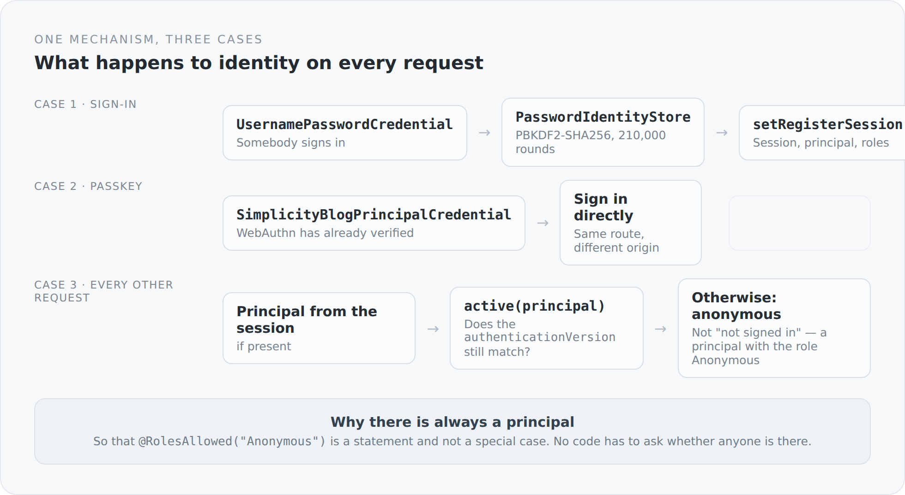

Authentication is the part of a system where you are most inclined to take something off the shelf. That is right, too — you do not build cryptography yourself. What you very much should write yourself is the place where it is decided *who is currently here*.

In Jakarta Security that place is called `HttpAuthenticationMechanism`. It is an interface with three methods, and in this blog there is exactly one implementation.

## Always a principal, even for nobody

The most important part sits at the end:

```scala
case _ =>
  Option(request.getUserPrincipal)
    .collect { case value: SimplicityBlogPrincipal => value }
    .orElse(
      Option(request.getSession(false))
        .flatMap(session => Option(session.getAttribute(SecuritySessionKeys.PrincipalKey)))
        .collect { case value: SimplicityBlogPrincipal => value }
    ) match {
    case Some(principal) if active(principal) =>
      httpMessageContext.notifyContainerAboutLogin(principal, principal.roles)
    case _ =>
      Option(request.getSession(false)).foreach(_.removeAttribute(SecuritySessionKeys.PrincipalKey))
      val principal = SimplicityBlogPrincipal.anonymous
      httpMessageContext.notifyContainerAboutLogin(principal, principal.roles)
  }
```

A request without a sign-in does not result in nobody being there. It results in an anonymous principal with the role `Anonymous`.

That is a small decision with a large effect. It turns a special case into the normal case. Nowhere in the system does "if somebody is signed in" appear as a precondition for a role check. Instead the controllers say:

```scala
@RolesAllowed(Array("Anonymous", "Guest", "User", "Administrator"))
def read(@PathParam("id") post: BlogPost, ...): Data[BlogPost] = ...

@RolesAllowed(Array("User", "Administrator"))
def save(post: BlogPost): Data[BlogPost] = ...
```

Public is not "without a check". Public is a role you have to write down. Anyone who adds a new endpoint and forgets the annotation does not get an open endpoint but a closed one.

{width=720}

## Three cases in one match

The mechanism distinguishes three situations, and because Scala has `match`, you see all three on one screen.

**Sign-in with a password.** The `PasswordIdentityStore` verifies, and on success a session is registered.

**Sign-in with a passkey.** Here no password arrives, but an already verified principal — the WebAuthn controller has checked the signature and passes the result in as a credential type of its own. From there it takes the same route.

That two completely different procedures converge at this point is why it is worth writing the mechanism yourself. Session handling, roles, principal — all of that exists once, whether somebody typed a password or put a finger on a sensor.

**Every other request.** Principal from the request or from the session, and then the check that matters most to me.

## The line that makes sessions revocable

```scala
private def active(principal: SimplicityBlogPrincipal): Boolean =
  principal.credentialId == null ||
    Option(entityManager.find(classOf[Credential], principal.credentialId))
      .exists(_.authenticationVersion == principal.authenticationVersion)
```

Every credential has an `authenticationVersion`. The principal in the session remembers which version applied when it signed in. On every request the two are compared.

Raise the version on the credential — on a password change, on a reset, on removing a passkey — and every existing session becomes invalid. Immediately, without searching a session store, without a token blacklist.

That is the answer to a question that systems using JWT typically answer badly: how do you throw out somebody who is already signed in? Here it is a number in one row and a comparison per request.

The price is a database query per request. That is the trade: a stateless token would be faster and could not be revoked.

## What a principal knows and what it does not

```scala
@RequestScoped
class CurrentIdentity {
  lazy val principal: SimplicityBlogPrincipal = ...
  lazy val user: User = ...
  lazy val credential: Credential = ...

  def isAuthenticated: Boolean = Option(principal).exists(_.userId != null)
  def hasRole(role: String): Boolean = Option(principal).exists(_.roleNames.contains(role))
}
```

The principal carries only ids and role names. The full user is loaded only when somebody needs it — `lazy val`, request-scoped, so at most once per request.

A role check therefore costs nothing. `hasRole("Administrator")` reads a set of strings. Only when a rule compares the user itself does loading happen — and then with the entity graph `User.full`, so in one query rather than five.

And one more detail: when nobody is signed in, `user` does not return `null` but an empty `User` object carrying the anonymous principal's name. The same pattern as above, one level down — there is always something, no `null` check.

## The password

```scala
object PasswordHash {
  private val Algorithm = "PBKDF2WithHmacSHA256"
  private val Iterations = 210000
  private val SaltBytes = 16

  def create(password: String): String = {
    require(Option(password).exists(_.length >= 8), "Password must contain at least 8 characters")
    val salt = new Array[Byte](SaltBytes)
    random.nextBytes(salt)
    s"$Prefix$$$Iterations$$${encode(salt)}$$${encode(derive(password, salt, Iterations))}"
  }
```

PBKDF2 with SHA-256 and 210,000 rounds. The number is not guessed — it matches the current OWASP recommendation for this method.

The stored value contains the algorithm, the iteration count, the salt and the hash. The iteration count can therefore be raised later without invalidating existing passwords: when verifying, the number is read from the record.

```scala
iterations >= 100000 && MessageDigest.isEqual(expected, derive(password, salt, iterations, expected.length * 8))
```

`MessageDigest.isEqual` instead of `==` — a constant-time comparison, so the duration of the comparison reveals nothing about the expected value. And a lower bound on the iteration count, so a tampered record cannot make verification cheap.

## A legacy, cleanly marked

```scala
} else {
  // Compatibility bridge for credentials created before password hashing.
  MessageDigest.isEqual(
    Option(password).getOrElse("").getBytes(StandardCharsets.UTF_8),
    Option(stored).getOrElse("").getBytes(StandardCharsets.UTF_8))
}

def needsUpgrade(stored: String): Boolean = !Option(stored).exists(_.startsWith(s"$Prefix$$"))
```

There is a path that compares passwords in clear text. For records from before hashing existed.

That is an open wound, and it comes with three things: a comment saying why it is there; a constant-time comparison, so at least it does not additionally leak; and `needsUpgrade`, with which the login can migrate such records on the next successful sign-in.

When this blog goes public, that branch belongs deleted — and the old records with it. Something like that may survive a migration, but not a move into production.

## Why write it myself at all

Because `HttpAuthenticationMechanism` is exactly the right size.

I build no cryptography: PBKDF2 comes from the JVM, WebAuthn from a library, session handling from Soteria and Undertow. What I write is eighty lines deciding which of those routes is taken on which request — and in which I could fit the revocability no standard procedure brings along.

That is the boundary I try to draw throughout this project. Not doing everything myself. But owning the place where the decisions come together.

The next article is about the second procedure — and about recognizing somebody without keeping anything about them that could be stolen.
