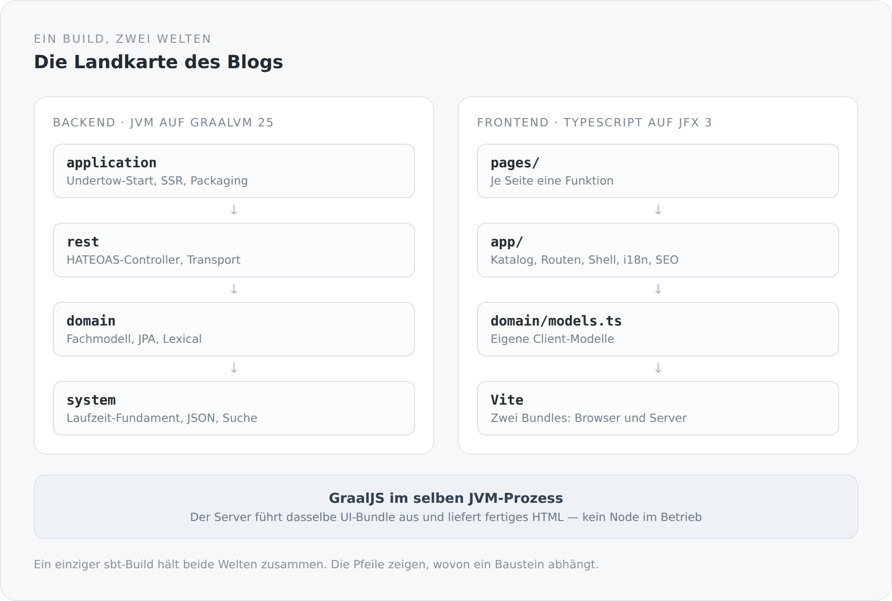
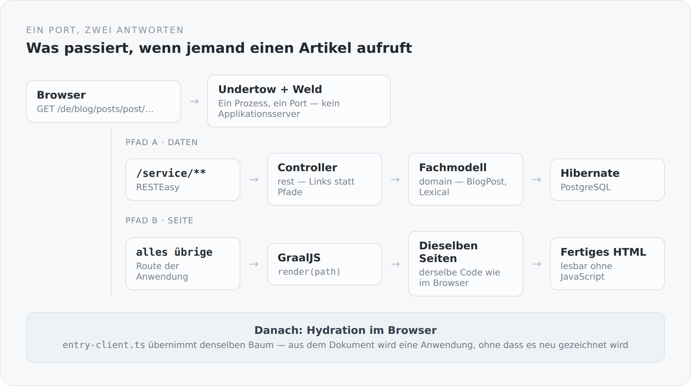

Ich habe diesen Blog gebaut, um zu zeigen, wie ich über Architektur denke. Bisher haben das nur die Texte behauptet. Jetzt soll es das System selbst tun. Dieser Artikel ist der Anfang einer Reihe, die den Blog Stück für Stück auseinandernimmt: den Build, das serverseitige Fundament, die Fachlichkeit, die API, die Oberfläche und die Naht dazwischen. Nicht als Tutorial. Eher als Werkstattbesuch.

Am Anfang steht eine Behauptung, und ich möchte sie deutlich aussprechen, bevor die Details kommen.

## Die Behauptung

Einfachheit ist nicht die Abwesenheit von Komplexität, sondern das Ergebnis ihrer Beherrschung.

Der Unterschied ist wichtig, weil beide Formen von außen gleich aussehen. Ein System kann einfach wirken, weil es Dinge weglässt, die es eigentlich braucht. Und es kann einfach wirken, weil jemand die schwierigen Stellen wirklich verstanden und dann geordnet hat. Die erste Art bricht beim ersten ernsten Anforderungswechsel. Die zweite trägt.

Man erkennt den Unterschied erst unter Last. Und genau deshalb ist ein Blog ein so guter Prüfstein. Er sieht banal aus. Artikel schreiben, Artikel anzeigen, ein bisschen Suche, zwei Sprachen, fertig. Aber sobald man ihn ernst nimmt, tauchen die echten Fragen auf. Was ist ein Artikel eigentlich, wenn er nicht nur eine Datenbankzeile sein soll? Was darf ein Client wissen? Wer entscheidet über Sichtbarkeit? Wann existiert eine Seite: wenn HTML ankommt oder wenn JavaScript fertig ist? Und wer hält das alles zusammen, wenn zwei Sprachwelten, Scala und TypeScript, im selben Projekt leben?

Ein großes System kann diese Fragen hinter Größe verstecken. Ein kleines nicht.

## Die Landkarte

Bevor ich in die Tiefe gehe, hier die ganze Anlage auf einem Bild. Alles, was in den nächsten Artikeln kommt, ist ein Ausschnitt daraus.

{width=720}

Drei Dinge sind daran wichtig.

Erstens: Es gibt einen Build, nicht zwei. Scala und TypeScript sind nicht zwei Projekte, die sich zufällig einen Ordner teilen. Ein `sbt`-Kommando baut beides.

Zweitens: Die Abhängigkeiten laufen nur in eine Richtung. `application` kennt `rest`, `rest` kennt `domain`, `domain` kennt `system`. Rückwärts geht nichts, und zwar nicht aus Disziplin, sondern weil es nicht kompiliert.

Drittens: Es gibt eine Naht zwischen Frontend und Backend, und sie liegt an einer ungewöhnlichen Stelle. Der Server führt dasselbe UI-Bundle aus wie der Browser, in seinem eigenen Prozess, mit GraalJS. Darauf komme ich gleich zurück.

## Der Build ist Teil der Architektur

Die meisten Projekte behandeln den Build als Konfigurationsordner. Für mich ist er die Stelle, an der Architekturentscheidungen verbindlich werden. Vier Zeilen aus der `build.sbt` sagen mehr über die Struktur des Systems als jedes Diagramm:

```scala
lazy val system = Project(id = "simplicity-blog-system", base = file("system"))

lazy val domain = Project(id = "simplicity-blog-domain", base = file("domain"))
  .dependsOn(system)

lazy val rest = Project(id = "simplicity-blog-rest", base = file("rest"))
  .dependsOn(domain)

lazy val application = Project(id = "simplicity-blog-backend", base = file("application"))
  .dependsOn(rest)
```

Das ist die Schichtung des Systems, ausgedrückt in einer Form, die der Compiler durchsetzt. Wenn ich später in `domain` versucht wäre, schnell einen REST-Controller anzufassen, weil es gerade praktisch wäre, geht es einfach nicht. Diese Art von Grenze ist mir lieber als jede Konvention, an die man sich erinnern muss.

Derselbe Build kennt auch den TypeScript-Teil. Er ruft Vite auf, erzeugt zwei Bundles, eines für den Browser und eines für den Server, und packt am Ende alles in ein Verzeichnis, das man kopieren und starten kann. Der Build ist damit nicht nur ein Werkzeug, sondern die einzige Stelle, an der das Gesamtsystem vollständig beschrieben ist.

## Der Server ist kein Applikationsserver

Der Blog benutzt Jakarta EE 11. Aber er läuft in keinem Applikationsserver. Es gibt kein Deployment, kein WAR, keinen Container, in den etwas hineingelegt wird. Der fertige Blog startet so:

```text
java --enable-native-access=ALL-UNNAMED -XX:+EnableJVMCI \
     -Dserver.static.path="$APP_HOME/frontend" \
     -Dserver.ssr.bundle="$APP_HOME/ssr/jfx-ssr.mjs" \
     -cp "$APP_HOME/conf:$APP_HOME/lib/*" \
     com.anjunar.simplicityblog.ApplicationMain
```

Eine `main`-Methode, ein Classpath, ein Prozess.

Jakarta EE ist hier kein Ort, an den man liefert, sondern ein Satz von Bibliotheken, den ich selbst zusammenstecke: Undertow als HTTP-Server, RESTEasy für JAX-RS, Weld für CDI, Agroal für den Pool, Narayana für Transaktionen, Hibernate für Persistenz. Ich bekomme die Standards, aber ich bekomme sie einzeln, und ich sehe, wo sie sich berühren. Genau darum geht es mir. Nicht darum, dass es weniger ist, sondern darum, dass nichts unsichtbar bleibt.

Der Preis dafür ist ehrlich: Was ein Applikationsserver sonst verkabelt, muss ich selbst verkabeln. Dieser Teil des Systems, das Modul `system`, ist deshalb im Grunde ein kleines, sehr bewusst gehaltenes Framework. Ihm ist ein eigener Abschnitt der Serie gewidmet.

## Die Seite ist eine Funktion

Auf der anderen Seite steht das Frontend. Es ist TypeScript, aber es ist kein React, kein Vue, kein Template. Eine Seite ist eine Funktion, die den Baum aufbaut, indem sie Funktionen aufruft:

```ts
export function imprintPage(): void {
  div(() => {
    classes("imprint-page", "content-page");
    pageSeo({ title: translated("Imprint").get, path: "/impressum" });

    div(() => {
      classes("imprint-page__hero", "content-page__header");
      heading(1, () => text(translated("Imprint")));
      paragraph(() => text(translated("Angaben gemäß § 5 DDG.")));
    });
  });
}
```

Kein virtueller DOM, der hinterher ausrechnet, was sich geändert hat. Kein Compiler-Schritt, der aus einer eigenen Sprache Code erzeugt. Was dasteht, passiert, und zwar in der Reihenfolge, in der es dasteht. Der Preis ist, dass Lebenszyklus und Bindung explizit sein müssen. Der Gewinn ist, dass man beim Lesen einer Seite nichts erraten muss.

Dass darunter eine Scala.js-Laufzeit liegt und TypeScript nur ihre Fassade ist, ist eine eigene Geschichte. Sie kommt später.

## Die Naht

Jetzt die interessanteste Stelle. Ein Blog ist zuerst ein Dokument im Netz und erst danach eine Anwendung. Er soll gefunden, gelesen und verstanden werden können, bevor irgendein Client-Code läuft. Also muss das erste HTML schon vollständig sein.

{width=720}

Der Server rendert die Seite deshalb selbst. Nicht mit einer zweiten, serverseitigen Template-Sprache, die das Frontend nachbaut, sondern mit demselben Bundle, das auch der Browser bekommt. GraalJS führt es im JVM-Prozess aus. Im Betrieb läuft kein Node.

```ts
export async function render(path: string, /* ... */): Promise<{ html: string; status: number }> {
  const result = await renderToString(
    () => i18nProvider(providerConfig(path), () => appDocument(/* ... */)),
    { document: true }
  );
  return { html: `<!doctype html>${result.html}`, status: result.status };
}
```

Das ist die ganze Grenze zwischen den beiden Welten: eine Funktion, die einen Pfad bekommt und HTML zurückgibt. Alles andere ist auf beiden Seiten derselbe Code.

Für mich ist das kein nostalgischer Rückschritt zu serverseitigem Rendering. Es ist die Weigerung, denselben Blog zweimal zu bauen.

## Was in dieser Reihe kommt

Die Serie geht von außen nach innen und dann wieder hinaus.

Zuerst das Build Management: das sbt-Monorepo, GraalVM als Laufzeitentscheidung, der Entwicklungsmodus, in dem Vite, Bundle-Watcher und JVM zusammen laufen, und das Paket, das am Ende ausgeliefert wird.

Dann das Fundament: wie man sich einen Applikationsserver aus Standardteilen selbst zusammensetzt, wie Transaktionen ohne Container-Magie funktionieren, warum es einen eigenen JSON-Mapper gibt und in welchen Formen der Server überhaupt spricht.

Dann die Fachlichkeit: was ein Artikel wirklich ist, warum sein Inhalt als Dokumentbaum und nicht als HTML-String gespeichert wird, wie Mehrsprachigkeit unterhalb des Artikels funktioniert und warum es Markdown als zweite Wahrheit gibt. Der Text, den Sie gerade lesen, liegt genau so in einem Repository.

Dann die API und die Identität: HATEOAS ernst genommen, Sichtbarkeit als Regel statt als Bedingung im Code, Kommentare und Moderation, Passwörter und Passkeys.

Dann die Oberfläche: JFX 3, expliziter Lebenszyklus, Routing, ein API-Client, der Links folgt statt Pfade zu bauen.

Und am Ende die Naht und der Betrieb: Hydration, Head und Canonical, der Weg von `localhost` zu einer Domain — und eine ehrliche Liste dessen, was bewusst fehlt.

## Warum überhaupt

Ich hätte ein fertiges Blogsystem nehmen können. Es wäre schneller gegangen und hätte besser ausgesehen. Aber es hätte nichts gezeigt.

Mich interessiert nicht, dass etwas funktioniert. Mich interessiert, warum es trägt. Diese Reihe ist der Versuch, das an einem System zu zeigen, das klein genug ist, um es ganz zu verstehen, und ernst genug, um die richtigen Fragen zu stellen.

Gute Architektur macht ein System nicht schwerer. Sie macht es tragfähiger.
