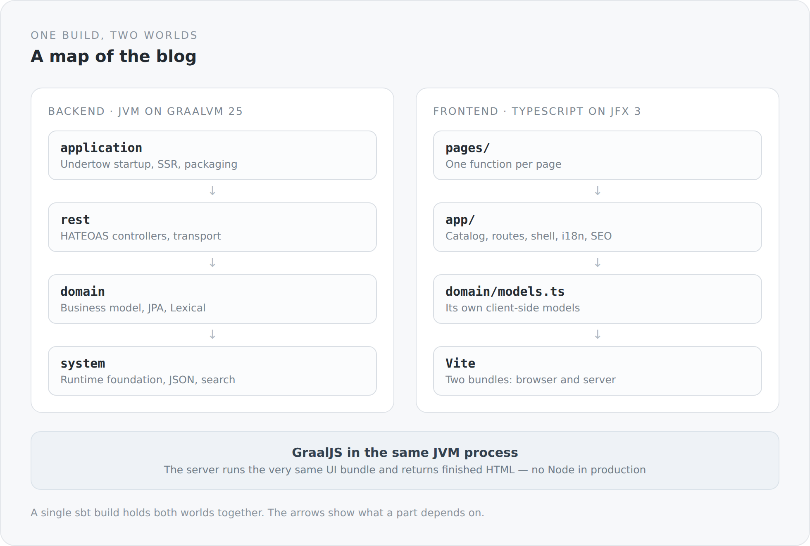
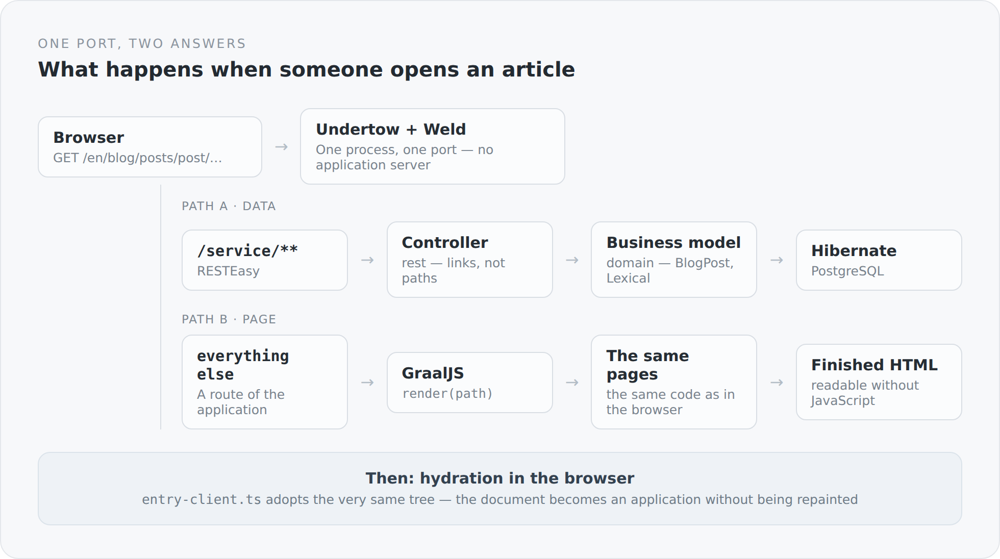

I built this blog to show how I think about architecture. So far only the texts have made that claim. Now the system itself should do it. This article opens a series that takes the blog apart piece by piece: the build, the server-side foundation, the domain, the API, the interface, and the seam between them. Not as a tutorial. More like a visit to the workshop.

There is a claim at the beginning, and I want to state it plainly before the details arrive.

## The claim

Simplicity is not the absence of complexity, but the result of mastering it.

The distinction matters, because both kinds look the same from the outside. A system can appear simple because it leaves out things it actually needs. And it can appear simple because someone genuinely understood the hard parts and then put them in order. The first kind breaks at the first serious change in requirements. The second holds.

You only see the difference under load. Which is exactly why a blog makes such a good test case. It looks trivial. Write articles, show articles, a bit of search, two languages, done. But the moment you take it seriously, the real questions appear. What is an article, if it is not merely a database row? What may a client know? Who decides visibility? When does a page exist — when HTML arrives, or when JavaScript has finished? And who holds all of it together when two language worlds, Scala and TypeScript, live in the same project?

A large system can hide these questions behind its size. A small one cannot.

## The map

Before going deep, here is the whole thing in one picture. Everything in the coming articles is a detail cut out of it.

{width=720}

Three things about it matter.

First: there is one build, not two. Scala and TypeScript are not two projects that happen to share a folder. A single `sbt` command builds both.

Second: dependencies run in one direction only. `application` knows `rest`, `rest` knows `domain`, `domain` knows `system`. Nothing runs backwards — not out of discipline, but because it does not compile.

Third: there is a seam between frontend and backend, and it sits in an unusual place. The server runs the very same UI bundle as the browser, inside its own process, with GraalJS. More on that shortly.

## The build is part of the architecture

Most projects treat the build as a folder of configuration. To me it is the place where architectural decisions become binding. Four lines from `build.sbt` say more about the structure of this system than any diagram:

```scala
lazy val system = Project(id = "simplicity-blog-system", base = file("system"))

lazy val domain = Project(id = "simplicity-blog-domain", base = file("domain"))
  .dependsOn(system)

lazy val rest = Project(id = "simplicity-blog-rest", base = file("rest"))
  .dependsOn(domain)

lazy val application = Project(id = "simplicity-blog-backend", base = file("application"))
  .dependsOn(rest)
```

That is the layering of the system, written in a form the compiler enforces. If I am later tempted to reach into a REST controller from `domain` because it happens to be convenient, it simply will not work. I prefer that kind of boundary to any convention you have to remember.

The same build also knows about the TypeScript side. It invokes Vite, produces two bundles — one for the browser and one for the server — and finally assembles a directory you can copy and start. The build is therefore not only a tool, but the only place where the whole system is described completely.

## The server is not an application server

The blog uses Jakarta EE 11. But it does not run inside an application server. There is no deployment, no WAR, no container that something gets placed into. The finished blog starts like this:

```text
java --enable-native-access=ALL-UNNAMED -XX:+EnableJVMCI \
     -Dserver.static.path="$APP_HOME/frontend" \
     -Dserver.ssr.bundle="$APP_HOME/ssr/jfx-ssr.mjs" \
     -cp "$APP_HOME/conf:$APP_HOME/lib/*" \
     com.anjunar.simplicityblog.ApplicationMain
```

One `main` method, one classpath, one process.

Jakarta EE here is not a place you deploy to, but a set of libraries I assemble myself: Undertow as the HTTP server, RESTEasy for JAX-RS, Weld for CDI, Agroal for the pool, Narayana for transactions, Hibernate for persistence. I get the standards, but I get them one at a time, and I can see where they touch. That is exactly the point. Not that there is less of it, but that nothing stays invisible.

The price is honest: what an application server otherwise wires up, I have to wire up. That part of the system, the `system` module, is essentially a small and very deliberately kept framework. It gets its own arc in this series.

## A page is a function

On the other side sits the frontend. It is TypeScript, but it is not React, not Vue, not a template. A page is a function that builds the tree by calling functions:

```ts
export function imprintPage(): void {
  div(() => {
    classes("imprint-page", "content-page");
    pageSeo({ title: translated("Imprint").get, path: "/impressum" });

    div(() => {
      classes("imprint-page__hero", "content-page__header");
      heading(1, () => text(translated("Imprint")));
      paragraph(() => text(translated("Information pursuant to Section 5 DDG.")));
    });
  });
}
```

No virtual DOM that works out afterwards what changed. No compiler step that turns a dialect into code. What is written happens, in the order it is written. The price is that lifecycle and binding have to be explicit. The gain is that reading a page requires no guessing.

That underneath it lies a Scala.js runtime and TypeScript is only its facade is a story of its own. It comes later.

## The seam

Now the most interesting part. A blog is a document on the web first and an application second. It should be findable, readable and understandable before any client code runs. So the first HTML has to be complete.

{width=720}

The server therefore renders the page itself. Not with a second, server-side template language that reimplements the frontend, but with the same bundle the browser gets. GraalJS runs it inside the JVM process. In production there is no Node.

```ts
export async function render(path: string, /* ... */): Promise<{ html: string; status: number }> {
  const result = await renderToString(
    () => i18nProvider(providerConfig(path), () => appDocument(/* ... */)),
    { document: true }
  );
  return { html: `<!doctype html>${result.html}`, status: result.status };
}
```

That is the entire border between the two worlds: a function that takes a path and returns HTML. Everything else is the same code on both sides.

To me this is not a nostalgic return to server-side rendering. It is a refusal to build the same blog twice.

## What this series will cover

The series works from the outside in, then back out again.

First build management: the sbt monorepo, GraalVM as a runtime decision, the development mode in which Vite, a bundle watcher and the JVM run together, and the package that finally ships.

Then the foundation: how to assemble an application server from standard parts, how transactions work without container magic, why there is a JSON mapper of its own, and what shapes the server speaks in at all.

Then the domain: what an article really is, why its content is stored as a document tree and not as an HTML string, how localization works below the article, and why Markdown exists as a second truth. The text you are reading right now lives exactly like that in a repository.

Then the API and identity: HATEOAS taken seriously, visibility as a rule rather than a condition in code, comments and moderation, passwords and passkeys.

Then the interface: JFX 3, explicit lifecycle, routing, an API client that follows links instead of building paths.

And finally the seam and operations: hydration, head and canonical, the road from `localhost` to a domain — plus an honest list of what is deliberately missing.

## Why at all

I could have taken an existing blog engine. It would have been faster and it would have looked better. But it would have shown nothing.

I am not interested in the fact that something works. I am interested in why it holds. This series is an attempt to show that on a system small enough to understand completely and serious enough to raise the right questions.

Good architecture does not make a system heavier. It makes it load-bearing.
