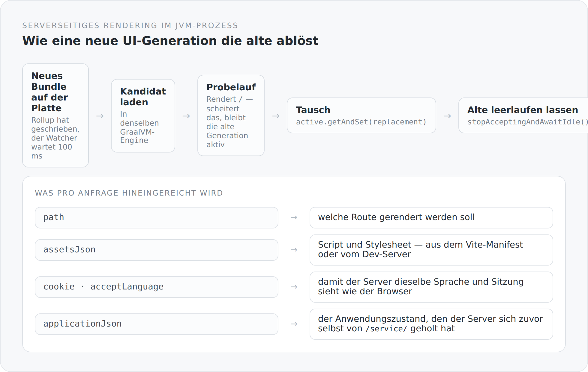

Der vorige Artikel hat die Funktion beschrieben, die HTML erzeugt. Dieser handelt davon, was es auf der JVM-Seite braucht, damit sie aufrufbar ist — und was passiert, wenn sich das Bundle unter einer laufenden Anwendung ändert.

## Ein Prozess, eine Engine

```scala
private val engine = Engine.create()
```

Eine GraalVM-`Engine`, für die Lebensdauer des Servers. Kein Node, kein zweiter Prozess, keine Netzwerkverbindung zwischen Server und Renderer. Das JavaScript läuft in derselben JVM wie die Datenbankverbindung.

Der Handler, der eine Seite ausliefert, ruft also eine Funktion auf, die im selben Speicherraum liegt. Das ist der Unterschied zu jeder Sidecar-Lösung: Es gibt keinen Zustand, der zwischen zwei Systemen synchron gehalten werden müsste.

## Der Tausch bei laufendem Betrieb

Im Entwicklungsmodus schreibt Vite das Bundle bei jeder Änderung neu. Der Server läuft weiter. Wie kommt der neue Code in eine laufende Anwendung, ohne dass jemand eine halbe Seite bekommt?

{width=720}

```scala
def reload(bundle: Path): JfxSsrResult = {
  if (closed.get()) throw IllegalStateException("Reloadable JFX SSR runtime was closed")
  val (replacement, smokeResult) = loadValidated(bundle)
  val (previous, drained) = lifecycleLock.synchronized {
    if (closed.get()) { replacement.close(); throw IllegalStateException(...) }
    val old = active.getAndSet(replacement)
    old -> old.stopAcceptingAndAwaitIdle()
  }
  try drained.toCompletableFuture.get(smokeTimeout.toMillis, TimeUnit.MILLISECONDS)
  finally previous.close()
  smokeResult
}
```

Vier Schritte, in dieser Reihenfolge.

**Erst laden und prüfen, dann tauschen.** `loadValidated` läuft außerhalb des Locks. Wenn das neue Bundle kaputt ist, fliegt hier eine Ausnahme — und die alte Generation ist noch aktiv. Ein Tippfehler in einer TypeScript-Datei legt den laufenden Server nicht lahm.

**Der Probelauf ist ein echtes Rendering.** `loadValidated` rendert `/` und wartet auf das Ergebnis. Es wird also nicht geprüft, ob die Datei syntaktisch gültig ist, sondern ob sie eine Seite erzeugen kann. Ein Bundle, das lädt und beim ersten Rendern scheitert, kommt nicht durch.

**Der Tausch selbst ist atomar.** `active.getAndSet(replacement)` — ab diesem Moment bekommt jede neue Anfrage die neue Generation.

**Die alte darf zu Ende arbeiten.** `stopAcceptingAndAwaitIdle()` nimmt keine neuen Aufträge mehr an und meldet, wenn die laufenden fertig sind. Erst danach wird sie geschlossen.

Kein Besucher bekommt eine abgeschnittene Seite, weil unter seinem Rendering die Laufzeit weggeräumt wurde.

## Der Beobachter

```scala
if (changed && running.get()) {
  Thread.sleep(settleDelay.toMillis)
  if (Files.isRegularFile(normalizedBundle)) {
    try {
      runtime.reload(normalizedBundle)
      failure.set(null)
```

Hundert Millisekunden Wartezeit, bevor gelesen wird. Der Grund ist banal und wichtig: Ein Schreibvorgang löst mehrere Dateiereignisse aus, und beim ersten ist die Datei oft noch unvollständig. Ohne die Verzögerung würde die Hälfte aller Neuladungen an einem halb geschriebenen Bundle scheitern.

Der Beobachter läuft in einem eigenen Daemon-Thread mit einem Namen:

```scala
private val thread = Thread.ofPlatform()
  .name("jfx-graaljs-bundle-watcher")
  .daemon(true)
  .start(() => watchLoop())
```

Ein benannter Thread ist eine Kleinigkeit, die sich beim ersten Thread-Dump auszahlt. `Thread-7` sagt nichts; `jfx-graaljs-bundle-watcher` sagt alles.

Und Fehler werden nicht verschluckt:

```scala
def lastReloadFailure: Option[Throwable] = Option(failure.get())
```

Der letzte Fehlschlag ist abfragbar. Wenn das Bundle nicht mehr lädt, weiß das System das — statt weiter mit der alten Generation zu rendern und den Eindruck zu erwecken, alles sei in Ordnung.

## Was pro Anfrage hineingeht

```scala
def render(path: String, cookie: Option[String], acceptLanguage: Option[String],
           publicOrigin: String = ""): JfxSsrResult = {
  val applicationJson = loadApplication(cookie, acceptLanguage)
  runtime.render(path, assetsJson, applicationJson, publicOrigin, cookie, acceptLanguage)
    .toCompletableFuture.get(timeout.toMillis, TimeUnit.MILLISECONDS)
}
```

Vier Dinge, und jedes hat einen Grund.

`path` ist die Route. `assetsJson` sind Script und Stylesheet — im Betrieb aus dem Vite-Manifest mit gehashten Dateinamen, in der Entwicklung direkt vom Dev-Server. `cookie` und `acceptLanguage` sorgen dafür, dass der Server dieselbe Sitzung und dieselbe Sprache sieht wie der Browser. Und `publicOrigin` ist die von außen sichtbare Adresse, aus der die Canonical-URLs entstehen.

Dazu ein **Timeout**. Ein Rendering, das hängt, blockiert nicht den Request-Thread für immer — es scheitert nach einer konfigurierbaren Zeit.

## Was GraalJS nicht ist

```ts
// GraalJS provides ECMAScript without Web APIs. Shared preferences use the
// WHATWG URL contract; install it only in this server runtime before rendering.
import "core-js/actual/url/index.js";
```

Die erste Zeile in `entry-graal.ts` ist ein Polyfill.

GraalJS ist eine ECMAScript-Laufzeit, keine Browserumgebung. Es gibt kein `window`, kein `document`, kein `fetch` und keine `URL` — all das gehört nicht zur Sprache, sondern zur Plattform.

Was fehlt, wird gezielt ergänzt: `URL` über ein Polyfill, `fetch` über ein vom Host bereitgestelltes `__jfxFetch`, `AbortController` über die Attrappe aus dem Lebenszyklus-Artikel. Und der Import steht ausdrücklich nur in diesem Einstiegspunkt: Der Browser hat `URL` bereits, dort wäre das Polyfill überflüssiges Gewicht.

Das ist eine Haltung, die man an mehreren Stellen dieses Projekts findet. Nicht eine Kompatibilitätsschicht, die alles nachbaut. Sondern genau die Teile, die genau hier gebraucht werden, mit einem Kommentar daneben, der sagt warum.

## Und im Betrieb

Da ändert sich nichts an dieser Datei — nur an einer Einstellung:

```scala
val watcher = if (reload) Some(new JfxSsrBundleWatcher(bundle, runtime)) else None
```

`server.ssr.reload` ist im Entwicklungsmodus an und sonst aus. Ohne Beobachter wird das Bundle einmal geladen, geprüft und läuft. Derselbe Code, ein Schalter weniger aktiv.

## Der Preis

**Speicher.** Ein JavaScript-Kontext in der JVM ist nicht gratis, und beim Neuladen existieren kurzzeitig zwei.

**Debugging über eine Sprachgrenze.** Wenn im gerenderten UI etwas schiefgeht, steht der Fehler in JavaScript und der Stacktrace in Java.

**Und eine Bindung an GraalVM**, die schon im Artikel über die Laufzeit ausführlich stand.

## Was ich dafür bekomme

Einen Blog, dessen erstes HTML vollständig ist, ohne dass es dafür einen zweiten Prozess, ein zweites Deployment oder eine zweite Implementierung derselben Seite gibt.

Und einen Entwicklungsmodus, in dem eine Änderung an einer TypeScript-Datei eine Sekunde später serverseitig gerendert wird — ohne Neustart.

Beides ist nicht spektakulär, wenn es funktioniert. Genau das ist der Punkt.

Im nächsten Artikel geht es darum, was dieses serverseitig gerenderte HTML enthalten muss, damit sich der ganze Aufwand überhaupt lohnt.
