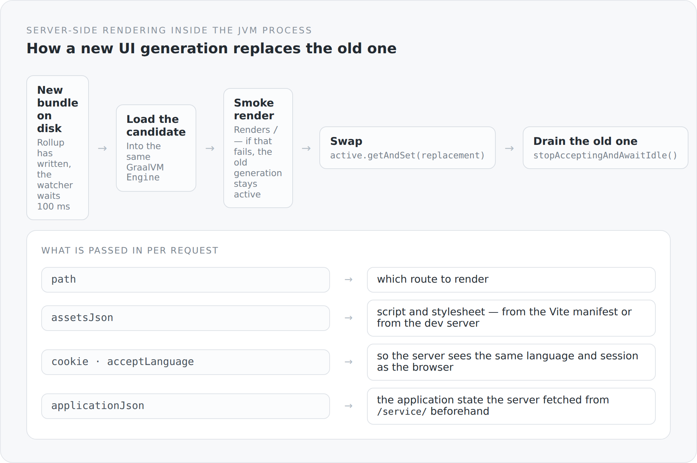

The previous article described the function that produces HTML. This one is about what the JVM side needs for it to be callable — and what happens when the bundle changes under a running application.

## One process, one engine

```scala
private val engine = Engine.create()
```

One GraalVM `Engine`, for the lifetime of the server. No Node, no second process, no network connection between server and renderer. The JavaScript runs in the same JVM as the database connection.

The handler that serves a page therefore calls a function living in the same memory space. That is the difference from any sidecar solution: there is no state that would have to be kept in sync between two systems.

## The swap while running

In development mode Vite rewrites the bundle on every change. The server keeps running. How does the new code get into a running application without anyone receiving half a page?

{width=720}

```scala
def reload(bundle: Path): JfxSsrResult = {
  if (closed.get()) throw IllegalStateException("Reloadable JFX SSR runtime was closed")
  val (replacement, smokeResult) = loadValidated(bundle)
  val (previous, drained) = lifecycleLock.synchronized {
    if (closed.get()) { replacement.close(); throw IllegalStateException(...) }
    val old = active.getAndSet(replacement)
    old -> old.stopAcceptingAndAwaitIdle()
  }
  try drained.toCompletableFuture.get(smokeTimeout.toMillis, TimeUnit.MILLISECONDS)
  finally previous.close()
  smokeResult
}
```

Four steps, in this order.

**Load and verify first, swap afterwards.** `loadValidated` runs outside the lock. If the new bundle is broken, an exception flies here — and the old generation is still active. A typo in a TypeScript file does not take the running server down.

**The smoke test is a real render.** `loadValidated` renders `/` and waits for the result. So what is checked is not whether the file is syntactically valid, but whether it can produce a page. A bundle that loads and fails on the first render does not get through.

**The swap itself is atomic.** `active.getAndSet(replacement)` — from that moment every new request gets the new generation.

**The old one is allowed to finish.** `stopAcceptingAndAwaitIdle()` takes no new work and reports when the in-flight work is done. Only then is it closed.

No visitor gets a truncated page because the runtime was cleared away underneath their render.

## The watcher

```scala
if (changed && running.get()) {
  Thread.sleep(settleDelay.toMillis)
  if (Files.isRegularFile(normalizedBundle)) {
    try {
      runtime.reload(normalizedBundle)
      failure.set(null)
```

A hundred milliseconds of waiting before reading. The reason is mundane and important: a write triggers several file events, and at the first one the file is often still incomplete. Without the delay half of all reloads would fail on a half-written bundle.

The watcher runs in a daemon thread of its own, with a name:

```scala
private val thread = Thread.ofPlatform()
  .name("jfx-graaljs-bundle-watcher")
  .daemon(true)
  .start(() => watchLoop())
```

A named thread is a small thing that pays off on the first thread dump. `Thread-7` says nothing; `jfx-graaljs-bundle-watcher` says everything.

And failures are not swallowed:

```scala
def lastReloadFailure: Option[Throwable] = Option(failure.get())
```

The last failure is queryable. When the bundle stops loading, the system knows it — instead of continuing to render with the old generation and giving the impression everything is fine.

## What goes in per request

```scala
def render(path: String, cookie: Option[String], acceptLanguage: Option[String],
           publicOrigin: String = ""): JfxSsrResult = {
  val applicationJson = loadApplication(cookie, acceptLanguage)
  runtime.render(path, assetsJson, applicationJson, publicOrigin, cookie, acceptLanguage)
    .toCompletableFuture.get(timeout.toMillis, TimeUnit.MILLISECONDS)
}
```

Four things, each with a reason.

`path` is the route. `assetsJson` is script and stylesheet — in production from the Vite manifest with hashed file names, in development straight from the dev server. `cookie` and `acceptLanguage` make sure the server sees the same session and the same language as the browser. And `publicOrigin` is the externally visible address the canonical URLs are built from.

Plus a **timeout**. A render that hangs does not block the request thread forever — it fails after a configurable interval.

## What GraalJS is not

```ts
// GraalJS provides ECMAScript without Web APIs. Shared preferences use the
// WHATWG URL contract; install it only in this server runtime before rendering.
import "core-js/actual/url/index.js";
```

The first line in `entry-graal.ts` is a polyfill.

GraalJS is an ECMAScript runtime, not a browser environment. There is no `window`, no `document`, no `fetch` and no `URL` — none of that belongs to the language, it belongs to the platform.

What is missing is added deliberately: `URL` through a polyfill, `fetch` through a host-provided `__jfxFetch`, `AbortController` through the stand-in from the lifecycle article. And the import sits explicitly in this entry point only: the browser already has `URL`, where the polyfill would be dead weight.

That is an attitude you find in several places in this project. Not a compatibility layer that reimplements everything. But exactly the pieces needed exactly here, with a comment next to them saying why.

## And in production

Nothing changes in this file — only a setting:

```scala
val watcher = if (reload) Some(new JfxSsrBundleWatcher(bundle, runtime)) else None
```

`server.ssr.reload` is on in development mode and off otherwise. Without a watcher the bundle is loaded once, verified, and runs. The same code, one switch less active.

## The price

**Memory.** A JavaScript context in the JVM process is not free, and during a reload two exist briefly.

**Debugging across a language boundary.** When something goes wrong in the rendered UI, the error is in JavaScript and the stack trace in Java.

**And a tie to GraalVM**, described at length in the article about the runtime.

## What I get for it

A blog whose first HTML is complete, without needing a second process, a second deployment or a second implementation of the same page.

And a development mode in which a change to a TypeScript file is rendered server-side a second later — without a restart.

Neither is spectacular when it works. That is exactly the point.

The next article is about what this server-rendered HTML has to contain for the whole effort to be worth anything at all.
