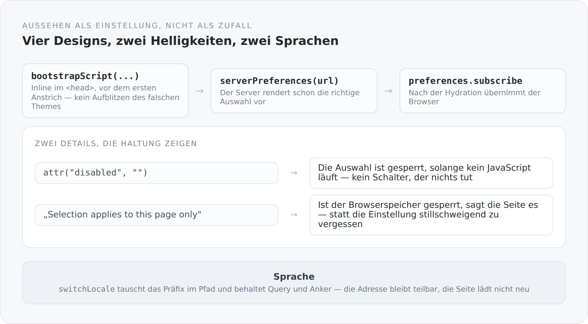

Aussehen gilt selten als Architektur. Es ist das, was man am Ende macht, wenn der Rest steht. Ich halte das für einen Fehler, und zwar aus einem sehr technischen Grund: Aussehen ist Zustand, und Zustand, den man nicht durchdacht hat, verhält sich falsch.

Dieser Blog hat vier Designs, zwei Helligkeiten und zwei Sprachen. Das sind sechzehn Kombinationen, und alle müssen serverseitig gerendert, im Browser übernommen und über Seitenwechsel hinweg stabil sein.

## Das Problem, das jeder kennt

Man öffnet eine Seite, sie blitzt kurz hell auf, dann wird sie dunkel. Das passiert, weil der Server nicht weiß, welche Einstellung der Besucher hat, und das JavaScript, das es weiß, erst nach dem ersten Anstrich läuft.

Die Lösung ist ein winziges Skript, das vor dem ersten Anstrich läuft:

```ts
const THEME_INIT_SCRIPT = bootstrapScript("simplicity-blog.theme");

disposeWith(documentHeadHandle.push(inlineScript("theme-init", THEME_INIT_SCRIPT)));
```

Inline im `<head>`, nicht als externe Datei. Eine externe Datei müsste erst geladen werden, und genau in dieser Zeitspanne blitzt es.

{width=720}

## Der Server rendert schon die richtige Auswahl

```ts
export function preferenceControls(url: string): void {
  const preferences = createPreferences("simplicity-blog.theme", url);
  const initial = serverPreferences(url);
  // ...
  for (const [value, title] of options) option(() => {
    attr("value", value);
    if (value === initial[axis]) attr("selected", "");
    text(title);
  });
```

`serverPreferences(url)` liest die Einstellung aus dem, was der Server über diese Anfrage weiß. Das ausgelieferte HTML enthält also bereits das richtige `selected`.

Ohne das würde die Auswahlliste nach der Hydration von der ersten auf die richtige Option springen. Ein kleiner Ruck, den man nicht bewusst wahrnimmt und der trotzdem den Eindruck hinterlässt, dass etwas nachlädt.

Der Kommentar über der Funktion ist ein Satz und sagt viel: *Each shell owns its preferences and subscriptions, including during SSR.* Auch während des serverseitigen Renderings gibt es Abonnements, und auch dort werden sie wieder abgebaut. Der Lebenszyklus aus dem vorigen Artikel gilt an beiden Orten.

## Zwei Details, die eine Haltung zeigen

```ts
select(() => {
  attr("id", id);
  attr("aria-label", translated(title));
  attr("disabled", "");
  // ...
  if (isBrowser()) {
    domProperty("disabled", false);
    const control = self();
    disposeWith({ dispose: preferences.subscribe(state => control.setDomProperty("value", state[axis])) });
  }
});
```

Die Auswahlliste wird **gesperrt ausgeliefert** und erst im Browser freigegeben.

Das ist die ehrliche Variante. Ohne JavaScript tut dieser Schalter nichts — also soll er auch nicht so aussehen, als täte er etwas. Ein Bedienelement, das auf einen Klick nicht reagiert, ist schlimmer als eines, dem man ansieht, dass es gerade nicht verfügbar ist.

Und das zweite:

```ts
const message = translated("Selection applies to this page only: browser storage is unavailable.");
const notice = property("");
let available = true;
disposeWith({ dispose: preferences.subscribe(state => {
  available = state.storageAvailable;
  notice.set(available ? "" : message.get);
}) });
```

Wenn der Browser nichts speichern darf — privater Modus, blockierte Site-Daten, strenge Einstellungen —, **sagt die Seite es**.

Die Alternative wäre gewesen, die Einstellung stillschweigend zu vergessen. Der Besucher stellt Dunkel ein, wechselt die Seite, alles ist wieder hell, und er hält das System für kaputt. Ein Satz, der erklärt, was passiert, ist ein besserer Umgang mit einem Zustand, den man nicht ändern kann.

Der Hinweis trägt `role="status"`, wird also auch von Screenreadern angesagt.

## Sprache wechseln, ohne die Adresse zu verlieren

```ts
export function switchLocale(next: string): void {
  if (typeof window === "undefined") {
    setLocale(next);
    return;
  }

  const url = new URL(window.location.href);
  const selected = normalizeLocale(next);
  setLocale(selected);
  window.history.replaceState(null, "", localizedUrl(`${url.pathname}${url.search}${url.hash}`, selected));
  window.dispatchEvent(new PopStateEvent("popstate"));
}
```

Vier Zeilen für den Browserfall, und jede hat einen Grund.

Der Pfad wird mit Query *und* Anker übernommen. Wer bei einem bestimmten Kommentar steht und die Sprache wechselt, bleibt dort.

`replaceState` statt `pushState`. Ein Sprachwechsel ist keine Navigation. Wer danach zurückgeht, will auf die vorherige Seite, nicht auf dieselbe Seite in der anderen Sprache.

Und ein `PopStateEvent`, damit der Router die neue Adresse mitbekommt. Kein Neuladen, keine leere Seite, kein Sprung nach oben.

## Zwei Begriffe von Sprache

Eine Feinheit, die mir wichtig ist: Es gibt in diesem System zwei Sprachbegriffe, und sie sind absichtlich getrennt.

Die **Oberflächensprache** bestimmt, in welcher Sprache Knöpfe, Beschriftungen und Meldungen erscheinen. Sie steht im Pfad und ist das, was `switchLocale` ändert.

Die **Inhaltssprache** ist die des Artikels, den man tatsächlich bekommt — und die kann eine andere sein, wenn es die gewünschte Übersetzung nicht gibt. Der Artikel über die Übersetzungen hat das ausführlich beschrieben.

`articleSeo` benutzt konsequent die zweite:

```ts
const contentLocale = normalizeLocale(post.locale.get);
const canonical = canonicalBlogPostUrl(post.slug.get, contentLocale);
entries.push(metaProperty("og:locale", contentLocale === "de" ? "de_DE" : "en_US"));
```

Die Oberfläche kann deutsch sein, während der Artikel englisch ist. Was in `og:locale` steht, ist die Sprache des Textes.

## Der Text als Teil der Architektur

`translated(source)` nimmt den englischen Quelltext als Schlüssel:

```ts
export function translated(source: string): ReadOnlyProperty<string> {
  if (runtime().name === "stub") return property(source);
  return t(message(source));
}
```

Kein `blog.post.edit.button.label`, sondern der Satz selbst. Man liest im Code, was auf dem Bildschirm steht.

Der Preis: Ändert man den englischen Text, ändert sich der Schlüssel und die Übersetzung fehlt. Der Gewinn: Es gibt keine Seite, auf der `blog.post.edit.button.label` steht, weil jemand einen Schlüssel vertippt hat — im schlimmsten Fall steht dort der englische Satz.

Für einen zweisprachigen Blog ist das der richtige Tausch. Bei zwanzig Sprachen wäre es der falsche.

Und die erste Zeile ist eine kleine Freundlichkeit: In einer minimalen Laufzeit ohne i18n gibt die Funktion einfach den Quelltext zurück. Ein Rendering-Test in Node funktioniert damit, ohne dass jemand einen Katalog aufbaut.

## Was mir hier wichtig ist

Nichts in diesem Artikel ist Architektur im üblichen Sinn. Es geht um ein Skript im Head, eine gesperrte Auswahlliste, einen Hinweis, einen Sprachwechsel.

Aber alle vier sind Zustandsprobleme, und alle vier wären als nachträgliche Reparatur unangenehm geworden. Ein Theme, das erst im Browser entsteht, blitzt. Ein Sprachwechsel, der die Adresse verliert, macht Links unteilbar. Eine Einstellung, die stillschweigend nicht gespeichert wird, wirkt wie ein Defekt.

„Architektonische Stille" ist der Anspruch, unter dem dieser Blog gebaut ist. Und Stille heißt in der Praxis vor allem: Es ruckelt nicht, es blitzt nicht, es springt nicht, und wenn etwas nicht geht, sagt es das.

Damit ist das Frontend beschrieben. In den nächsten Artikeln geht es um die Stelle, an der es auf das Backend trifft — und darum, warum diese Naht der interessanteste Teil des ganzen Systems ist.
