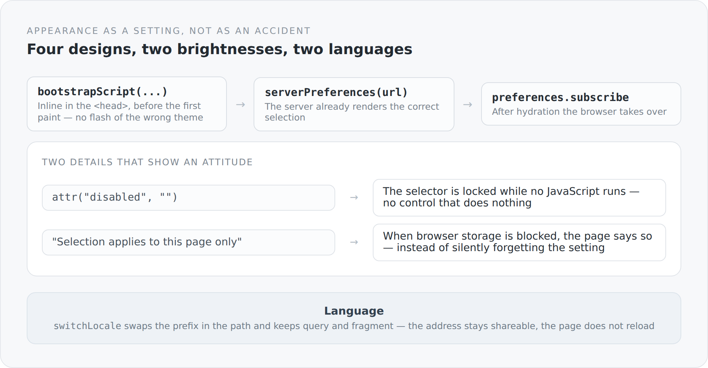

Appearance is rarely counted as architecture. It is what you do at the end, once the rest stands. I think that is a mistake, for a very technical reason: appearance is state, and state you have not thought through behaves incorrectly.

This blog has four designs, two brightnesses and two languages. That is sixteen combinations, and every one of them has to be rendered on the server, adopted in the browser and stay stable across page changes.

## The problem everybody knows

You open a page, it flashes bright for a moment, then it goes dark. That happens because the server does not know which setting the visitor has, and the JavaScript that does know runs only after the first paint.

The solution is a tiny script that runs before the first paint:

```ts
const THEME_INIT_SCRIPT = bootstrapScript("simplicity-blog.theme");

disposeWith(documentHeadHandle.push(inlineScript("theme-init", THEME_INIT_SCRIPT)));
```

Inline in the `<head>`, not as an external file. An external file would have to be fetched first, and that is exactly the interval in which it flashes.

{width=720}

## The server renders the right selection already

```ts
export function preferenceControls(url: string): void {
  const preferences = createPreferences("simplicity-blog.theme", url);
  const initial = serverPreferences(url);
  // ...
  for (const [value, title] of options) option(() => {
    attr("value", value);
    if (value === initial[axis]) attr("selected", "");
    text(title);
  });
```

`serverPreferences(url)` reads the setting from what the server knows about this request. The delivered HTML therefore already contains the right `selected`.

Without that, the select would jump from the first option to the correct one after hydration. A small lurch you do not consciously notice and that still leaves the impression something is loading.

The comment above the function is one sentence and says a lot: *Each shell owns its preferences and subscriptions, including during SSR.* Even during server-side rendering there are subscriptions, and there too they get torn down. The lifecycle from the previous article applies in both places.

## Two details that show an attitude

```ts
select(() => {
  attr("id", id);
  attr("aria-label", translated(title));
  attr("disabled", "");
  // ...
  if (isBrowser()) {
    domProperty("disabled", false);
    const control = self();
    disposeWith({ dispose: preferences.subscribe(state => control.setDomProperty("value", state[axis])) });
  }
});
```

The select is **delivered disabled** and only enabled in the browser.

That is the honest variant. Without JavaScript this control does nothing — so it should not look as if it did. A control that does not respond to a click is worse than one you can see is currently unavailable.

And the second:

```ts
const message = translated("Selection applies to this page only: browser storage is unavailable.");
const notice = property("");
let available = true;
disposeWith({ dispose: preferences.subscribe(state => {
  available = state.storageAvailable;
  notice.set(available ? "" : message.get);
}) });
```

When the browser may store nothing — private mode, blocked site data, strict settings — **the page says so**.

The alternative would have been to silently forget the setting. The visitor picks dark, changes page, everything is bright again, and they conclude the system is broken. A sentence explaining what is happening is a better way of dealing with a state you cannot change.

The notice carries `role="status"`, so screen readers announce it too.

## Switching language without losing the address

```ts
export function switchLocale(next: string): void {
  if (typeof window === "undefined") {
    setLocale(next);
    return;
  }

  const url = new URL(window.location.href);
  const selected = normalizeLocale(next);
  setLocale(selected);
  window.history.replaceState(null, "", localizedUrl(`${url.pathname}${url.search}${url.hash}`, selected));
  window.dispatchEvent(new PopStateEvent("popstate"));
}
```

Four lines for the browser case, and every one has a reason.

The path is carried over with query *and* fragment. Somebody sitting at a particular comment who switches language stays there.

`replaceState` instead of `pushState`. A language switch is not navigation. Going back afterwards should lead to the previous page, not to the same page in the other language.

And a `PopStateEvent`, so the router picks up the new address. No reload, no blank page, no jump to the top.

## Two notions of language

A subtlety that matters to me: there are two notions of language in this system, and they are deliberately separate.

The **surface language** determines which language buttons, labels and messages appear in. It lives in the path and is what `switchLocale` changes.

The **content language** is that of the article you actually receive — and it can be a different one when the desired translation is missing. The article about translations described that at length.

`articleSeo` consistently uses the second:

```ts
const contentLocale = normalizeLocale(post.locale.get);
const canonical = canonicalBlogPostUrl(post.slug.get, contentLocale);
entries.push(metaProperty("og:locale", contentLocale === "de" ? "de_DE" : "en_US"));
```

The surface can be German while the article is English. What goes into `og:locale` is the language of the text.

## The text as part of the architecture

`translated(source)` uses the English source text as the key:

```ts
export function translated(source: string): ReadOnlyProperty<string> {
  if (runtime().name === "stub") return property(source);
  return t(message(source));
}
```

Not `blog.post.edit.button.label`, but the sentence itself. You read in the code what appears on the screen.

The price: change the English text and the key changes and the translation is missing. The gain: there is no page showing `blog.post.edit.button.label` because somebody mistyped a key — at worst the English sentence appears.

For a bilingual blog that is the right trade. At twenty languages it would be the wrong one.

And the first line is a small kindness: in a minimal runtime without i18n the function simply returns the source text. A rendering test in Node works with that, without anyone assembling a catalog.

## What matters to me here

None of this article is architecture in the usual sense. It is about a script in the head, a disabled select, a notice, a language switch.

But all four are state problems, and all four would have been unpleasant as retrofits. A theme that only comes into being in the browser flashes. A language switch that loses the address makes links unshareable. A setting silently not stored feels like a defect.

"Architectural stillness" is the claim this blog is built under. And in practice stillness mostly means: it does not stutter, it does not flash, it does not jump, and when something does not work, it says so.

That completes the frontend. The next articles are about where it meets the backend — and why that seam is the most interesting part of the whole system.
