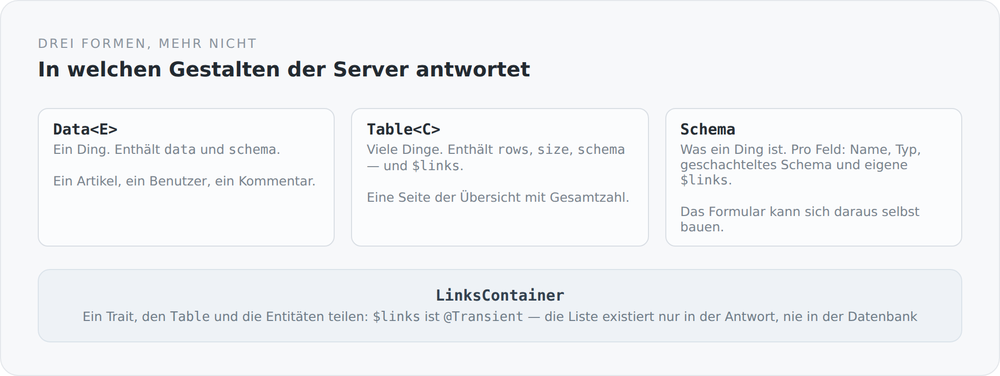

Die meisten REST-APIs haben so viele Antwortformen, wie sie Endpunkte haben. Jeder Controller gibt zurück, was gerade passt: mal das Objekt selbst, mal eine Liste, mal ein Objekt mit einer Liste und einer Gesamtzahl, mal ein Wrapper mit `data` und `meta`. Jede Variante für sich ist vernünftig. Zusammen sind sie ein Client, der für jeden Endpunkt einen eigenen Fall kennen muss.

Dieser Server kennt drei Formen. Sie stehen in vier kleinen Dateien im Modul `system`.

{width=720}

## Ein Ding

```scala
class Data[E](
  @(JsonbProperty @field) @field val data: E,
  @(JsonbProperty @field)("schema") @field val dataSchema: Schema | Null
) extends DTO
```

Ein Artikel, ein Benutzer, ein Kommentar. Zwei Felder: der Inhalt und das Schema, das ihn beschreibt.

Das `extends DTO` ist kein Zufall. Es ist genau das Marker-Interface, an dem der Message-Body-Writer erkennt, dass hier der eigene Mapper zuständig ist — mit Sichtbarkeitsregeln, Links und Schema-Erzeugung.

## Viele Dinge

```scala
class Table[C](
  @(JsonbProperty @field) @field val rows: java.util.List[C],
  @(JsonbProperty @field) @field val size: Long,
  @(JsonbProperty @field)("schema") @field val tableSchema: Schema | Null
) extends DTO with LinksContainer
```

`rows` sind die Zeilen dieser Seite, `size` ist die Gesamtzahl über alle Seiten. Das ist die Trennung, an der viele Listen-APIs scheitern: Wer nur `rows` liefert, kann keine Seitenanzeige bauen; wer `size` mit der Zeilenzahl verwechselt, baut eine falsche.

Und `Table` ist ein `LinksContainer`. Eine Liste kann also selbst Möglichkeiten tragen — „hier kannst du etwas anlegen", „hier geht es zur nächsten Seite" — und nicht nur ihre Elemente.

## Was ein Ding ist

```scala
class Schema(
  @(JsonbProperty @field) @field val entries: util.List[SchemaProperty] = new util.ArrayList()
)

class SchemaProperty(
  @(JsonbProperty @field) @field val name: String,
  @(JsonbProperty @field)("type") @field val typeName: String,
  @(JsonbProperty @field) @field val schema: Schema | Null,
  @(JsonbProperty @field)("$links") @field val links: util.List[Link] = new util.ArrayList()
)
```

Das Schema ist die interessanteste der drei Formen, weil es etwas beschreibt, das sonst nur im Kopf des Frontend-Entwicklers existiert.

Pro Feld: der Name, der Typ, gegebenenfalls ein geschachteltes Schema — und eigene Links. Ein Feld kann also eigene Möglichkeiten haben. Das ist der Punkt, an dem Sichtbarkeit fein wird: Nicht „darfst du diesen Artikel bearbeiten", sondern „darfst du dieses Feld dieses Artikels bearbeiten".

Damit kann ein Formular sich aus der Antwort selbst bauen. Es muss die Felder nicht kennen, und es muss vor allem nicht wissen, welche davon dieser Benutzer sehen darf.

## Der Trait, der alles zusammenhält

```scala
trait LinksContainer {
  @(JsonbProperty @field)("$links")
  @Transient
  val links: util.List[Link] = new util.ArrayList[Link]()

  def addLinks(value: Link*): Unit =
    value.filter(_ != null).foreach(link => links.add(link))
}
```

Zwei Annotationen, die zusammen die eigentliche Aussage machen.

`@JsonbProperty("$links")` — die Links heißen in jeder Antwort gleich. Ein Client, der `$links` findet, weiß, was er hat, egal an welchem Endpunkt.

`@Transient` — die Liste ist nicht persistent. Sie existiert im Speicher und in der Antwort, nie in der Datenbank. Das ist die technische Absicherung einer fachlichen Aussage: Möglichkeiten sind kein Zustand eines Objekts, sondern eine Aussage über den Aufrufer im Moment der Anfrage. Derselbe Artikel hat für mich andere `$links` als für einen anonymen Leser — und es gibt keine Stelle, an der man das versehentlich speichern könnte.

`addLinks` filtert `null` heraus. Damit kann der Code, der Links erzeugt, einfach `null` zurückgeben, wenn etwas nicht erlaubt ist, statt an jeder Aufrufstelle ein `if` zu schreiben.

## Das Dollarzeichen

`$links` sieht nach JSON-LD aus, und das ist kein Zufall — der Blog hat früher JSON-LD gesprochen. Das ist bewusst entfernt worden; heute ist der Medientyp schlicht `application/json`. Geblieben ist die Namenskonvention.

Ich finde das in Ordnung. Das Präfix trennt Metadaten von Fachdaten, ohne dass man dafür eine eigene Ebene im Dokument braucht. Ein Feld, das `$` vorne trägt, gehört dem Protokoll und nicht der Fachlichkeit.

## Was das für den Client bedeutet

Ein Client, der diese drei Formen kennt, kennt die ganze API.

`Data` auspacken, `Table` durchlaufen, `Schema` lesen, `$links` folgen. Es gibt keinen Endpunkt, der etwas anderes tut. Und weil das so ist, kann der Client generisch sein: Die TypeScript-Seite hat entsprechend `Data<E>`, `Table<C>` und `relation(...)` — dieselben drei Begriffe, dieselbe Bedeutung.

Das ist der eigentliche Gewinn. Nicht die drei Klassen, sondern die Tatsache, dass es nur drei sind.

## Der Preis

Manche Antworten sind größer, als sie sein müssten. Ein Schema mitzuschicken kostet Bytes, auch wenn der Client es diesmal nicht braucht. Und `Data<E>` mit einem einzigen Feld darin ist eine Verpackung, die man bei einer schlichten API nicht bräuchte.

Es gibt außerdem eine Stelle im System, an der genau das wehtut: Die Übersichtsseite lädt derzeit pro Zeile den kompletten Artikel samt aller Übersetzungen. Das ist kein Problem der drei Formen, sondern eine fehlende Projektion — aber es zeigt, dass eine einheitliche Hülle die Frage „wie viel gehört hinein" nicht beantwortet. Sie stellt sie nur an einer Stelle.

Der nächste Artikel bleibt bei den Listen und schaut sich an, wie aus Query-Parametern eine Datenbankabfrage wird, ohne dass ein Controller jemals eine `where`-Klausel sieht.
