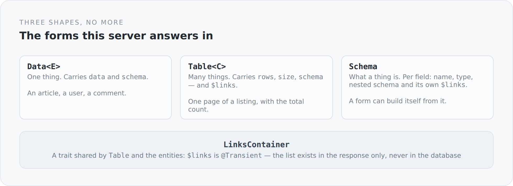

Most REST APIs have as many response shapes as they have endpoints. Every controller returns whatever fits at the time: sometimes the object itself, sometimes a list, sometimes an object with a list and a total, sometimes a wrapper with `data` and `meta`. Each variant is reasonable on its own. Together they are a client that has to know a separate case per endpoint.

This server knows three shapes. They live in four small files in the `system` module.

{width=720}

## One thing

```scala
class Data[E](
  @(JsonbProperty @field) @field val data: E,
  @(JsonbProperty @field)("schema") @field val dataSchema: Schema | Null
) extends DTO
```

An article, a user, a comment. Two fields: the content and the schema describing it.

The `extends DTO` is not incidental. It is exactly the marker interface by which the message body writer recognizes that the custom mapper is responsible here — with visibility rules, links and schema generation.

## Many things

```scala
class Table[C](
  @(JsonbProperty @field) @field val rows: java.util.List[C],
  @(JsonbProperty @field) @field val size: Long,
  @(JsonbProperty @field)("schema") @field val tableSchema: Schema | Null
) extends DTO with LinksContainer
```

`rows` are the rows of this page, `size` is the total across all pages. That is the distinction many listing APIs get wrong: if you only return `rows`, no pager can be built; if you confuse `size` with the row count, you build a wrong one.

And `Table` is a `LinksContainer`. A list can therefore carry possibilities itself — "you can create something here", "the next page is over there" — not only its elements.

## What a thing is

```scala
class Schema(
  @(JsonbProperty @field) @field val entries: util.List[SchemaProperty] = new util.ArrayList()
)

class SchemaProperty(
  @(JsonbProperty @field) @field val name: String,
  @(JsonbProperty @field)("type") @field val typeName: String,
  @(JsonbProperty @field) @field val schema: Schema | Null,
  @(JsonbProperty @field)("$links") @field val links: util.List[Link] = new util.ArrayList()
)
```

The schema is the most interesting of the three shapes, because it describes something that otherwise exists only in the head of the frontend developer.

Per field: the name, the type, possibly a nested schema — and links of its own. A field can therefore have its own possibilities. That is the point where visibility becomes fine-grained: not "may you edit this article", but "may you edit this field of this article".

A form can then build itself from the response. It does not have to know the fields, and above all it does not have to know which of them this user is allowed to see.

## The trait that holds it together

```scala
trait LinksContainer {
  @(JsonbProperty @field)("$links")
  @Transient
  val links: util.List[Link] = new util.ArrayList[Link]()

  def addLinks(value: Link*): Unit =
    value.filter(_ != null).foreach(link => links.add(link))
}
```

Two annotations that together make the actual statement.

`@JsonbProperty("$links")` — the links are called the same thing in every response. A client that finds `$links` knows what it has, no matter which endpoint it came from.

`@Transient` — the list is not persistent. It exists in memory and in the response, never in the database. That is the technical guarantee behind a domain statement: possibilities are not state of an object, but a statement about the caller at the moment of the request. The same article has different `$links` for me than for an anonymous reader — and there is no place where you could accidentally store that.

`addLinks` filters out `null`. That way the code creating links can simply return `null` when something is not allowed, instead of writing an `if` at every call site.

## The dollar sign

`$links` looks like JSON-LD, and that is no accident — the blog used to speak JSON-LD. That was deliberately removed; today the media type is plain `application/json`. What remained is the naming convention.

I think that is fine. The prefix separates metadata from domain data without needing a separate level in the document. A field carrying a `$` belongs to the protocol, not to the domain.

## What it means for the client

A client that knows these three shapes knows the whole API.

Unwrap `Data`, iterate `Table`, read `Schema`, follow `$links`. There is no endpoint that does anything else. And because that is so, the client can be generic: the TypeScript side has `Data<E>`, `Table<C>` and `relation(...)` — the same three concepts, the same meaning.

That is the actual gain. Not the three classes, but the fact that there are only three.

## The price

Some responses are larger than they need to be. Shipping a schema costs bytes even when the client does not need it this time. And `Data<E>` with a single field inside is a wrapper you would not need in a plain API.

There is also one place in the system where exactly that hurts: the listing page currently loads the complete article per row, including all translations. That is not a problem of the three shapes but a missing projection — but it shows that a uniform envelope does not answer the question of how much belongs inside. It only asks it in one place.

The next article stays with listings and looks at how query parameters become a database query, without a controller ever seeing a `where` clause.
