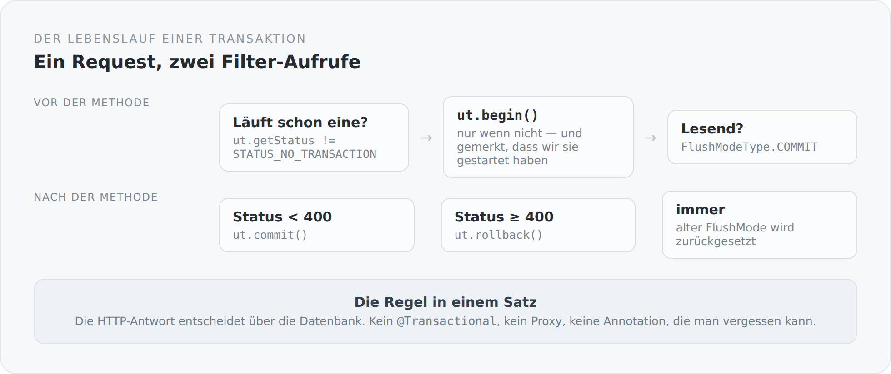

`@Transactional` ist eine der bequemsten Annotationen, die es gibt, und eine der undurchsichtigsten. Man schreibt sie an eine Methode, und danach gibt es eine Transaktion. Wo sie beginnt, wann sie committet, was passiert, wenn eine andere Methode derselben Klasse aufgerufen wird, was bei einer geprüften Ausnahme geschieht — all das ist Verhalten eines Proxys, den man nie sieht.

In diesem Blog gibt es die Annotation nicht. Es gibt einen Filter.

## Der ganze Mechanismus

```scala
@Provider
class QuarkusTransactionFilter extends ContainerRequestFilter with ContainerResponseFilter {

  override def filter(requestContext: ContainerRequestContext): Unit = {
    val ut = userTransaction
    val transactionActive = ut.getStatus != Status.STATUS_NO_TRANSACTION

    if (!transactionActive) {
      ut.begin()
      requestContext.setProperty(startedKey, java.lang.Boolean.TRUE)
    }

    requestContext.setProperty(flushModeKey, entityManager.getFlushMode)
    if (isReadOnly(requestContext)) {
      entityManager.setFlushMode(FlushModeType.COMMIT)
    }
  }

  override def filter(requestContext: ContainerRequestContext,
                      responseContext: ContainerResponseContext): Unit = {
    try {
      val ut = userTransaction
      if (wasStarted(requestContext) && ut.getStatus != Status.STATUS_NO_TRANSACTION) {
        if (responseContext.getStatus < 400) ut.commit() else ut.rollback()
      }
    } finally {
      Option(requestContext.getProperty(flushModeKey).asInstanceOf[FlushModeType])
        .foreach(entityManager.setFlushMode)
    }
  }
}
```

Das ist alles. Vor der Ressourcenmethode wird eine Transaktion geöffnet, danach wird sie abhängig vom HTTP-Status abgeschlossen.

{width=720}

## Die eine Regel

Der Kern steht in einer Zeile:

```scala
if (responseContext.getStatus < 400) ut.commit() else ut.rollback()
```

Der HTTP-Status entscheidet über die Datenbank.

Das ist eine strengere Regel als die übliche. Bei `@Transactional` entscheidet, ob eine Ausnahme geflogen ist — und zwar meistens nur eine ungeprüfte. Ein Controller, der einen Fehler abfängt und höflich `Response.status(400)` zurückgibt, würde in vielen Systemen trotzdem committen. Hier nicht.

Ich finde das richtig, weil es der Erwartung des Aufrufers entspricht. Wer eine 400 bekommt, geht davon aus, dass nichts passiert ist. Wenn im Hintergrund doch etwas geschrieben wurde, ist das ein Fehler, den man erst Wochen später in den Daten findet.

## Die drei Details, die man leicht übersieht

**Die Transaktion wird nur geöffnet, wenn keine läuft**, und nur die Ebene, die sie geöffnet hat, schließt sie. Das klingt trivial, ist aber der Unterschied zwischen einem Filter, der einmal funktioniert, und einem, der auch dann funktioniert, wenn er verschachtelt aufgerufen wird — was beim serverseitigen Rendering tatsächlich vorkommt.

**Lesende Requests bekommen `FlushModeType.COMMIT`.** Standardmäßig prüft Hibernate vor jeder Query, ob im Persistenzkontext etwas Ungeschriebenes liegt, und schreibt es vorsorglich. Bei einem `GET` gibt es nichts zu schreiben, also ist diese Prüfung reine Arbeit. Der Schalter spart sie.

**Der alte Flush-Modus wird im `finally` zurückgesetzt.** Der `EntityManager` ist request-scoped, könnte aber innerhalb desselben Requests weiterverwendet werden. Einen globalen Zustand zu ändern und nicht zurückzusetzen ist die Sorte Fehler, die nur unter Last auftritt.

## Was darunter liegt

Der Filter selbst wäre ohne die Verkabelung aus dem vorigen Artikel wirkungslos. Damit `UserTransaction` überhaupt etwas bedeutet, muss der Connection-Pool an den Transaktionsmanager angebunden sein:

```scala
val transactionIntegration = new NarayanaTransactionIntegration(
  transactionManager, transactionSynchronizationRegistry
)

val connectionFactoryConfig = new AgroalConnectionFactoryConfigurationSupplier()
  .connectionProviderClass(classOf[PGXADataSource])

val poolConfig = new AgroalConnectionPoolConfigurationSupplier()
  .transactionRequirement(TransactionRequirement.WARN)
  .connectionFactoryConfiguration(connectionFactoryConfig)
  .transactionIntegration(transactionIntegration)
```

Drei Dinge stehen hier explizit, die ein Applikationsserver für einen entschieden hätte.

`PGXADataSource` — die Verbindungen sind XA-fähig. Für einen Blog mit einer Datenbank braucht man das streng genommen nicht. Es kostet ein wenig, und es hält die Tür für eine zweite Ressource offen.

`NarayanaTransactionIntegration` — der Pool weiß, welche Verbindung zu welcher Transaktion gehört. Ohne diese Zeile bekäme jeder `EntityManager`-Aufruf potenziell eine andere Verbindung, und die Transaktion wäre eine Illusion.

`TransactionRequirement.WARN` — wenn jemand eine Verbindung ohne laufende Transaktion zieht, gibt es eine Warnung im Log. Nicht einen Fehler, aber auch kein Schweigen. Das ist ein Kompromiss, und er ist bewusst so gewählt: Beim serverseitigen Rendering und bei Startup-Code gibt es legitime Zugriffe außerhalb eines Requests.

## Was dieser Ansatz nicht kann

Ehrlich bleiben, auch hier.

**Es gibt keine feinkörnigere Steuerung.** Eine Methode, die zwei unabhängige Transaktionen bräuchte, kann das mit diesem Mechanismus nicht ausdrücken. `REQUIRES_NEW` gibt es nicht. Für diesen Blog ist das kein Problem — für ein System mit Workflows wäre es eins.

**Der Geltungsbereich ist der Request, nicht die fachliche Operation.** Das ist meistens dasselbe, aber nicht immer. Ein sehr langer Request hält die Transaktion sehr lange offen.

**Und der Name ist falsch.** Die Klasse heißt `QuarkusTransactionFilter`, obwohl in diesem Projekt kein Quarkus läuft. Der Name erzählt, woher die Idee kam. Ich habe ihn im Artikel über die Module schon als offene Schuld erwähnt, und er steht immer noch da.

## Warum mir das lieber ist

Weil ich die Frage „warum wurde hier nicht committet" in einer Datei beantworten kann.

Bei einer Annotation ist die Antwort verteilt: auf das Verhalten des Proxys, auf die Konfiguration des Containers, auf die Frage, ob der Aufruf überhaupt durch den Proxy ging. Bei einem Filter steht sie in dreißig Zeilen, die man am Stück lesen kann.

Das ist kein Argument gegen `@Transactional` in einem Produktteam. Es ist ein Argument dafür, dass man in einem System, das man verstehen will, an genau dieser Stelle keine Magie haben sollte.

Der nächste Artikel geht eine Schicht höher: zu der Stelle, an der aus diesen verwalteten Objekten JSON wird — und zurück.
